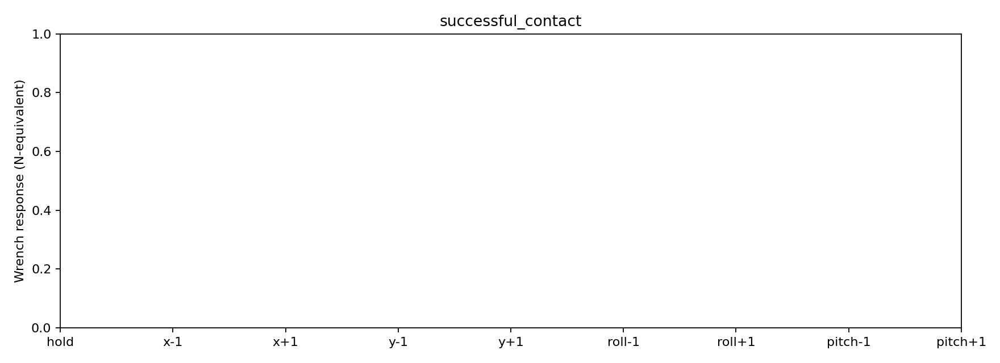
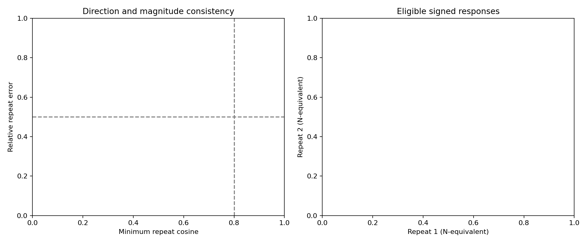
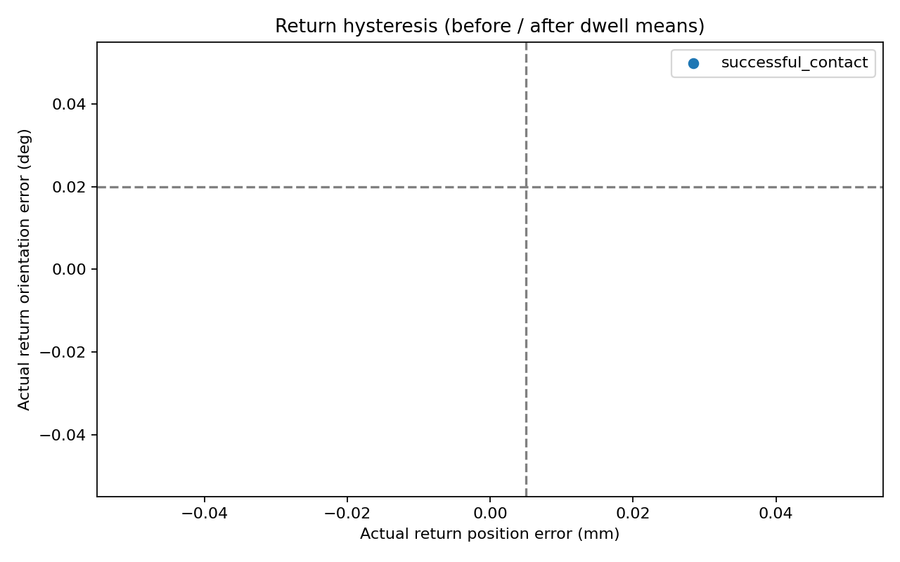

# Active micro-probing identification pilot

Status: **interrupted_preflight**. Native FORGE physics: 120 Hz. 1 selected terminal states; 2 repeats per signed direction and hold.

## Protocol and interpretation

Each attempt resets the freely grasped Panda/FORGE scene with the same seed, replays the complete insertion prefix, and holds its final controller target for 0.75 s. The nominal target preserves insertion preload; it is not replaced with the measured pose. Both the prefix and paused state must match a local reference using unchanged FORGE replay tolerances. A mismatch prevents the perturbation. Local references are characterized again; archived outcomes are provenance, not assumed local labels.

A probe holds for 0.25 s, ramps outward over 0.25 s, dwells for 0.25 s, ramps back over 0.25 s, and observes the return for 0.5 s. Commands are ±0.1 mm world X/Y or ±0.2 degrees spatial roll/pitch about the nominal peg base. Order is randomized within each repeat. The hold baseline has the identical schedule with zero command change. Every following attempt starts with a fresh replay, so return hysteresis cannot accumulate.

All raw per-step contact and wrist wrenches, actual world peg position/quaternion, COM and peg-base velocities, depth, contact load, penetration, grasp slip, commands, and budget flags are saved. Contact torques are transported from the moving peg base to one fixed world anchor per case for analysis. Raw contact/wrist signals remain separate. Operational budgets use the existing raw wrist norms (20 N, 1 Nm), existing overlap screen and grasp-retention limits; no physics/material/controller parameters changed.

Δw and actual Δξ use the final 0.125 s of before/plateau dwells. Return errors use the after dwell; a returned command does not establish restoration of contact memory. Return mismatch is reported separately; initial-state replay governs eligibility. Positive/negative differences divide by actual signed pose span, not requested amplitude. Missing opposite actual motion (<1 µm or <0.002 degrees) is rejected. Off-axis motion above 50% in the scaled pose metric prevents directional attribution; saved secants in such cases describe coupled paths only. No full 6D matrix is claimed.

Force and torque are reported separately. Combined wrench norms use ||[F, τ/L]|| with L=10 mm (N-equivalent); pose coupling uses [translation, L·rotation]. The baseline is the larger of hold drift and within-dwell RMS variability, maximized across valid holds. A 0.0001 N-equivalent analysis floor prevents division by zero; it is not calibrated sensor noise.

Predeclared exploratory criteria: at least two eligible holds; each signed response ≥3× baseline; repeated response vectors have cosine ≥0.8 and maximum deviation from their mean ≤50% of mean magnitude. Two positive-axis vectors are distinguishable when their distance exceeds the sum of repeat radii plus 3× baseline and both pass repeatability. These small-sample criteria are descriptive, not statistical confidence bounds or safety certification.

## Local contact states

| Case | Archived success / stalled | Local success / stalled | Max depth (mm) | Max normal load (N) |
|---|---|---|---:|---:|
| successful_contact | True / False | True / False | 19.821 | 4.732 |

## Results

- attempts: 2
- completed: 0
- eligible: 0
- baseline repeats: 0
- signed above baseline: 0
- valid central pairs: 0
- repeatable signed directions: 0
- distinguishable axis pairs: 0

All exclusions and safety stops remain in summary.csv; missing/ineligible pairs do not count as zero response. Check central_differences.csv for actual motion and coupling, and repeatability.csv / distinguishability.csv for the criteria above.

**Decision:** The pilot does not establish repeatable directional identification above the hold baseline. Resolve the reported replay, excitation, or variability limitations before constraint-aware control.

Only two contact states and two or three repeats are tested. Timestep convergence, generalization, contact memory, dynamic versus quasi-static response, and finite-amplitude nonlinearity remain unresolved. No recovery label, controller, corrective insertion action, or ML model is implemented.

Re-run analysis without simulation: `python -m research.active_probing outputs/Active-Probing-Pilot-v1`.
