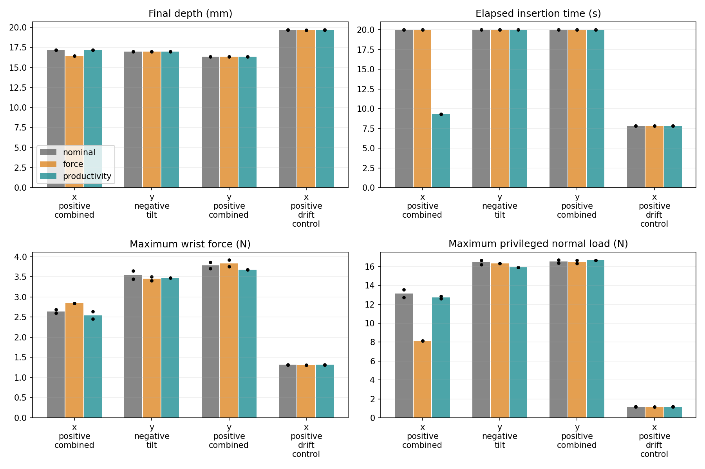
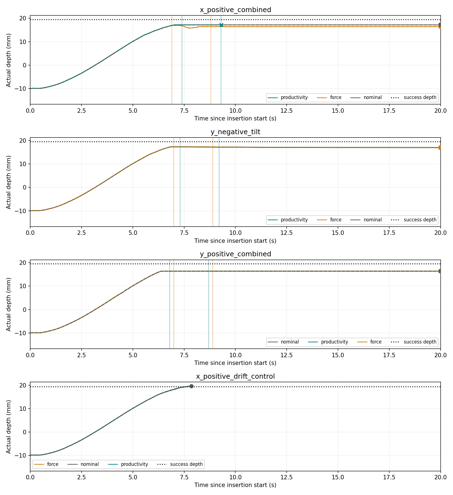
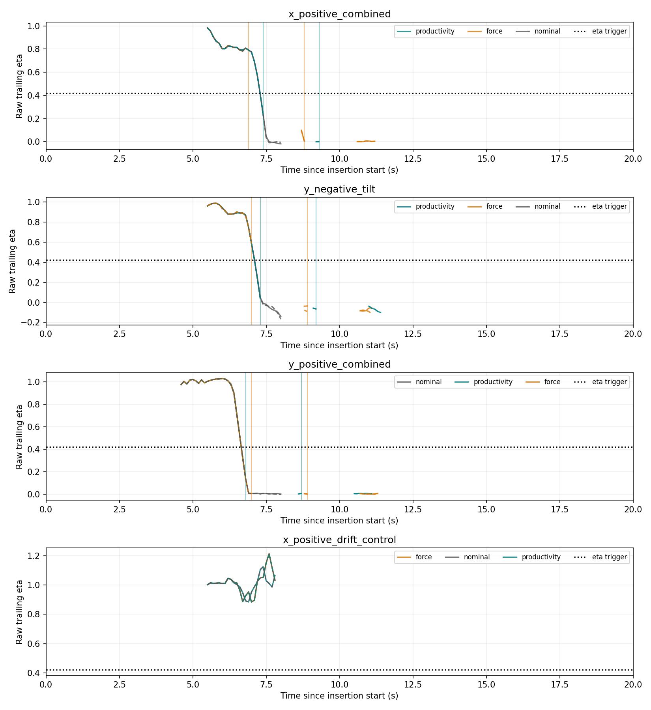
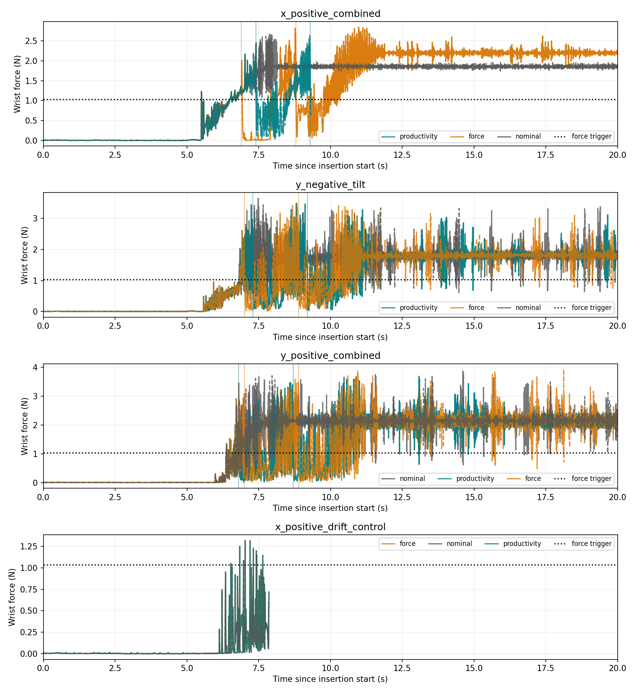
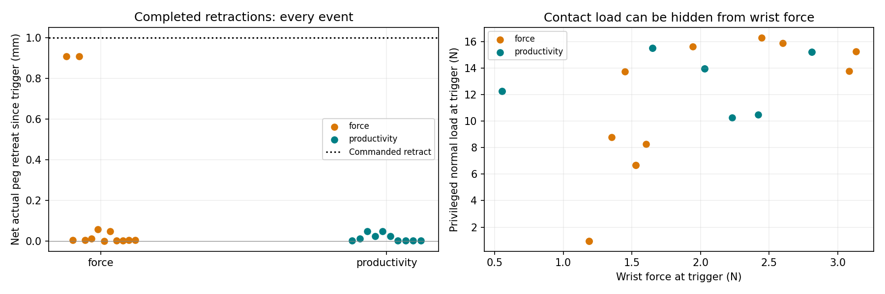

# Contact Productivity intervention pilot

Status: **complete**. 24 runs, 4 Stage4 path geometries, two deterministic preparation repeats per policy. Native FORGE physics 120 Hz; unchanged scene, contact settings, controller gains and hard safety limits.

## Main result

| Policy | Success | Ever stalled | Safety stops | Interventions | Mean final depth (mm) |
|---|---:|---:|---:|---:|---:|
| nominal | 2/8 | 6/8 | 0 | 0 | 17.554 |
| force | 2/8 | 6/8 | 0 | 12 | 17.373 |
| productivity | 2/8 | 6/8 | 2 | 12 | 17.548 |

Productivity changed successes by +0 versus nominal and +0 versus force intervention. A lower stall count alone is not evidence of better insertion: stopping, exhausting retries, or reaching a safety limit can censor the stall predicate.

Results cover four geometries with repeated resets. They assess this bounded policy and numerical repeatability; they do not establish population-level controller performance. No policy or threshold was tuned on pilot outcomes.

## Observed behavior

| Case | Nominal successes | Force successes | Productivity successes | Mean final depths: nominal / force / productivity (mm) |
|---|---:|---:|---:|---|
| x_positive_combined | 0/2 | 0/2 | 0/2 | 17.181 / 16.454 / 17.178 |
| y_negative_tilt | 0/2 | 0/2 | 0/2 | 16.986 / 16.998 / 16.958 |
| y_positive_combined | 0/2 | 0/2 | 0/2 | 16.362 / 16.363 / 16.366 |
| x_positive_drift_control | 2/2 | 2/2 | 2/2 | 19.688 / 19.675 / 19.688 |

**force**: 12 interventions started; 12 completed the retract phase and 0 were interrupted. Median net actual retreat was 0.0053 mm (range 0.0003–0.9090 mm), versus the 1 mm command. 4/6 first interventions preceded that run's first confirmed stall. This timing does not imply the trigger preceded the 0.5 s stall lookback interval.

**productivity**: 12 interventions started; 10 completed the retract phase and 2 were interrupted. Median net actual retreat was 0.0073 mm (range 0.0013–0.0486 mm), versus the 1 mm command. 4/6 first interventions preceded that run's first confirmed stall. This timing does not imply the trigger preceded the 0.5 s stall lookback interval.

A hidden-load example is y_positive_combined repeat 0: productivity triggered at eta=0.139, wrist force 0.554 N and privileged contact load 12.284 N. Normal load was logged for analysis and did not enter the decision.

**Conclusion for this fixed pilot:** productivity intervention did not improve insertion success. The progress signal can flag difficult contact at modest wrist force, but a commanded retract does not ensure an achieved retract, and retrying the same misalignment can reload the same contact. These results do not validate this fixed retract/retry policy as a stall-reducing controller. The next bounded experiment should first verify sufficient actual unloading/retraction, then test a revised retry action; no such tuning or expanded collection is part of this pilot.

Final depth and maximum-load comparisons include safety-terminated episodes with shorter exposure; a lower peak or shorter elapsed time on an aborted run is not a safety/performance gain. Depth plot end markers are circles for success, squares for timeout and crosses for a safety stop. Productivity plots leave undefined history intervals blank. All raw logs remain unchanged by report generation.

## Frozen design and calibration

Trailing actual depth change / commanded depth change over 0.5 s; raw ratio is never clipped. Checks every 0.1 s, requiring at least 0.1 mm positive command progress and a complete contiguous insertion history beyond ramp onset + 0.1 mm. No normal-load or ML predictor.

Productivity triggers at eta < **0.421266** for two consecutive checks. Force triggers at wrist force >= **1.035449 N** for two consecutive eligible checks. The common motion/history gate avoids pre-contact transient alarms; the force decision itself uses force only. Missing history, an interrupted segment or a non-consecutive check resets the counter.

Thresholds were frozen from 118 trajectories / 104 path groups in Phase2A and Phase2B development data. Stage4 and all earlier trajectories sharing its path groups were excluded (including all Stage3). Both thresholds maximize sensitivity within a 10% group-weighted non-stalled trajectory alert budget; centered duplicates share weight. Calibration uses entire insertion histories and is not a claim of pre-stall prediction. See calibration.json for hashes and diagnostic alert rates.

Every policy receives 20 s after a 2 s approach, stopping early only after 19.5 mm for 0.2 s or a safety violation. Nominal retains the archived 8 s smoothstep descent then holds its endpoint for the remaining budget. All three arms therefore have the same available wall-time.

Both intervention arms share the same response: stop at measured hand pose for 0.25 s; command 1 mm straight world-Z retraction over 0.5 s, preserving the measured hand orientation; then smoothly rejoin the original depth-dependent path over 0.5 s. Restart the original smoothstep clock at the measured retracted depth. No lateral/tilt correction is selected. Maximum-reached-depth ramp memory never rewinds. The nominal lateral/tilt demand is restored smoothly during rejoin; this may reload contact. At most two interventions; after that, continue the path subject to the same hard limits and total time budget.

The commanded depth during stop/retract is the captured peg-depth reference; during rejoin it is the interpolated peg-depth reference. Commanded hand pose is logged explicitly. Rejoin/stop/retract histories are excluded from the eta detector. Grasp compliance means commanded and actual retraction can differ; interventions.csv records both net retraction since trigger and motion during the retract phase.

Hard safety gates have priority at every observed physics tick: wrist force 20 N, wrist torque 1 Nm, grasp slip 0.1 mm / 0.5 deg, penetration screen 0.126475 mm. A violation terminates the episode; it is never treated as another recoverable soft trigger. The inherited Bench preparation/reset is unchanged; logged gates cover its returned initial state onward.

Stall uses the original 0.5 s / >=0.5 mm commanded / <0.1 mm actual predicate, restricted to uninterrupted insertion segments so intentional retraction is not labeled a stall. All episodes, including safety terminations and timeouts, remain in denominators. Timeouts have no time-to-success value; insertion_time_s is elapsed time to outcome, including interventions and final hold.

## Pairing, repeatability and intervention timing

Policy order is randomized within each case/repeat with fixed seed; preparation seed is shared. 4/16 policy-versus-nominal common-prefix endpoints pass the existing strict full-state match. Prefix depth/wrist RMSE and pose mismatch are in paired_comparisons.csv. Matches do not restore unobserved solver state; mismatches weaken counterfactual interpretation and are retained, not excluded.

Vertical plot lines mark interventions; solid/dashed lines are the two repeats. Interventions.csv reports lead to that repeat’s nominal stall confirmation, with match status; it is a paired descriptive comparison, not a newly measured stall onset. No stall label is backdated.

## Artifacts and integrity

summary.csv contains all requested per-run metrics plus safety, slip, penetration, elapsed/active time and outcomes. policy_summary.csv aggregates the policies; paired_comparisons.csv and interventions.csv expose pairing and actual retract behavior. Each run retains trajectory.csv at physics rate, events.json and metrics.json. Wrench, actual pose, velocity, contact load, commanded hand pose, detector eligibility, checks and actions are logged.

Existing-output audit: 3278 pre-existing files checked by size/mtime; changed: 0. Calibration source files are additionally SHA-256 checked before simulation. Physics/source hashes and configuration snapshots are retained in this new namespace.

Reproduce with a new directory:

```bash
./productivity_control.sh --headless --calibration experiments/productivity_control_calibration.json \
  --output-dir outputs/Contact-Productivity-Control-v2
```

Offline report regeneration: `python -m research.productivity_control_report outputs/Contact-Productivity-Control-v1`.










