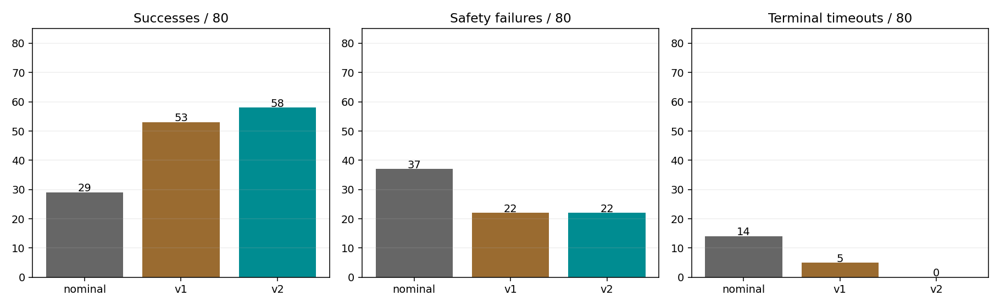
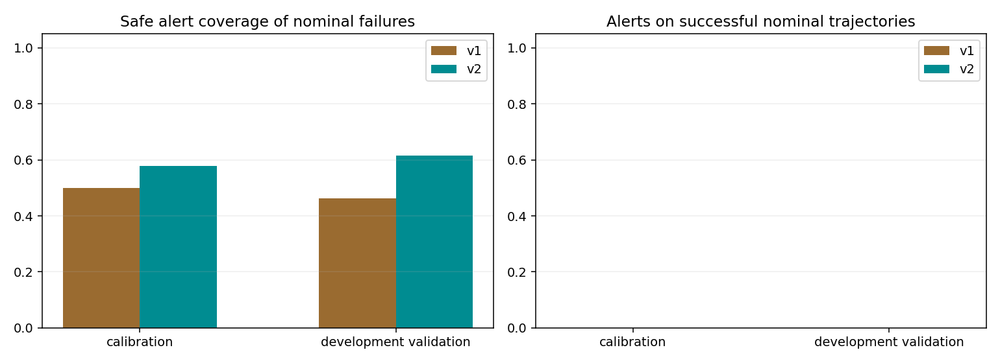

# Contact Productivity Detector v2 development

80 new targeted conditions × nominal/v1/v2 = 240 episodes. The de-wedging recovery, normal trigger, hard safety, physics, assets and budgets were unchanged. No final generalization test was run.

| Policy | Success | Safety failures | Terminal timeouts | Intervened runs | Verified / recoveries |
|---|---:|---:|---:|---:|---:|
| nominal | 29/80 | 37 | 14 | 0 | 0/0 |
| v1 | 53/80 | 22 | 5 | 26 | 23/26 |
| v2 | 58/80 | 22 | 0 | 31 | 29/31 |

| Development subset | Policy | Success | Safety failures | Terminal timeouts |
|---|---|---:|---:|---:|
| calibration | v1 | 39/60 | 18 | 3 |
| calibration | v2 | 43/60 | 17 | 0 |
| validation | v1 | 14/20 | 4 | 2 |
| validation | v2 | 15/20 | 5 | 0 |

## Trigger coverage and false interventions

| Split | Detector | Failed nominal trajectories alerted | Successful nominal trajectories alerted | Interventions on nominal successes | Safety cases alerted ≥0.1 s early | Median safety lead (s) |
|---|---|---:|---:|---:|---:|---:|
| all | v1 | 25/51 | 0/29 | 0 | 11/37 | 0.217 |
| all | v2 | 30/51 | 0/29 | 0 | 12/37 | 0.217 |
| calibration | v1 | 19/38 | 0/22 | 0 | 8/27 | 0.225 |
| calibration | v2 | 22/38 | 0/22 | 0 | 9/27 | 0.225 |
| validation | v1 | 6/13 | 0/7 | 0 | 3/10 | 0.208 |
| validation | v2 | 8/13 | 0/7 | 0 | 3/10 | 0.208 |

| V2 trigger branch | Recovery attempts | Verified unloading | Successful retries |
|---|---:|---:|---:|
| normal | 24 | 23 | 23 |
| urgent | 1 | 1 | 1 |
| terminal | 6 | 5 | 5 |

| Condition using an added v2 branch | Split | Branch sequence | V1 outcome | V2 outcome | Strict prefix match |
|---|---|---|---|---|---|
| [d018_terminal_band_s0_l2](conditions/d018_terminal_band_s0_l2.png) | calibration | terminal | time_budget_exhausted | insertion_success | False |
| [d019_terminal_band_s0_l3](conditions/d019_terminal_band_s0_l3.png) | calibration | terminal | insertion_success | insertion_success | False |
| [d026_terminal_band_s2_l2](conditions/d026_terminal_band_s2_l2.png) | validation | terminal | time_budget_exhausted | insertion_success | True |
| [d027_terminal_band_s2_l3](conditions/d027_terminal_band_s2_l3.png) | validation | terminal | time_budget_exhausted | insertion_success | True |
| [d043_oblique_tilt_s2_l3](conditions/d043_oblique_tilt_s2_l3.png) | calibration | urgent | grasp_retention_limit | insertion_success | False |
| [d064_rapid_ramp_s0_l0](conditions/d064_rapid_ramp_s0_l0.png) | calibration | terminal | time_budget_exhausted | grasp_retention_limit | False |
| [d072_rapid_ramp_s2_l0](conditions/d072_rapid_ramp_s2_l0.png) | calibration | terminal | time_budget_exhausted | insertion_success | True |

This branch-use table is descriptive and selected after observing which branches acted; it does not replace the full-condition comparison or define another test split.

V2 initiated 24 normal, 1 urgent and 6 terminal recoveries. V1 initiated 26 normal recoveries.

Safety stops during recovery: v1 3, v2 2; 1 v2 stops followed an added-branch trigger. V2 safety stops before any recovery: 20. Trigger coverage does not establish that the reached state is recoverable within the unchanged safety limits. Terminal phase and grasp slip at the last trigger/stop are retained in summary.csv.

Observed success changed by +5/80 conditions; nominal-failure trigger coverage changed by +5; successful-nominal shadow alerts changed by +0. These are development results, not final generalization estimates.

Coverage/lead and false alerts are replayed on exactly the same new nominal histories, so they isolate detector logic. Only safe trigger samples count as actionable. Safety lead is nominal safety-stop time minus first safe shadow trigger; positive is earlier. Stall lead is also retained and can be negative. Lead is not proof that the unchanged recovery has enough time to prevent that failure. Terminal opportunity and trigger delay are separate from artificial time-to-episode-deadline measures.

An alert on a nominal trajectory that subsequently succeeds is the conservative unnecessary-trigger label. Actual interventions on paired nominal successes are reported separately; reset differences mean these are imperfect counterfactuals. Normal-branch alerts cannot be eliminated by v2 without violating the frozen-detector requirement. Terminal opportunities may already be preceded by a normal/urgent alarm, so negative terminal delay means an earlier branch acted.

## Frozen configuration

Frozen at 2026-09-15T19:19:19.555318+00:00, after 80 nominal references and before any closed-loop comparison. Normal eta < 0.4212659765112803 for two consecutive 0.1 s checks. Urgent eta < 0.2 and deficit acceleration ≥ 2 mm/s². Terminal depth-range rate ≤ 0.01 mm/s over a full 0.5 s endpoint-hold window.

The urgent branch retains original positive-command/contact-onset eligibility, requires a positive progress-deficit rate, and uses adjacent check history. Terminal windows must remain below success, above contact onset and in a single hold segment with command depth at 20 mm. Depth range, rather than net displacement, rejects oscillatory cancellation. No load or future samples enter the detector.

Calibration used only 60 new nominal trajectories in 15 preassigned sign/onset groups. Twenty new conditions in five different groups were reserved for development validation. The candidate grid and zero-additional-success-alert constraint were fixed before collection. Selection maximized new/earlier safe coverage of failed nominal trajectories, then lead and conservative thresholds. Closed-loop success did not select thresholds. No thresholds changed after validation/comparison outcomes.

The previous 48-condition result files were not calibration/evaluation inputs. Only their pre-collection parameter plan was used to reject duplicate paths. This development set targets moderate terminal conditions, severe oblique/combined tilts and late steep ramps, with successful controls. Target names describe inputs, not guaranteed outcomes. All trials retain the original 8 s insertion command and 20 s episode budget.

## Remaining failures and matching

V2 unsuccessful outcomes: {'grasp_retention_limit': 22}. All failures remain in denominators; see failure_cases.csv and the 80 per-condition depth/grasp histories under conditions/.

Strict v1/v2 pre-intervention matches: 37/80. Discordant successes when neither intervened: 0. Those differences cannot be attributed to detector/recovery actions. One execution per condition/policy measures broad targeted coverage, not independent repeated-trial reliability.

Outcome discordances where v2 never used either added branch: 6. In those v2 executions only the unchanged normal trigger acted (or no intervention occurred). Reset-state variation can change grasp-safety outcomes even when both policies trigger normally at the same time. These differences are retained in primary success rates but are not evidence of benefit from the new branches. paired_comparisons.csv records branch use, first-trigger times and state-match errors.

## Validation and artifacts

Audit passed: 324653 physics rows, 26928 detector checks. Original recovery code and its geometric commands, verified retreat/hold, retry pose and safety priorities were replayed; detector-v2 decisions were independently reconstructed. 4299 old output files checked, changed: 0. Source snapshots, development plan and selected configuration hashes are retained.

Required artifacts: detector_v2_config.json, summary.csv, trigger_analysis.csv, false_trigger_analysis.csv and validation.json. Additional artifacts: policy_summary.csv, calibration_candidates.csv, recovery_events.csv, paired_comparisons.csv, failure_cases.csv, per-run logs/events/metrics and condition plots.

```bash
./productivity_detector_v2.sh --headless
```

The launcher refuses existing output directories. Offline report regeneration: `python -m research.productivity_detector_v2_report outputs/Contact-Productivity-DetectorV2-Dev`.




