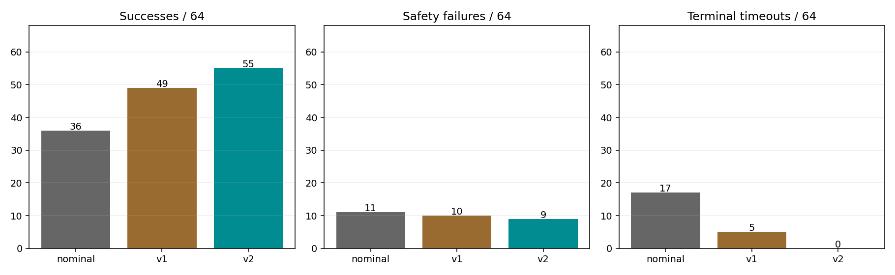
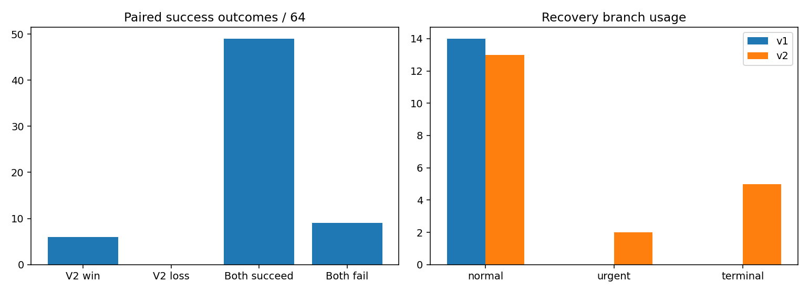
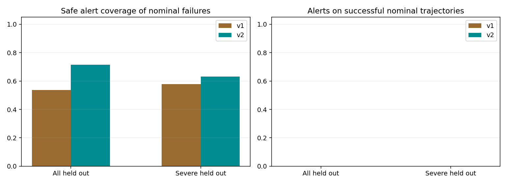

# Frozen Detector v2 held-out evaluation

64 fresh conditions × three frozen policies = 192 episodes. Every condition and the complete collection/analysis implementation were frozen before the first episode. No calibration, tuning, outcome-driven exclusions, replacement conditions, or added repeats were performed.

| Subset | Policy | Success | Safety stops | Terminal timeouts | Before-recovery safety stops |
|---|---|---:|---:|---:|---:|
| all | nominal | 36/64 | 11 | 17 | 11 |
| all | v1 | 49/64 | 10 | 5 | 9 |
| all | v2 | 55/64 | 9 | 0 | 8 |
| severe | nominal | 9/28 | 10 | 9 | 10 |
| severe | v1 | 18/28 | 9 | 1 | 8 |
| severe | v2 | 20/28 | 8 | 0 | 7 |
| strict_matched | nominal | 14/26 | 5 | 7 | 5 |
| strict_matched | v1 | 18/26 | 5 | 3 | 4 |
| strict_matched | v2 | 22/26 | 4 | 0 | 4 |
| severe_strict_matched | nominal | 1/9 | 4 | 4 | 4 |
| severe_strict_matched | v1 | 4/9 | 4 | 1 | 3 |
| severe_strict_matched | v2 | 6/9 | 3 | 0 | 3 |

## Paired v1 versus v2

| Subset | N | V2 wins | V2 losses | Both succeed | Both fail | Success difference [95% CI] | Exact paired p |
|---|---:|---:|---:|---:|---:|---|---:|
| all | 64 | 6 | 0 | 49 | 9 | +9.4 pp [+3.1, +15.7] | 0.03125 |
| severe | 28 | 2 | 0 | 18 | 8 | +7.1 pp [+0.0, +17.9] | 0.5 |
| strict_matched | 26 | 4 | 0 | 18 | 4 | +15.4 pp [+7.7, +26.9] | 0.125 |
| severe_strict_matched | 9 | 2 | 0 | 4 | 3 | +22.2 pp [+11.1, +33.3] | 0.5 |

Primary test: two-sided exact conditional McNemar (binomial among discordant pairs). CI: 10,000 paired condition bootstraps stratified by predeclared family, fixed seed 20260918. With zero discordances, exact p=1; a degenerate bootstrap interval does not establish equivalence. Structured conditions are not a random population sample. Severe and matched subsets are descriptive sensitivity analyses, not additional confirmatory tests.

Overall observed v2 minus v1 success: +6/64. Safety stops: 10 → 9; terminal timeouts: 5 → 0; safety stops before any recovery: 9 → 8.

## Recovery and branch accounting

| Policy | Stalled runs | Runs intervened | Recoveries | Verified | Ready to retry | Retry successes | Repeated stalls | Recovery safety stops |
|---|---:|---:|---:|---:|---:|---:|---:|---:|
| nominal | 12 | 0 | 0 | 0 | 0 | 0 | 0 | 0 |
| v1 | 7 | 14 | 14 | 13 | 13 | 13 | 0 | 1 |
| v2 | 4 | 20 | 20 | 19 | 19 | 19 | 0 | 1 |

| Policy | Branch | Attempts | Verified | Ready | Retry successes | Repeated stalls |
|---|---|---:|---:|---:|---:|---:|
| v1 | normal | 14 | 13 | 13 | 13 | 0 |
| v1 | urgent | 0 | 0 | 0 | 0 | 0 |
| v1 | terminal | 0 | 0 | 0 | 0 | 0 |
| v2 | normal | 13 | 12 | 12 | 12 | 0 |
| v2 | urgent | 2 | 2 | 2 | 2 | 0 |
| v2 | terminal | 5 | 5 | 5 | 5 | 0 |

Verified means actual retreat ≥0.5 mm continuously for 0.25 s; ready additionally requires the unchanged post-verification hold. A later rebound or safety stop can prevent retry even after initial verification. Repeated stalls are stalls in a retry interval, not independent trials. Hard safety takes priority over soft detector alarms; branch counts include actions actually started, not ignored alarms.

## Coverage, unnecessary interventions, and lead time

| Subset | Detector | Failed nominal cases alerted | Successful nominal cases alerted | Actual interventions on nominal successes | Safety cases alerted ≥0.1 s early | Median safety lead (s) | Median stall lead (s) |
|---|---|---:|---:|---:|---:|---:|---:|
| all | v1 | 15/28 | 0/36 | 0 | 1/11 | 0.058 | -0.029 |
| all | v2 | 20/28 | 0/36 | 0 | 2/11 | 0.125 | -0.008 |
| severe | v1 | 11/19 | 0/9 | 0 | 1/10 | 0.058 | -0.021 |
| severe | v2 | 12/19 | 0/9 | 0 | 2/10 | 0.125 | 0.004 |
| strict_matched | v1 | 5/12 | 0/14 | 0 | 0/5 | 0.025 | -0.017 |
| strict_matched | v2 | 8/12 | 0/14 | 0 | 1/5 | 0.125 | 0.000 |
| severe_strict_matched | v1 | 4/8 | 0/1 | 0 | 0/4 | 0.025 | -0.008 |
| severe_strict_matched | v2 | 5/8 | 0/1 | 0 | 1/4 | 0.125 | 0.004 |

Shadow detectors see identical fresh nominal histories without intervening; only safe alarm samples count. A shadow alert on a trajectory that subsequently succeeds is the conservative unnecessary-intervention label. Closed-loop interventions on paired nominal successes are a separate counterfactual proxy affected by reset differences. Strict nominal-versus-controller matching counts/denominators are retained in policy_summary.csv and false_trigger_analysis.csv.

Positive lead means the alarm preceded the nominal first stall or safety stop. Negative lead means it came after the first stall. Medians include only cases with both an event and an alarm; coverage denominators expose missed cases. A warning lead does not establish recoverability. Terminal endpoint opportunity and its trigger delay are reported separately in trigger_analysis.csv; time remaining to a timeout is not presented as early safety prediction.

## Failure cases and attribution

| Family | V1 failures | V2 failures | V2 failure outcomes |
|---|---:|---:|---|
| axis_offset | 0 | 0 | {} |
| axis_tilt | 4 | 2 | {'grasp_retention_limit': 2} |
| combined | 3 | 3 | {'grasp_retention_limit': 3} |
| easy_controls | 0 | 0 | {} |
| late_combined | 4 | 3 | {'grasp_retention_limit': 3} |
| oblique_offset | 0 | 0 | {} |
| oblique_tilt | 3 | 1 | {'grasp_retention_limit': 1} |
| terminal_band | 1 | 0 | {} |

| Discordant condition | Severity | V1 outcome | V2 outcome | V2 branches | Strict match |
|---|---|---|---|---|---|
| [h026_axis_tilt_moderate_v2](conditions/h026_axis_tilt_moderate_v2.png) | moderate | time_budget_exhausted | insertion_success | terminal | False |
| [h027_axis_tilt_moderate_v3](conditions/h027_axis_tilt_moderate_v3.png) | moderate | time_budget_exhausted | insertion_success | terminal | True |
| [h033_oblique_tilt_moderate_v1](conditions/h033_oblique_tilt_moderate_v1.png) | moderate | time_budget_exhausted | insertion_success | terminal | True |
| [h034_oblique_tilt_moderate_v2](conditions/h034_oblique_tilt_moderate_v2.png) | moderate | time_budget_exhausted | insertion_success | terminal | False |
| [h055_terminal_band_severe_v3](conditions/h055_terminal_band_severe_v3.png) | severe | time_budget_exhausted | insertion_success | terminal | True |
| [h063_late_combined_severe_v3](conditions/h063_late_combined_severe_v3.png) | severe | grasp_retention_limit | insertion_success | urgent | True |

Strict full-prefix v1/v2 matches: 26/64. Discordant outcomes without any added v2 branch: 0; discordances with neither policy intervening: 0. These differences remain in primary denominators but cannot be credited to urgent/terminal logic.

Strict matching requires every common-prefix sample through the earlier first intervention (or earlier episode end) to pass the original FORGE pose/orientation, joints, velocities, wrench, load, hand/finger and grasp tolerances. Endpoint-only matching, mismatch counts, and depth RMSE are also retained. Matching is an offline audit; privileged normal load is never an online detector feature. The matched subset can be smaller and selectively easier and does not replace the full-set result. One execution per policy/condition estimates breadth, not repeatability.

## Frozen protocol and provenance

Plan frozen: 2026-09-16T04:07:00.802920+00:00. Detector-v2 config SHA256: `189da99e1ba35a73a68221683cf0d6d215b3443d332c906e7e1afd231194de1d` (byte-for-byte copy of the development-selected file). Normal eta < 0.4212659765112803 for two consecutive checks; urgent eta < 0.2 and deficit acceleration ≥2 mm/s²; terminal depth-range rate ≤0.01 mm/s over a full 0.5 s endpoint-hold history. All original eligibility guards remain.

Eight families × eight paths: easy controls, axis offset, oblique offset, axis tilt, oblique tilt, combined offset/tilt, terminal-band targets, and late-ramp combined targets. Severity is preassigned (8 easy, 28 moderate, 28 severe); family names express target inputs, not observed outcomes. Ramp onsets span 6.8–18.2 mm. Full ramp depth 20 mm, insertion command 8 s, native FORGE 120 Hz. Identical existing scene, contact, gains, hard safety, success/stall definitions and recovery budgets. No clearance/geometry changes.

All 64 complete commanded paths were checked against the 48-condition benchmark, all 80 development conditions, Phase 2A/2B and earlier pilot descriptors. Metadata and signed zeros are ignored in path fingerprints. Shared aligned approach prefixes are intentional; full paths are distinct. Only prior parameter descriptors are used for exclusion, never prior outcomes for fitting or selection. Source manifest hashes retain the exclusion provenance.

Conditions are randomly ordered with predeclared seed; policy order rotates so each policy occupies each position 21 or 22 times. Reset seed and original solver priming remain unchanged. 192 required episodes; optional force and axial baselines add 128 episodes (~67% collection time). Prioritize all 64 fresh paired conditions.

Validation passed: 269733 physics rows, 22383 checks, 34 interventions replayed. All frozen sources, selected configuration and plan were checked before every episode and after analysis. 5155 preexisting files checked for size/mtime changes: zero. Full run artifact SHA256 hashes and environment details are in provenance_audit.json.

Artifacts: summary.csv, policy_summary.csv, paired_comparisons.csv, paired_statistics.csv, branch_analysis.csv, failure_cases.csv, trigger_analysis.csv, false_trigger_analysis.csv, recovery_events.csv, condition_plan.json, detector_v2_config.json, validation.json, provenance_audit.json, per-condition plots, per-run trajectory/events/metrics, and complete source snapshots.

Collection command: `./productivity_detector_v2_generalization.sh --headless`. Existing output directories are refused. Analysis command: `python -m research.productivity_detector_v2_generalization_report outputs/Contact-Productivity-DetectorV2-Generalization-v1`.

