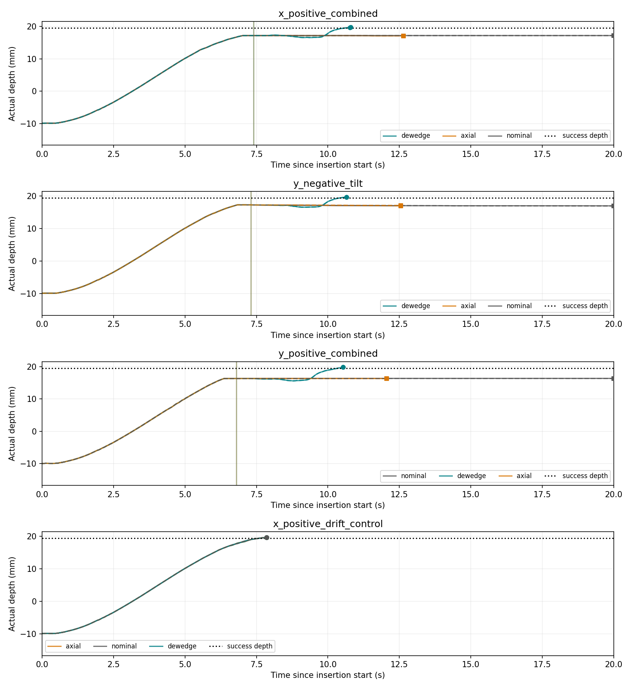
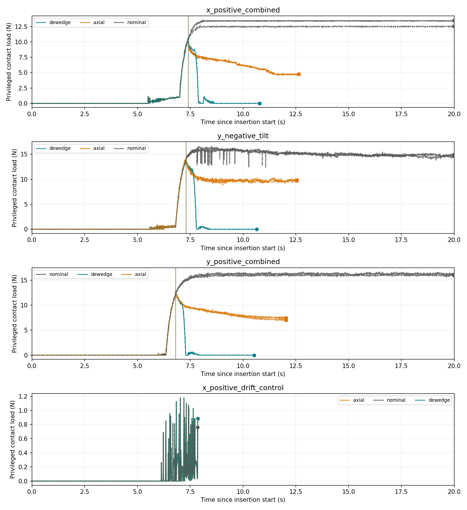
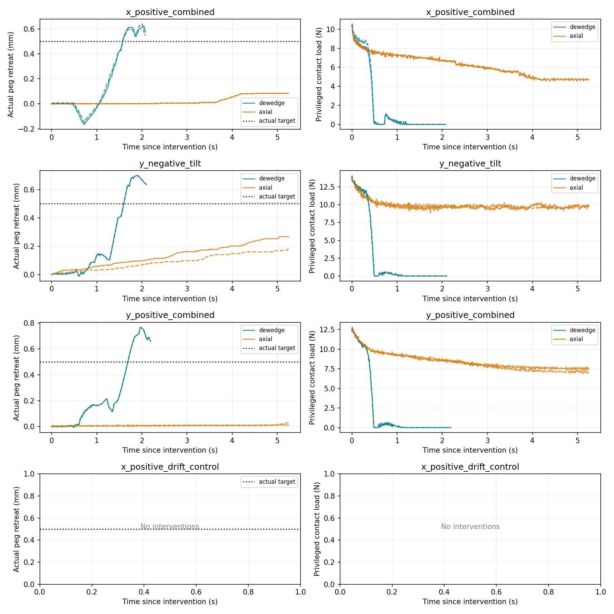
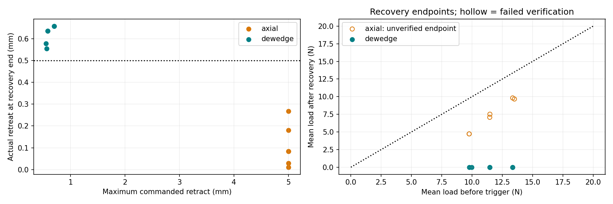
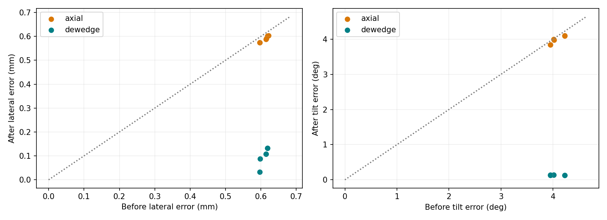

# Productivity-triggered de-wedging pilot

Completed 24 runs: four frozen Stage4-style cases × two repeats × three policies, native 120 Hz FORGE physics.

| Policy | Success | Ever stalled | Safety stops | Recovery budget stops | Safe 0.5 mm crossings / attempts | 0.25 s verified | Ready after hold | Retry successes |
|---|---:|---:|---:|---:|---:|---:|---:|---:|
| nominal | 2/8 | 6/8 | 0 | 0 | 0/0 | 0 | 0 | 0/0 |
| axial | 2/8 | 2/8 | 0 | 6 | 0/6 | 0 | 0 | 0/0 |
| dewedge | 8/8 | 2/8 | 0 | 0 | 6/6 | 6 | 6 | 6/6 |

## Main questions

**Does relaxation enable actual unloading?** De-wedging crossed 0.5 mm safely in 6/6 attempts, held it for 0.25 s in 6, and remained unloaded through the extra hold in 6. Axial-only verified 0/6. All attempts, including safety and deadline failures, remain in the denominator.

**Does load decrease more?** Among first-attempt case/repeat pairs, the de-wedging endpoint load drop exceeded axial-only in 6/6 comparisons. Mean additional drop: 7.263 N. Endpoint durations differ; safety-terminated endpoints and reset mismatches are flagged in paired_load_changes.csv. These descriptive changes do not isolate relaxation from stopping, retraction and elapsed time.

**Can insertion resume successfully?** De-wedging produced 6 active insertion retries, 6 successful retries, and 0 stalls among 6 retries with enough commanded motion to evaluate the original stall predicate. Overall success: 8/8, compared with nominal 2/8 and axial-only 2/8.

Among the 3 strictly matched axial/de-wedging first-attempt pairs, the endpoint load drop was larger with de-wedging in 3/3. Mean additional drop within that matched subset: 7.205 N. The full six-pair result above retains the reset mismatches.

## Case outcomes

| Case / policy | Attempts | Verified | Actual retreat at recovery end (mm) | Mean load before → after (N) | Safety-stopped attempts |
|---|---:|---:|---|---|---:|
| x_positive_combined / axial | 2 | 0 | 0.0839–0.0839 | 9.763 → 4.724 | 0 |
| x_positive_combined / dewedge | 2 | 2 | 0.5539–0.5787 | 9.873 → 0.000 | 0 |
| y_negative_tilt / axial | 2 | 0 | 0.1802–0.2680 | 13.424 → 9.742 | 0 |
| y_negative_tilt / dewedge | 2 | 2 | 0.6362–0.6362 | 13.352 → 0.000 | 0 |
| y_positive_combined / axial | 2 | 0 | 0.0108–0.0285 | 11.466 → 7.294 | 0 |
| y_positive_combined / dewedge | 2 | 2 | 0.6579–0.6579 | 11.459 → 0.000 | 0 |

### Achieved de-wedging motion

| Case | Lateral error before → after (mm), mean | Tilt magnitude before → after (deg), mean | Load at relaxation end (N), mean | Command / actual retreat at recovery end (mm), mean |
|---|---|---|---:|---|
| x_positive_combined | 0.597 → 0.060 | 3.948 → 0.135 | 1.030 | 0.555 / 0.566 |
| y_negative_tilt | 0.619 → 0.132 | 4.013 → 0.134 | 0.565 | 0.581 / 0.636 |
| y_positive_combined | 0.614 → 0.107 | 4.222 → 0.126 | 0.596 | 0.701 / 0.658 |

Holding commanded depth during relaxation does not guarantee stationary actual depth. The per-event relaxation-end depth records motion released by changing contact preload, including possible additional insertion before axial retraction. Retry authorization always uses the full measured retreat from the original trigger depth.

The outcomes support de-wedging followed by achieved-motion verification as a feasible bounded recovery on these cases. They justify broader controlled validation with the same safety gates; four geometries and two repeats do not establish reliability across unseen contact states.

## Frozen protocol and bounded recovery

The previous Detector and recent_signal are imported unchanged: raw eta < 0.4212659765112803 for two consecutive 0.1 s checks, 0.5 s history, at least 0.1 mm positive command progress, and the original contact/onset gate. No retuning or ML. Simulator normal load is logged for analysis only, not used for intervention or retry authorization.

Nominal insertion directly calls the original execute function. Axial-only directly calls the previous execute_verified function, including its original verification and retry behavior. Both baseline sources, the detector, calibration, scene, physics and safety protocol are checked against the previous experiment.

De-wedging stops at the measured hand pose for the original 0.25 s. Over 0.5 s, a smoothstep interpolation takes the captured actual peg x/y toward the hole center and relative roll/pitch toward zero, preserving relative yaw. Quaternion slerp rotates about the peg base using the grasp transform captured at the trigger. Commanded peg depth stays fixed during relaxation; hand Z can change due to the rotation lever arm. The authored peg-depth reference, not hand Z displacement, defines commanded axial retreat.

After relaxation, upward command follows the original 5 mm / 4 s smooth ramp. A safe measured depth decrease of at least 0.5 mm from trigger freezes the command. The target must persist for 0.25 s to record verification, then another 0.25 s to authorize retry. A rebound resets the continuous hold and resumes the command ramp without resetting depth, time or command budgets. Relaxation, retraction, verification and the extra hold all share the existing 5 s deadline after the initial stop. The total episode remains 20 s after the 2 s approach, with at most two interventions.

On readiness, the measured peg x/y, orientation and current grasp transform are latched. Rejoin lasts the original 0.5 s and insertion restarts from actual depth, retaining that measured pose rather than restoring the imposed offset/tilt ramp. No assumption is made that the peg actually reached neutral: the before/after pose logs quantify achieved relaxation. The nominal_* CSV fields retain the counterfactual frozen case ramp, while command_hand_* logs the applied target and retry_pose_latched identifies changed retry behavior.

Hard limits stay wrist force 20 N, wrist torque 1 Nm, penetration 0.126475 mm, grasp slip 0.1 mm / 0.5 deg. Every physics tick is screened before verification, retry, success or a soft trigger. Failed recovery ends the episode safely; no expanded budget or lateral search is attempted.

## Measurements and limitations

summary.csv includes success, stalls, maximum wrench/load, safety outcomes, intervention/retry counts, insertion time and final depth. unloading_events.csv contains trigger pose/depth/productivity, commanded relaxation, actual x/y/roll/pitch changes, commanded and achieved retreat, safe crossing and verification times, before/after contact and wrist wrench, retry success, and repeated stall. Per-run trajectory.csv retains full pose, velocity, contact load, wrench, grasp and target histories; events.json captures grasp transforms and the retry pose.

Before/after means use 0.1 s windows ending at trigger/recovery endpoint; sample counts and durations are retained. Verified-time load means are separate from final recovery endpoint means. A historical 0.25 s verification may be followed by rebound or timeout before readiness; these are separate labels. Empty retry/stall fields mean no retry or insufficient exposure, not successful prevention. Retry success and stall labels end at the next intervention or episode termination.

Strict prefix matching passed 8/24 pair endpoints. Same cases, preparation seed, repeats, solver priming and randomized policy order are used. All reset mismatches remain in paired_comparisons.csv; no observations are discarded. Two repeated resets of four geometries are a bounded feasibility study, not independent population samples or a guarantee of recovery.

## Integrity and reproducibility

Audit passed: 42452 physics rows, 3526 causal detector checks, 12 interventions. The replay checks the relaxation pivot, command/depth bounds, achieved-motion dwell, safety priority and retained retry pose. 23 source snapshots verified. 3501 pre-existing output files checked; changed: 0. Exact scene/configuration and calibration match the previous pilot.

Collection command:

```bash
./productivity_dewedge.sh --headless --output-dir outputs/Contact-Productivity-Dewedge-v1
```

The launcher refuses existing directories. For another authorized collection, choose a new directory. Offline report regeneration: `python -m research.productivity_dewedge_report outputs/Contact-Productivity-Dewedge-v1`.

Plot conventions: solid/dashed curves are repeats 0/1; vertical lines mark triggers. In depth/load comparisons, endpoint circles indicate success, squares indicate budget termination, and crosses indicate hard safety stops. Overlapping repeats may appear as one curve.










