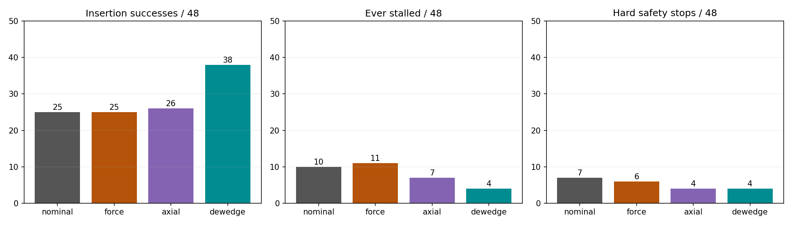
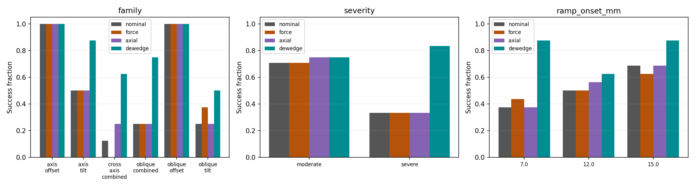
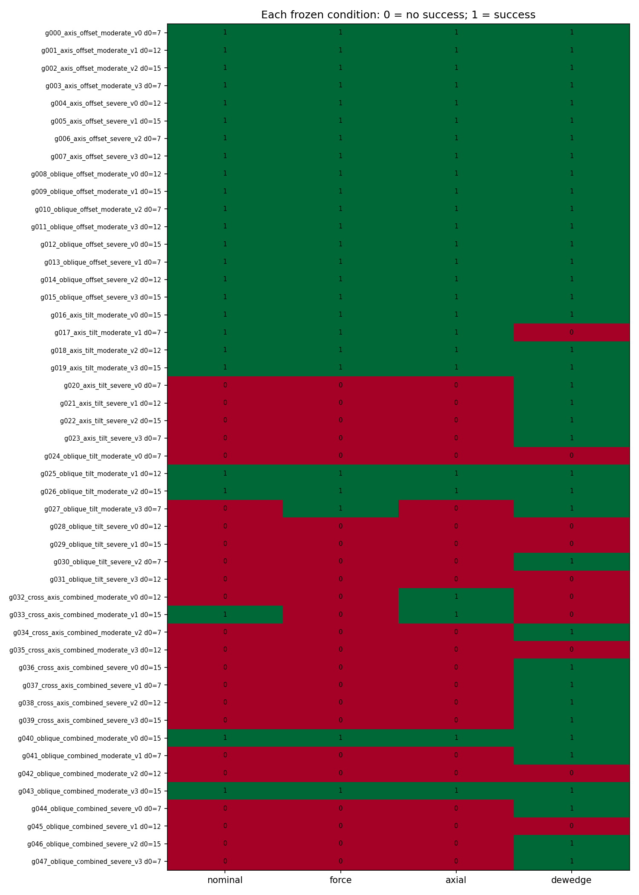
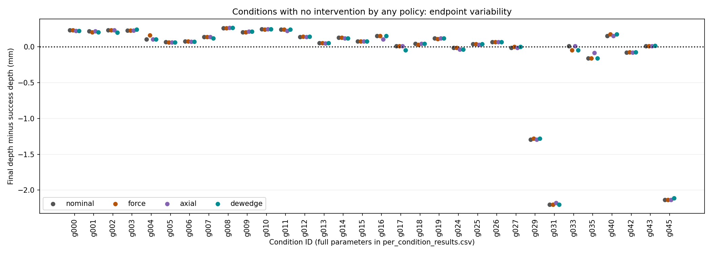
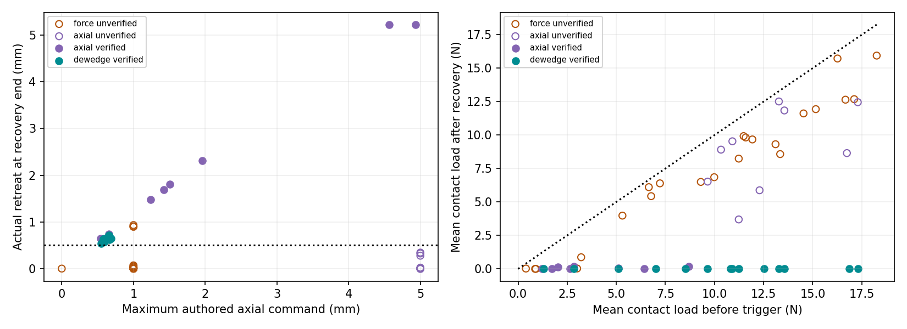
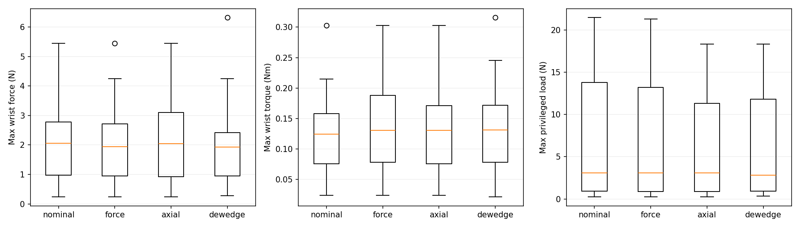

# Frozen Contact Productivity generalization benchmark

48 unseen pose/misalignment conditions × four frozen policies = 192 episodes. No policy retuning, outcome-driven condition replacement or ML. Same audited peg/socket assets and native 120 Hz FORGE physics.

| Policy | Insertion success | Ever stalled | Safety stops | Verified / recovery attempts | Successful retries / retries | Mean final depth (mm) |
|---|---:|---:|---:|---:|---:|---:|
| nominal | 25/48 | 10 | 7 | not enforced | 0/0 | 18.690 |
| force | 25/48 | 11 | 6 | not enforced | 0/22 | 18.662 |
| axial | 26/48 | 7 | 4 | 8/17 | 0/8 | 18.604 |
| dewedge | 38/48 | 4 | 4 | 14/14 | 14/14 | 19.488 |

## Main questions

**Unseen-condition success:** de-wedging succeeded in 38/48 conditions (79.2%). Nominal: 25/48; force-threshold: 25/48; axial-only: 26/48.

**Verified unloading:** de-wedging completed the 0.25 s measured-retreat verification in 14/14 recovery attempts and remained unloaded through the extra hold in 14. It produced 14 successful retries from 14 active retries, with 0 repeated stalls among 11 evaluable retries. Axial-only verified 8/17. Triggered-attempt rates and overall success answer different questions: policies may intervene on different conditions/states.

**Comparison without retuning:** all four existing execute functions and helper sources are frozen against the prior pilot; neither thresholds nor recovery logic changed. Paired effects below include all test conditions, including hard safety and numerical failures.

| Baseline vs de-wedging | Conditions | De-wedging wins / losses | Success difference | Stratified condition-bootstrap 95% interval |
|---|---:|---:|---:|---|
| nominal | 48 | 15 / 2 | +27.1% | [+12.5%, +39.6%] |
| force | 48 | 14 / 1 | +27.1% | [+14.6%, +39.6%] |
| axial | 48 | 15 / 3 | +25.0% | [+10.4%, +39.6%] |

No-intervention discordances (de-wedging wins / losses versus baseline): nominal 1 / 2; force 0 / 1; axial 1 / 3. Neither policy intervened in those pairs, so their outcome differences cannot be attributed to recovery actions. They remain in the primary all-condition results.

De-wedging maintained a higher observed success rate than all three baselines in this frozen benchmark. This supports generalization within the tested misalignment design; it is not a guarantee on arbitrary geometries, clearances, materials or contact states.

## Which unseen conditions fail?

De-wedging failures: 10/48. Failure classes: {'no_policy_trigger_before_timeout': 6, 'grasp_retention_limit_during_insertion': 4}.

| Condition | Endpoint x/y (mm); roll/pitch (deg) | Onset (mm) | Outcome | Final depth (mm) | Recoveries | Verified | Plot |
|---|---|---:|---|---:|---:|---:|---|
| g017_axis_tilt_moderate_v1 | +0.00, +0.00; -3.50, +0.00 | 7 | no_policy_trigger_before_timeout | 19.454 | 0 | 0 | [history](conditions/g017_axis_tilt_moderate_v1.png) |
| g024_oblique_tilt_moderate_v0 | +0.00, +0.00; +2.10, +2.80 | 7 | no_policy_trigger_before_timeout | 19.463 | 0 | 0 | [history](conditions/g024_oblique_tilt_moderate_v0.png) |
| g028_oblique_tilt_severe_v0 | +0.00, +0.00; +4.20, +5.60 | 12 | grasp_retention_limit_during_insertion | 17.292 | 0 | 0 | [history](conditions/g028_oblique_tilt_severe_v0.png) |
| g029_oblique_tilt_severe_v1 | +0.00, +0.00; -4.20, -5.60 | 15 | grasp_retention_limit_during_insertion | 18.222 | 0 | 0 | [history](conditions/g029_oblique_tilt_severe_v1.png) |
| g031_oblique_tilt_severe_v3 | +0.00, +0.00; -4.20, +5.60 | 12 | grasp_retention_limit_during_insertion | 17.297 | 0 | 0 | [history](conditions/g031_oblique_tilt_severe_v3.png) |
| g032_cross_axis_combined_moderate_v0 | +0.70, +0.00; +3.50, +0.00 | 12 | no_policy_trigger_before_timeout | 19.483 | 0 | 0 | [history](conditions/g032_cross_axis_combined_moderate_v0.png) |
| g033_cross_axis_combined_moderate_v1 | -0.70, +0.00; -3.50, +0.00 | 15 | no_policy_trigger_before_timeout | 19.453 | 0 | 0 | [history](conditions/g033_cross_axis_combined_moderate_v1.png) |
| g035_cross_axis_combined_moderate_v3 | +0.00, -0.70; +0.00, +3.50 | 12 | no_policy_trigger_before_timeout | 19.339 | 0 | 0 | [history](conditions/g035_cross_axis_combined_moderate_v3.png) |
| g042_oblique_combined_moderate_v2 | +0.56, -0.42; +2.80, +2.10 | 12 | no_policy_trigger_before_timeout | 19.425 | 0 | 0 | [history](conditions/g042_oblique_combined_moderate_v2.png) |
| g045_oblique_combined_severe_v1 | -0.96, -0.72; -5.60, +4.20 | 12 | grasp_retention_limit_during_insertion | 17.387 | 0 | 0 | [history](conditions/g045_oblique_combined_severe_v1.png) |

3 de-wedging runs hit a hard safety limit with only one consecutive low-productivity check recorded and no recovery yet initiated. The unchanged two-check detector had not authorized intervention. These are failures before recovery, not evidence that the de-wedging action itself failed. Last eligible eta, check time, consecutive count and terminal safety measurements are retained in failure_cases.csv.

6 de-wedging runs timed out in the final command hold without intervention. The original detector requires recent positive commanded insertion progress, so hold-phase history is ineligible. Failure records include minimum/last eligible eta and final depth: adequate productivity while moving does not guarantee the success-depth criterion is eventually reached. No detector, endpoint or success threshold was changed.

All-policy failure details: [failure_case_analysis.md](failure_case_analysis.md) and failure_cases.csv. Per-condition endpoint parameters and four-policy outcomes are in per_condition_results.csv; each condition has a complete depth/load/productivity plot.

## Frozen held-out design

Six families: axis offsets, oblique x/y offsets, axis tilts, oblique roll/pitch tilts, cross-axis offset/tilt combinations and oblique four-component combinations. Each has two severity levels and four signed variants: 48 distinct reference paths. Moderate component-vector magnitudes are 0.7 mm offset and 3.5 deg tilt; severe magnitudes are 1.2 mm and 7 deg. Absent components remain zero. Oblique vector components use 0.6/0.8 weights. The tilt magnitude refers to the roll/pitch parameter vector, not an exact quaternion rotation angle.

Ramp onset depths are 7, 12 and 15 mm (16 cases each), all different from the original 5/10 mm pilot onsets. The design balances coverage without claiming a full factorial crossing of every sign, amplitude and onset. Every path starts aligned, uses the existing maximum-previous-actual-depth feedback and reaches its prescribed endpoint at 20 mm. The original 8 s nominal insertion command, 20 s episode budget and preparation seed remain unchanged.

The plan was frozen at 2026-09-15T13:03:53.777669+00:00. 252 previous descriptors (163 unique sampled reference paths) were checked; exact overlaps: 0. Paths may share their aligned early history by design. No training/fitting occurs here. This is held-out evaluation after previous pilot development, not a retroactive split of that pilot.

Policy outcomes can differ near the success-depth threshold even when neither policy intervenes. Those pairs are flagged in paired_comparisons.csv and counted in paired_policy_effects.csv; their differences cannot be attributed to recovery actions. No near-threshold failures are relabeled or excluded.

Condition order is randomized once; each policy occupies each within-condition ordinal position exactly 12 times. One run per policy/condition prioritizes 48 distinct conditions over duplicate repeats. Same reset seed and solver priming are used; strict pre-intervention state matching is reported rather than assumed.

Clearance variation was not included: the backend enforces unit mesh scale and the audited 9 mm bore. Changing diameter metadata does not alter the USD geometry; a real clearance change would require mesh/geometry-audit changes. No such changes were made. These are 48 new pose/misalignment conditions on the same solid assets.

## Frozen policies and measurement

Productivity eta threshold: 0.4212659765112803, two consecutive 0.1 s checks, unchanged 0.5 s history and positive-command/contact-onset eligibility. Force baseline threshold: 1.035449028015137 N with the original same eligibility and two-check behavior; it executes the original fixed 1 mm / 0.5 s retract and rejoin. It is not the 20 N hard safety gate and is not newly calibrated.

Axial-only and de-wedging call the previous functions unchanged. De-wedging stops 0.25 s, relaxes captured actual peg x/y and relative roll/pitch toward neutral over 0.5 s at fixed commanded depth, preserves relative yaw, then retracts. Actual retreat must reach 0.5 mm and remain achieved for 0.25 s, followed by the existing extra 0.25 s hold. Relaxation/retraction/holds share the original 5 s deadline after the stop; axial command cap 5 mm with 4 s active ramp. Retry retains the measured relaxed pose. The original two-intervention cap and all hard force/torque/penetration/grasp limits remain.

Per-run trajectory.csv and events.json retain full wrench, actual pose/motion, target, detector and recovery histories. summary.csv adds productivity-trigger diagnostics on each policy's own observed history. For nominal/force policies those are offline shadow-detector results, not interventions executed by those policies. Actual productivity-triggered recoveries are a separate field. Simulator normal load is analysis-only.

Verified-unloading counts refer to the online measured-motion verification in axial/de-wedging arms. The force arm does not enforce verification; its achieved/sustained motion is still recorded separately in recovery_events.csv. Blank retry/stall labels mean no retry or insufficient qualifying motion. Failure endpoints and all safety stops remain in denominators. Time summaries include timeouts and stops; success-only times are separately identified.

Force versus de-wedging compares complete policies with different detectors and recovery actions; it does not isolate detector quality. Axial versus de-wedging shares the productivity detector and compares recovery behavior, subject to reset-state matching limits.

Stalls use the unchanged contiguous-insertion predicate. A controller may terminate before confirming a stall; therefore low recorded stall frequency alone is not improved insertion. Before/after load means use the existing 0.1 s windows. Load changes combine changed pose, elapsed time and retraction; no hold-only ablation is implied.

## Matching, uncertainty and integrity

paired_comparisons.csv retains all strict-prefix mismatches. Paired effect estimates resample whole conditions within the six design families, never physics samples. The intervals describe variation across this structured set under a condition-resampling assumption, not independently sampled real-world operating conditions. Wilson intervals in policy_summary.csv are also descriptive. Matching-filtered sensitivity results are separate and do not replace the all-condition primary endpoint.

| Baseline | Strictly matched conditions | De-wedging wins / losses in matched subset |
|---|---:|---:|
| nominal | 19 | 8 / 0 |
| force | 27 | 10 / 0 |
| axial | 22 | 8 / 0 |

Validation passed for 309809 physics rows and 25748 causal checks. The audit replays frozen detector decisions, bounded force commands, axial/de-wedging recovery state machines, achieved-motion dwell and retry-pose retention. 26 source snapshots verified; 3618 pre-existing output files checked, changed: 0. Exact scene/configuration and calibration match the previous pilot. Frozen plan/policy hashes are checked before and during collection.

The collection-time analysis snapshot is retained. Final report-only diagnostics (terminal detector/safety details and no-intervention discordances) are recorded separately in source/postprocessing and validation/provenance.json. They are descriptive analyses of the test outcomes; the conditions, policies, primary endpoint and bootstrap plan were not changed. Unit-test and collection logs are retained under validation/.

## Files and reproduction

Primary data: summary.csv, per_condition_results.csv, policy_summary.csv, stratified_results.csv, paired_policy_effects.csv, paired_comparisons.csv, detector_checks.csv, recovery_events.csv, failure_cases.csv, validation.json and frozen_plan.json. Source snapshots and per-condition plots are retained.

```bash
./productivity_generalization.sh --headless --output-dir outputs/Contact-Productivity-Generalization-v1
```

Collection refuses an existing output directory. Offline report regeneration: `python -m research.productivity_generalization_report outputs/Contact-Productivity-Generalization-v1`.












