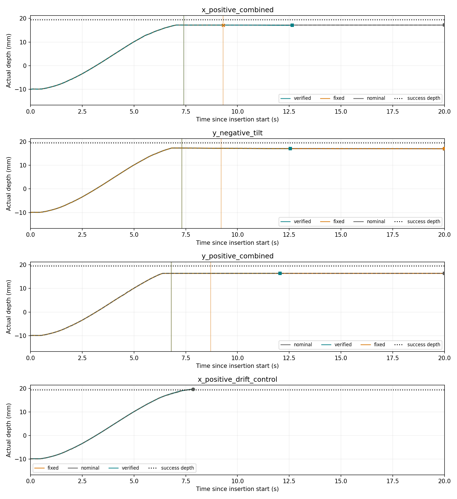
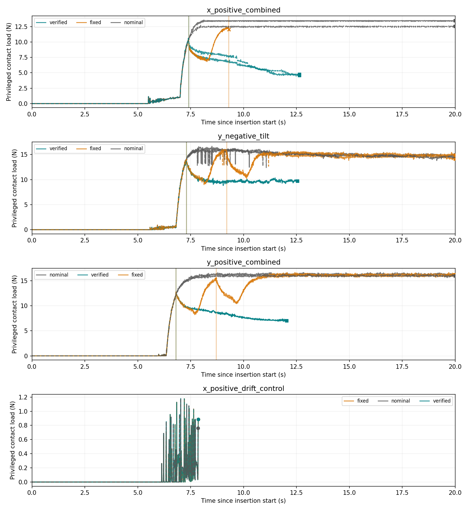
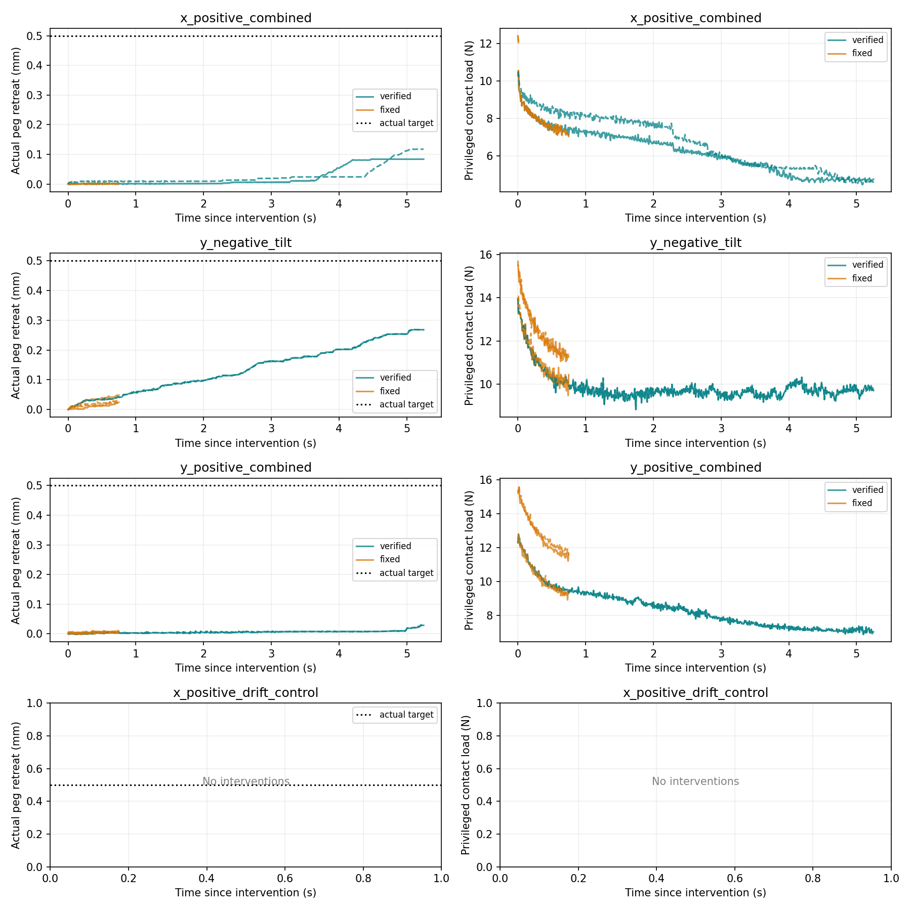
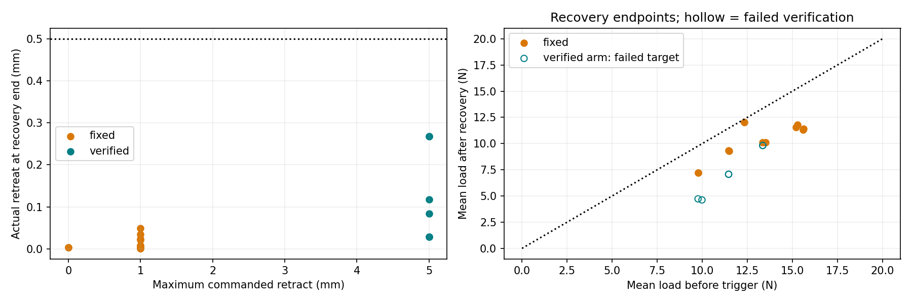

# Productivity-triggered verified unloading

Status: **complete**. 24 runs; four frozen Stage4 cases and two preparation repeats per policy. Native 120 Hz FORGE physics.

## Results

| Policy | Success | Ever stalled | Safety stops | Recovery budget stops | 0.5 mm safe crossings / attempts | Verified unloadings |
|---|---:|---:|---:|---:|---:|---:|
| nominal | 2/8 | 6/8 | 0 | 0 | 0/0 | 0 |
| fixed | 2/8 | 6/8 | 2 | 0 | 0/12 | 0 |
| verified | 2/8 | 2/8 | 0 | 6 | 0/6 | 0 |

**Can 0.5 mm actual unloading be achieved?** The verified arm safely crossed 0.5 mm in 0/6 attempts and completed the sustained verification hold in 0/6. Safety stops and recovery deadlines remain in the denominator; zero attempts on a successful control are not unloading successes.


**Does contact load decrease?** No verified unloading completed, so reduction after verified unloading is untested. Failed-attempt endpoint loads are reported separately.

**Does retry improve insertion?** The verified arm completed 2/8 insertions. Of 0 retries, 0 had enough continued commanded motion to evaluate the existing stall predicate; 0 of those stalled. Compare successes and safety outcomes in the table. A failure that terminates before retry or stall confirmation cannot count as stall prevention.

This fixed pilot did not improve insertion success over nominal or the previous fixed retract. Any reduction in recorded stalls must be interpreted alongside early termination, achieved unloading, retry exposure and safety stops.

Across all 6 verified-arm recovery attempts, including failures, mean contact load decreased in 6. These are endpoint comparisons after partial or verified motion; they do not establish that the 0.5 mm target was met.

| Verified-arm case | Attempts | Verified | Actual retreat at attempt end (mm), range | Mean load before / after (N) |
|---|---:|---:|---|---|
| x_positive_combined | 2 | 0 | 0.0839–0.1176 | 9.873 / 4.673 |
| y_negative_tilt | 2 | 0 | 0.2680–0.2680 | 13.352 / 9.819 |
| y_positive_combined | 2 | 0 | 0.0285–0.0285 | 11.459 / 7.072 |

The tested 5 mm / 5 s recovery budget did not deliver sustained 0.5 mm actual retreat. No verified-arm insertion retry was authorized. Fewer repeated stalls in that arm therefore reflect termination after failed unloading, not evidence of successful recovery. This is a bounded negative result; it does not establish that unloading is impossible with other permitted commands or durations. No budget expansion was performed in this experiment.

## Frozen protocol

The previous Detector, recent_signal, calibration JSON and baseline execute function are reused unchanged. Eta < 0.4212659765112803 for two consecutive 0.1 s checks; 0.5 s history, >=0.1 mm positive command progress, original contact/onset gate. No threshold retuning, ML or normal-load predictor.

Nominal and fixed call the previous controller directly. Verified changes only recovery. After the same 0.25 s stop at measured hand pose, upward command grows smoothly to at most 5 mm over 4 s of active retraction. The recovery deadline is 5 s after the stop and includes the verification hold. The target is a measured peg-depth decrease of >=0.5 mm from the original trigger depth. At target crossing the last command is held; 0.25 s continuously above target verifies unloading. Rebound resets the hold and resumes the ramp without a command jump, a new anchor or an extended deadline. Grasp, force/torque and penetration gates take priority, including on the crossing tick.

A verified hold permits the original 0.5 s rejoin and smoothstep retry from measured depth. The maximum-reached-depth offset/tilt ramp is retained, as before. No additional lateral or angular correction is selected; the unloading command changes world Z only. The original lateral/tilt path demand returns smoothly during rejoin. At most two interventions and the same 20 s insertion budget after a 2 s approach. Failure to verify within either recovery or episode budget ends the episode with no retry.

Hard limits are unchanged: wrist force 20 N; wrist torque 1 Nm; grasp slip 0.1 mm / 0.5 deg; penetration 0.126475 mm. Reset/preparation and solver priming are inherited unchanged. Baselines receive the same available episode time, ending early for the existing success dwell or safety limits.

## Measurement and interpretation

unloading_events.csv contains trigger depth, maximum achieved command, actual/max retreat, first safe 0.5 mm crossing time, verification status, wrench/load before and after, load decrease, retry exposure and stall-after-retry. Per-tick trajectory.csv files retain full wrist/contact wrench, pose, velocities, grasp slip, commanded hand pose and detector fields. Commanded retreat uses the authored peg-depth reference; hand_target_retract_mm separately records the float32 hand-target difference, including its tiny rounding error. Rejoin-start and active-insertion retry-start are recorded separately. Before/after means use 0.1 s windows ending at trigger/recovery end; sample counts and after-window duration are reported. For completed verified unloading the after-window is in the hold; failed attempts use their terminal window. The fixed endpoint may still be moving. Short or unsafe failure endpoints are not verified-unloading outcomes. Load decrease is a descriptive strict decrease of these means, not a statistical significance claim. Recovery combines stopping, retraction and time at the state; without an equal-duration hold-only control, load decay cannot be attributed solely to achieved axial motion.

The fixed arm is also scored offline for actual 0.5 mm crossing/sustained retreat, but its original policy does not enforce that criterion. Time to crossing is measured from trigger (including stop). A safe crossing alone is distinct from completing the verification hold. No commanded displacement is accepted as achieved peg motion.

Stall uses the unchanged 0.5 s, >=0.5 mm commanded, <0.1 mm actual predicate within contiguous insertion segments. stall_after_retry is empty when there is no retry or insufficient qualifying motion to evaluate it; such missing labels are not negatives. Retry windows end at the next intervention or episode termination. Summary outcomes retain all failed and safety-terminated runs.

Strict pair matching passed 8/24 common-prefix endpoints across nominal/fixed/verified comparisons. The same preparation seed and randomized within-case policy order are used; four geometries and repeated resets do not establish population-level performance. Mismatches remain visible in paired_comparisons.csv and limit causal attribution.

## Integrity and use

Audit passed for 46614 physics rows and 3876 detector checks, including upward-only command bounds, achieved-motion retry authorization and safety priority. Scene/configuration and calibration match the prior pilot. 3389 pre-existing output files checked; changed: 0. Source snapshots and validation.json are retained.

```bash
./productivity_unloading.sh --headless --output-dir outputs/Contact-Productivity-Unloading-v2
```

Offline regeneration: `python -m research.productivity_unloading_report outputs/Contact-Productivity-Unloading-v1`.








