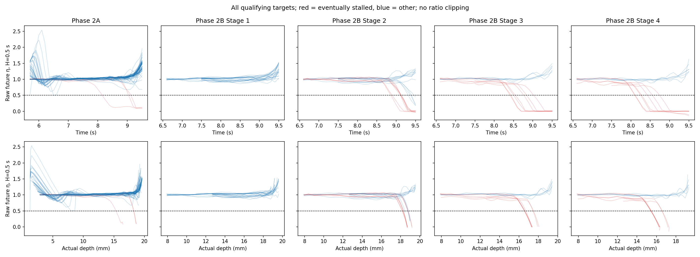
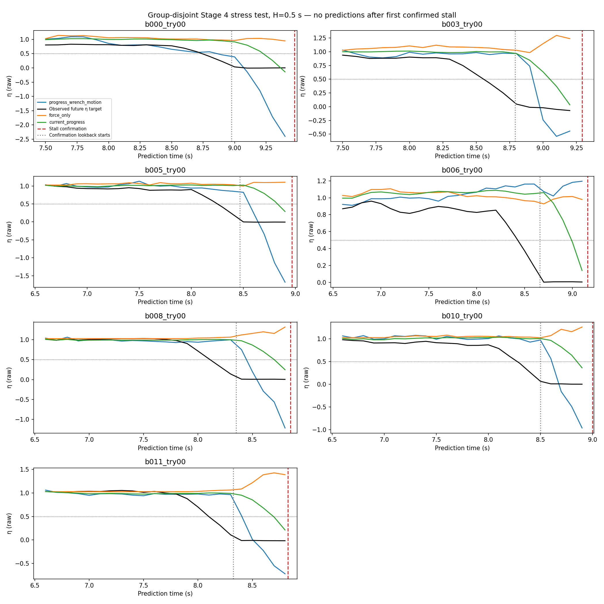
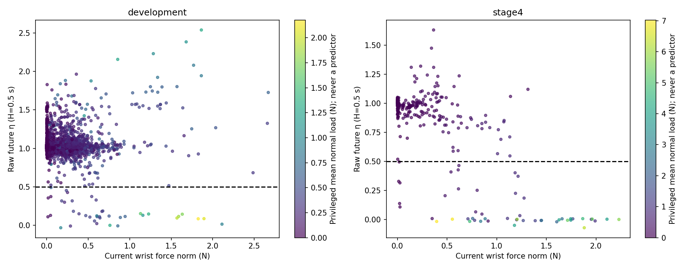
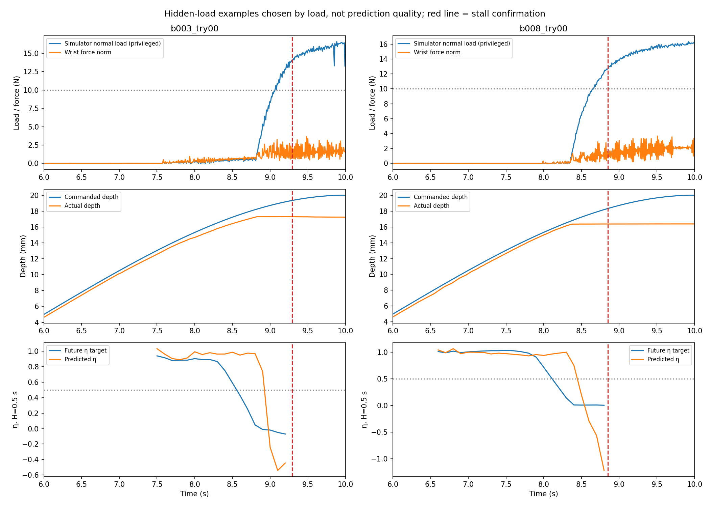

# Contact Productivity — offline proof of concept

170 trajectories: 118 development, 39 quarantined earlier-stage shared paths, and 13 Stage 4 stress-test trajectories.

## Target and causal feature contract

`eta(t,H) = [depth(t+H)-depth(t)] / [command_depth(t+H)-command_depth(t)]`, with H = 0.25, 0.5, 1.0 s. Both progress terms are in mm. Future endpoints must remain in the logged insertion phase and commanded progress must be at least 0.1 mm. The signed raw ratio is the regression target and all primary metrics/predictions are unclipped. A separately named [0,1]-clipped diagnostic is saved but never fitted or scored. Ratios above 1 and below 0 are retained.

Features use only the preceding 0.5 s including the current sample, at 0.1 s stride. They include causal force/torque statistics and derivatives, actual/commanded depth and rates, trailing productivity, progress deficit, linear/angular velocity, lateral position and sign-invariant spatial orientation. Future commanded progress is a target denominator only; it is not an input. No experiment ID, severity, time-to-stall, outcome, future target, or normal load enters a model.

Primary wrench features use the logged wrist force/torque: raw wrist norms and world-frame wrench transported by the logger to the peg base. The requested fx/fy/fz/taux/tauy/tauz peg-contact columns are retained in separately named contact-wrench comparisons. These true contact signals are simulator-derived and must not be mistaken for a deployable wrist sensor. Actual peg pose is assumed observable. No contact load, contact count, penetration or contact-power proxy is a predictor.

## Leakage controls and estimator

Stage 4 is never used for fitting, scaling, hyperparameter selection or alarm-threshold calibration. All earlier-stage members of its 13 path groups are quarantined, including all Stage 3 paths. They are analyzed and predicted separately. Keeping all Stage 3 paths in training would contradict a group-disjoint Stage 4 test. Centered repeats form one group; repeated severities/retries remain in their path group.

Numerically valid trajectories are retained even when the archived grasp-retention flag is false: actual peg motion is the target, and slipping is not silently excluded. That flag remains in trajectory_summary.csv. History must be fully after actual entry. For depth-ramp cases it must begin beyond ramp onset +0.1 mm; this removes common aligned pre-ramp histories. Exact rounded physical-history duplicates across distinct groups are excluded. Group weights give each group equal total influence, including duplicate centered controls. Five outer development folds provide out-of-fold predictions; three inner group folds select ridge alpha from 0.001, 0.01, 0.1. Scaling and fitting occur inside each training fold. Final stress-test fits use only eligible development data. models.json and split_audit.json make the input lists and split decisions reviewable.

All seven fitted comparisons use the same standardized linear ridge estimator over engineered histories. The five primary comparisons are force-only norm history, torque-only norm history, current progress, wrist-wrench history, and progress+wrist-wrench+motion. Two extra comparisons substitute true contact wrench. Persistence predicts future productivity using trailing actual/commanded productivity without fitting.

## Before-stall interpretation

The existing stall predicate is reconstructed exactly: over the trailing 0.5 s, command progress ≥0.5 mm and actual progress <0.1 mm while inserting. Its first confirmation time agrees with every archived stalled flag. No model is trained or evaluated on an already-confirmed stalled state. Post-confirmation target rows are retained only for descriptive plots.

Confirmation is delayed by a lookback window. Warnings are therefore assessed both before confirmation and strictly before the start of that 0.5 s window. The latter is a conservative timing audit, not a measured physical stall-onset timestamp. Two consecutive predictions 0.1 s apart must trigger; the second timestamp is the alert time. Leads are measured on complete at-risk trajectories, not by treating overlapping windows as independent experiments.

Semantic degradation uses predicted eta ≤0.5 (true target eta <0.5). Separately, alarm thresholds are calibrated for at most 10% group-weighted non-stalled-trajectory alerts on training-only inner/outer out-of-fold predictions. A non-stall alert is not automatically a false productivity alert: insertion can degrade without satisfying the formal stall predicate. Fixed wrist-force thresholds of 1, 2, 5, 10 and 20 N are also evaluated. Stage 4 thresholds remain frozen.

## Prediction results

Metrics below weight groups equally. R² is against the evaluation-set mean, not a trained baseline. Compare MAE with current progress and persistence before attributing performance to wrench history. No confidence interval treats windows as independent.

| Split | H (s) | Model | MAE | RMSE | R² | Degradation AUC |
|---|---:|---|---:|---:|---:|---:|
| development_oof | 0.25 | force_only | 0.107 | 0.217 | 0.050 | 0.455 |
| stage4 | 0.25 | force_only | 0.231 | 0.397 | -0.213 | 0.696 |
| development_oof | 0.25 | torque_only | 0.108 | 0.223 | -0.000 | 0.349 |
| stage4 | 0.25 | torque_only | 0.256 | 0.419 | -0.351 | 0.584 |
| development_oof | 0.25 | current_progress | 0.078 | 0.155 | 0.516 | 0.757 |
| stage4 | 0.25 | current_progress | 0.177 | 0.298 | 0.318 | 0.826 |
| development_oof | 0.25 | wrench_history | 0.108 | 0.220 | 0.024 | 0.498 |
| stage4 | 0.25 | wrench_history | 0.260 | 0.495 | -0.884 | 0.589 |
| development_oof | 0.25 | progress_wrench_motion | 0.079 | 0.163 | 0.463 | 0.668 |
| stage4 | 0.25 | progress_wrench_motion | 0.208 | 0.389 | -0.165 | 0.708 |
| development_oof | 0.25 | persistence | 0.112 | 0.278 | -0.565 | 0.855 |
| stage4 | 0.25 | persistence | 0.144 | 0.260 | 0.481 | 0.959 |
| development_oof | 0.5 | force_only | 0.074 | 0.153 | 0.025 | 0.130 |
| stage4 | 0.5 | force_only | 0.264 | 0.449 | -0.597 | 0.430 |
| development_oof | 0.5 | torque_only | 0.076 | 0.155 | 0.005 | 0.414 |
| stage4 | 0.5 | torque_only | 0.257 | 0.421 | -0.400 | 0.663 |
| development_oof | 0.5 | current_progress | 0.053 | 0.109 | 0.507 | 0.712 |
| stage4 | 0.5 | current_progress | 0.186 | 0.317 | 0.204 | 0.814 |
| development_oof | 0.5 | wrench_history | 0.078 | 0.168 | -0.167 | 0.267 |
| stage4 | 0.5 | wrench_history | 0.262 | 0.532 | -1.235 | 0.537 |
| development_oof | 0.5 | progress_wrench_motion | 0.061 | 0.136 | 0.234 | 0.371 |
| stage4 | 0.5 | progress_wrench_motion | 0.191 | 0.364 | -0.047 | 0.827 |
| development_oof | 0.5 | persistence | 0.089 | 0.228 | -1.157 | 0.830 |
| stage4 | 0.5 | persistence | 0.150 | 0.268 | 0.431 | 0.918 |
| development_oof | 1.0 | force_only | 0.042 | 0.082 | -0.016 | 0.042 |
| stage4 | 1.0 | force_only | 0.266 | 0.439 | -0.610 | 0.335 |
| development_oof | 1.0 | torque_only | 0.043 | 0.082 | -0.014 | 0.180 |
| stage4 | 1.0 | torque_only | 0.262 | 0.428 | -0.528 | 0.698 |
| development_oof | 1.0 | current_progress | 0.028 | 0.058 | 0.493 | 0.853 |
| stage4 | 1.0 | current_progress | 0.202 | 0.333 | 0.076 | 0.873 |
| development_oof | 1.0 | wrench_history | 0.044 | 0.084 | -0.061 | 0.096 |
| stage4 | 1.0 | wrench_history | 0.296 | 0.595 | -1.949 | 0.546 |
| development_oof | 1.0 | progress_wrench_motion | 0.036 | 0.081 | 0.009 | 0.065 |
| stage4 | 1.0 | progress_wrench_motion | 0.206 | 0.355 | -0.054 | 0.793 |
| development_oof | 1.0 | persistence | 0.069 | 0.172 | -3.461 | 0.897 |
| stage4 | 1.0 | persistence | 0.185 | 0.308 | 0.209 | 0.867 |

## Added value of wrench/motion

Paired group-bootstrap 95% intervals for baseline MAE minus combined-model MAE. Positive means the combined model improves; intervals spanning zero are inconclusive. These are conditional on the fitted model and these selected paths, not training-population confidence bounds.

| Split | H | Comparison baseline | MAE improvement | 95% interval |
|---|---:|---|---:|---|
| development_oof | 0.25 | force_only | 0.028 | [0.022, 0.035] |
| development_oof | 0.25 | current_progress | -0.001 | [-0.009, 0.005] |
| development_oof | 0.25 | persistence | 0.034 | [0.016, 0.048] |
| development_oof | 0.25 | wrench_history | 0.029 | [0.024, 0.036] |
| development_oof | 0.5 | force_only | 0.013 | [0.008, 0.018] |
| development_oof | 0.5 | current_progress | -0.008 | [-0.016, -0.001] |
| development_oof | 0.5 | persistence | 0.029 | [0.013, 0.046] |
| development_oof | 0.5 | wrench_history | 0.017 | [0.014, 0.021] |
| development_oof | 1.0 | force_only | 0.006 | [0.002, 0.009] |
| development_oof | 1.0 | current_progress | -0.008 | [-0.012, -0.004] |
| development_oof | 1.0 | persistence | 0.033 | [0.017, 0.048] |
| development_oof | 1.0 | wrench_history | 0.008 | [0.005, 0.010] |
| stage4 | 0.25 | force_only | 0.023 | [-0.024, 0.060] |
| stage4 | 0.25 | current_progress | -0.031 | [-0.069, -0.004] |
| stage4 | 0.25 | persistence | -0.065 | [-0.119, -0.026] |
| stage4 | 0.25 | wrench_history | 0.052 | [0.014, 0.090] |
| stage4 | 0.5 | force_only | 0.073 | [0.028, 0.125] |
| stage4 | 0.5 | current_progress | -0.005 | [-0.022, 0.012] |
| stage4 | 0.5 | persistence | -0.040 | [-0.074, -0.010] |
| stage4 | 0.5 | wrench_history | 0.071 | [-0.010, 0.165] |
| stage4 | 1.0 | force_only | 0.060 | [0.019, 0.105] |
| stage4 | 1.0 | current_progress | -0.004 | [-0.036, 0.023] |
| stage4 | 1.0 | persistence | -0.021 | [-0.049, -0.000] |
| stage4 | 1.0 | wrench_history | 0.090 | [0.039, 0.145] |

## Warning timing

Primary timing comparison shown at H=0.5 s. All horizons, fixed thresholds and individual detected/missed trajectories are in warning_summary.csv and warning_events.csv. Lead medians include detected cases only; the detection denominator is shown.

| Split | Model | Alarm | Before confirmation | Before lookback starts | Median lead to confirmation (s) | Non-stall alerts |
|---|---|---|---:|---:|---:|---:|
| development_oof | force_only | calibrated | 0/6 | 0/6 | — | 9/112 |
| development_oof | force_only | semantic_eta_0.5 | 0/6 | 0/6 | — | 0/112 |
| stage4 | force_only | calibrated | 0/7 | 0/7 | — | 0/6 |
| stage4 | force_only | semantic_eta_0.5 | 0/7 | 0/7 | — | 0/6 |
| development_oof | torque_only | calibrated | 0/6 | 0/6 | — | 7/112 |
| development_oof | torque_only | semantic_eta_0.5 | 0/6 | 0/6 | — | 0/112 |
| stage4 | torque_only | calibrated | 4/7 | 0/7 | 0.171 | 0/6 |
| stage4 | torque_only | semantic_eta_0.5 | 0/7 | 0/7 | — | 0/6 |
| development_oof | current_progress | calibrated | 2/6 | 1/6 | 0.612 | 10/112 |
| development_oof | current_progress | semantic_eta_0.5 | 1/6 | 1/6 | 0.758 | 1/112 |
| stage4 | current_progress | calibrated | 7/7 | 0/7 | 0.158 | 0/6 |
| stage4 | current_progress | semantic_eta_0.5 | 4/7 | 0/7 | 0.067 | 0/6 |
| development_oof | wrench_history | calibrated | 1/6 | 0/6 | 0.267 | 8/112 |
| development_oof | wrench_history | semantic_eta_0.5 | 1/6 | 0/6 | 0.267 | 1/112 |
| stage4 | wrench_history | calibrated | 4/7 | 1/7 | 0.283 | 0/6 |
| stage4 | wrench_history | semantic_eta_0.5 | 4/7 | 0/7 | 0.158 | 0/6 |
| development_oof | progress_wrench_motion | calibrated | 3/6 | 0/6 | 0.267 | 11/112 |
| development_oof | progress_wrench_motion | semantic_eta_0.5 | 0/6 | 0/6 | — | 1/112 |
| stage4 | progress_wrench_motion | calibrated | 6/7 | 1/7 | 0.313 | 0/6 |
| stage4 | progress_wrench_motion | semantic_eta_0.5 | 6/7 | 0/7 | 0.238 | 0/6 |
| development_oof | persistence | calibrated | 1/6 | 1/6 | 0.858 | 10/112 |
| development_oof | persistence | semantic_eta_0.5 | 1/6 | 1/6 | 0.858 | 14/112 |
| stage4 | persistence | calibrated | 6/7 | 0/7 | 0.062 | 0/6 |
| stage4 | persistence | semantic_eta_0.5 | 7/7 | 0/7 | 0.075 | 0/6 |
| development_oof | force_threshold | calibrated | 1/6 | 1/6 | 0.758 | 12/112 |
| development_oof | force_threshold | force_5N | 0/6 | 0/6 | — | 0/112 |
| development_oof | force_threshold | force_20N | 0/6 | 0/6 | — | 0/112 |
| stage4 | force_threshold | calibrated | 5/7 | 2/7 | 0.292 | 0/6 |
| stage4 | force_threshold | force_5N | 0/7 | 0/7 | — | 0/6 |
| stage4 | force_threshold | force_20N | 0/7 | 0/7 | — | 0/6 |

### Stage 4 timing across horizons

Calibrated thresholds correspond to different predicted eta levels; they are not all tests of eta <0.5. In particular, the 1 s detector can warn on mild predicted degradation. The 0.5 s lookback boundary remains a timing audit, not known physical onset.

| H (s) | Alarm | Predicted eta threshold | Before confirmation | Before lookback | Median confirmation lead (s) | Non-stall alerts |
|---|---|---:|---:|---:|---:|---:|
| 0.25 | calibrated | 0.675 | 4/7 | 0/7 | 0.288 | 0/6 |
| 0.25 | semantic_eta_0.5 | 0.500 | 4/7 | 0/7 | 0.271 | 0/6 |
| 0.5 | calibrated | 0.760 | 6/7 | 1/7 | 0.313 | 0/6 |
| 0.5 | semantic_eta_0.5 | 0.500 | 6/7 | 0/7 | 0.238 | 0/6 |
| 1.0 | calibrated | 0.929 | 5/7 | 3/7 | 0.700 | 0/6 |
| 1.0 | semantic_eta_0.5 | 0.500 | 3/7 | 0/7 | 0.167 | 0/6 |

## Hidden contact load

Predefined hidden-load subset: trailing mean simulator normal load ≥10 N while current wrist force ≤5 N. Load is privileged analysis only, never supplied to fitting, tuning, scaling or alarm calibration. This probes whether opposing contact forces or moments can be missed by a scalar wrist-force threshold; it does not identify a unique physical jamming mechanism.

The primary mean-load ≥10 N subset has no eligible pre-confirmation prediction windows in this dataset. Its qualifying productivity windows occur after confirmation. hidden_state_summary.csv documents this timing, and hidden_states.csv retains high-load insertion/hold states with undefined productivity explicitly marked. Instantaneous ≥10 N and mean ≥5 N comparisons below are descriptive sensitivity checks added after the coverage audit; no model or threshold is retuned.

| Split | H | Model | Load definition | Hidden windows / groups | MAE | Mean eta |
|---|---:|---|---|---:|---:|---:|
| stage4 | 0.25 | force_only | instant_10N_sensitivity | 8 / 5 | 1.119 | -0.007 |
| stage4 | 0.25 | force_only | mean_5N_sensitivity | 7 / 7 | 1.104 | -0.008 |
| stage4 | 0.25 | current_progress | instant_10N_sensitivity | 8 / 5 | 0.349 | -0.007 |
| stage4 | 0.25 | current_progress | mean_5N_sensitivity | 7 / 7 | 0.310 | -0.008 |
| stage4 | 0.25 | progress_wrench_motion | instant_10N_sensitivity | 8 / 5 | 1.127 | -0.007 |
| stage4 | 0.25 | progress_wrench_motion | mean_5N_sensitivity | 7 / 7 | 1.267 | -0.008 |
| stage4 | 0.5 | force_only | instant_10N_sensitivity | 8 / 5 | 1.237 | -0.013 |
| stage4 | 0.5 | force_only | mean_5N_sensitivity | 7 / 7 | 1.188 | -0.011 |
| stage4 | 0.5 | current_progress | instant_10N_sensitivity | 8 / 5 | 0.299 | -0.013 |
| stage4 | 0.5 | current_progress | mean_5N_sensitivity | 7 / 7 | 0.215 | -0.011 |
| stage4 | 0.5 | progress_wrench_motion | instant_10N_sensitivity | 8 / 5 | 1.062 | -0.013 |
| stage4 | 0.5 | progress_wrench_motion | mean_5N_sensitivity | 7 / 7 | 1.218 | -0.011 |
| stage4 | 1.0 | force_only | instant_10N_sensitivity | 5 / 3 | 1.141 | -0.009 |
| stage4 | 1.0 | force_only | mean_5N_sensitivity | 4 / 4 | 1.133 | -0.008 |
| stage4 | 1.0 | current_progress | instant_10N_sensitivity | 5 / 3 | 0.173 | -0.009 |
| stage4 | 1.0 | current_progress | mean_5N_sensitivity | 4 / 4 | 0.073 | -0.008 |
| stage4 | 1.0 | progress_wrench_motion | instant_10N_sensitivity | 5 / 3 | 0.848 | -0.009 |
| stage4 | 1.0 | progress_wrench_motion | mean_5N_sensitivity | 4 / 4 | 0.685 | -0.008 |

## Decision

At the prespecified 0.5 s horizon, the combined model has Stage 4 MAE 0.191, R² -0.047, and degradation AUC 0.827. Its MAE change relative to force alone is 0.073; relative to current progress it is -0.005 (positive is improvement).

The semantic observer alerts before confirmation in 6/7 at-risk stalled stress-test trajectories and before the confirmation lookback begins in 0/7; it also alerts in 0/6 non-stalled trajectories.

These results do not yet justify a validated online productivity observer; address the reported generalization and early-warning limitations first.

The raw combined-model forecasts can substantially overshoot below zero on Stage 4; clipping would hide part of this extrapolation error and is not used in the reported scores. The tested ridge models do not establish that no nonlinear predictive relationship exists.

An incremental benefit from wrench is only supported if the combined model improves over progress/persistence, not merely over force. This small, deterministic dataset uses a fixed scripted insertion duration and selected geometries; forecasts describe that recorded continuation. No action-conditioned safety, arbitrary command schedules, calibrated probability, real-robot transfer, or controller performance is established. No online observer or controller was implemented.

## Validation and outputs

Input hash and file-metadata audit: 3247 pre-existing output files checked; 0 changed. All 170 archived stall flags matched reconstruction. Predictor lists exclude simulator normal load. Split audit confirms no Stage 4 group in fitting/tuning and no group crossing an outer fold.

Raw labels and causal features: trajectory_summary.csv / window_features.csv. Out-of-fold and held-out forecasts: predictions.csv. Primary stress-test metrics: stage4_results.csv. Strict pre-lookback metrics: pre_lookback_metrics.csv. Hidden-load comparisons: hidden_load_results.csv. All model coefficients, training transforms, source hashes, and analysis settings are saved.

## Completed-data checks

90 tests passed, including 10 focused productivity tests. Recomputed all 16,680 raw productivity targets from source endpoints, checked every forecast precedes first stall confirmation, and verified group separation and predictor exclusions. One numerically valid slipping Stage 4 trajectory is retained. The coverage correction did not change any fitted coefficients, transforms or alarm thresholds. All 195 consumed input hashes and 3,247 pre-existing output files remained unchanged. See validation.json and tests.log.
