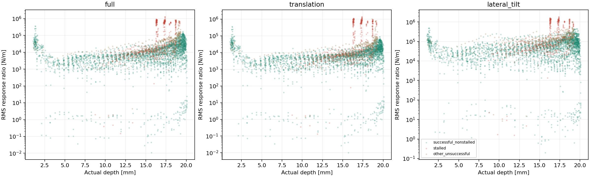
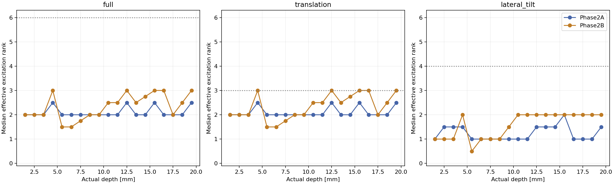
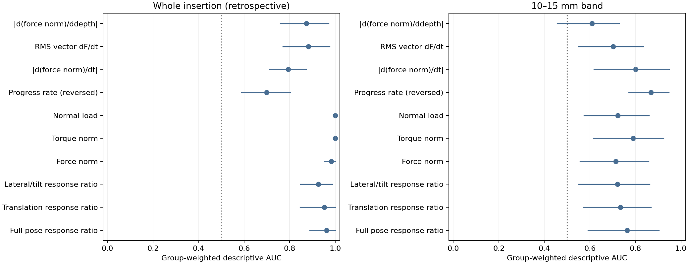
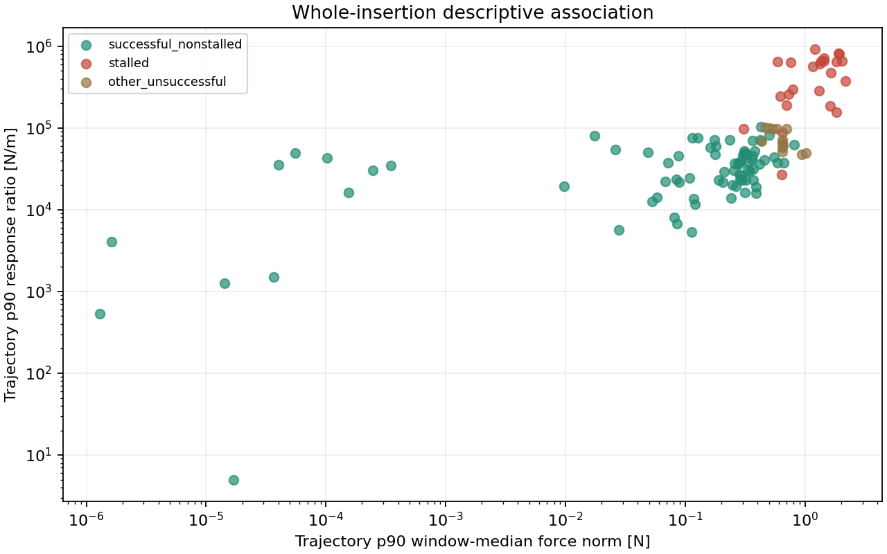

# Offline empirical contact response

Analyzed **170 / 170 references** and **7820 entered-insertion windows**. Outcomes: {'successful_nonstalled': 133, 'other_unsuccessful': 13, 'stalled': 24}.

**This is an observational proof of concept.** It estimates responses along recorded motion, not a causal stiffness matrix or an identified six-dimensional contact law. No probing or simulation changes were made.

## Main findings

**Full 6D identification is unsupported at the primary settings:** 0 of 7805 accepted windows have all six directions excited; median effective rank is 2. Translation has 3464 fully excited windows; lateral/tilt has 0. These counts do not establish causal identifiability.

**Some local continuation prediction is possible:** the loaded-window median full-model skill is 0.361 against zero wrench change and 0.365 against drift. But two-step differences give median skill 0.0734; the result depends on temporal sampling and should not be treated as a stable material property.

**No clear added discrimination over force in the early band:** 10–15 mm sensitivity AUC is 0.764, versus 0.714 for force on the same 157 references. Their paired difference interval is [-0.0161, 0.122]. Progress-rate AUC is 0.868; torque AUC is 0.789. These are descriptive outcome associations, not test-set predictive accuracy.

Within Phase 2B alone, early-band sensitivity AUC is 0.791 versus 0.816 for force. Cohort-specific results matter; pooling stages and paths does not remove their design confounding.

**Proceed only to a controlled active micro-probing identification pilot.** The observed association and excitation deficit justify collecting better measurements; this dataset does not justify deploying the fitted full matrix or claiming superior contact-response features. No active probes were implemented.

## Data and coordinate conventions

| Study | References | Physics Hz |
| --- | ---: | ---: |
| Forge-Phase2-100 | 100 | 120 |
| Forge-Phase2B-Stage1 | 24 | 120 |
| Forge-Phase2B-Stage2 | 20 | 120 |
| Forge-Phase2B-Stage3 | 13 | 120 |
| Forge-Phase2B-Stage4 | 13 | 120 |

Only each ledger reference `insertion.csv` is read for motion/wrench data. Approach, hold, negative-depth windows, recovery traces and replay prefixes are excluded. Existing success/stall/numerical labels are read unchanged. Other unsuccessful non-stalled references form a separate group. Comparisons also report the exploratory union of stalled and other unsuccessful references as difficult.

Actual peg-base translation is reconstructed as `[tip_x_mm, tip_y_mm, -depth_mm]/1000` up to an irrelevant constant. Archived logger code, unit scale and fixed zero fixture orientation are checked; fixture axes equal world axes in these studies. Orientation increments use the shortest world-frame SO(3) logarithm of `q_next * conjugate(q_previous)`, handling quaternion sign flips. The lateral/tilt model uses infinitesimal world roll/pitch increments, not Euler-angle subtraction. Hand motion and commanded pose are never predictors.

Wrench uses socket-on-peg contact force and torque, including friction, in world axes. Raw torque is about the moving peg base. Before differencing, torque is transported to the fixed first peg-base position of each window: `tau_anchor = tau_peg + (p - p_anchor) × F`. This removes the pure moving-origin torque artifact. All models within a window use this same anchor; coefficients are local to it.

## Local estimators and observability

Primary window: 0.25 s; stride: 0.1 s; lag: 1 physics step. Adjacent pose/wrench differences within a window are not smoothed. The primary ratio is `s = ||DeltaW_scaled||_F / ||DeltaXi_scaled||_F`, equivalent to the ratio of RMS increment norms. `endpoint_sensitivity` separately uses the first-to-last increment and is missing when net motion is unresolved.

Mixed units require a declared metric. With L=10 mm, pose is `[dp, L*dtheta]` in metres and wrench is `[F, tau/L]` in equivalent newtons; the ratio is N/m. Raw norms that add metres to radians or newtons to newton-metres are not used. Translation-only maps 3 translations to 3 forces; lateral/tilt maps dx,dy,dtheta_x,dtheta_y to Fx,Fy,Fz,tau_x,tau_y. Sensitivities across different model dimensions are not interchangeable material constants.

A window/model is rejected if RMS input motion is at most 1 micrometres in the scaled metric, no singular direction clears the excitation floor, or there are too few train/test pairs. Effective rank uses singular values greater than max(1% of the largest, motion floor × sqrt(number of pairs)). Numerical rank, unregularized full condition number, retained-subspace condition number, and singular vectors are separately recorded. These are analysis settings, not changes to simulation thresholds. A finite ridge inverse does not establish observability.

A separate 0.0001 N equivalent RMS response floor flags weak wrench changes and suppresses ill-defined normalized validation scores with near-zero baseline error. Absolute validation RMSE is still retained. The pose and wrench floors are explicit analysis choices, not calibrated sensor-noise bounds; weak-direction identification still requires an independent noise experiment.

Ridge fits have no intercept and use alpha = 0.001 × trace(XᵀX)/input_dimension in scaled coordinates. `local_models.jsonl` stores G in SI and scaled units, singular values and the excited input basis. Coefficients outside the excited subspace must not be interpreted. Even fully excited noisy designs are not automatically physically identifiable.

Temporal validation fits the first 65% of difference pairs and evaluates later pairs, skipping one pair at the boundary to avoid shared endpoint measurements. Skill is 1 − MSE_model/MSE_baseline, compared with zero wrench change and the training-mean wrench change (local drift). Nonpositive skill means no improvement. Validation projection coverage reports how much later motion lies in the training-excited subspace. This is local continuation checking, not independent trajectory-level model validation.

## Observability and local continuation fit

| Variant | Model | Accepted / windows | Fully excited | Median rank | Loaded validation windows | Test skill vs zero | vs drift | Fraction beating zero |
| --- | --- | ---: | ---: | ---: | ---: | ---: | ---: | ---: |
| primary | full | 7805 / 7820 | 0 | 2 | 2556 | 0.361 | 0.365 | 0.745 |
| primary | translation | 7804 / 7820 | 3464 | 2 | 2555 | 0.126 | 0.132 | 0.638 |
| primary | lateral_tilt | 7190 / 7820 | 0 | 2 | 2504 | 0.419 | 0.422 | 0.745 |
| length_5mm | full | 7804 / 7820 | 0 | 2 | 2555 | 0.242 | 0.244 | 0.698 |
| length_5mm | translation | 7804 / 7820 | 3464 | 2 | 2555 | 0.126 | 0.132 | 0.638 |
| length_5mm | lateral_tilt | 7165 / 7820 | 0 | 2 | 2479 | 0.352 | 0.354 | 0.739 |
| length_20mm | full | 7813 / 7820 | 2 | 2 | 2564 | 0.45 | 0.456 | 0.771 |
| length_20mm | translation | 7804 / 7820 | 3464 | 2 | 2555 | 0.126 | 0.132 | 0.638 |
| length_20mm | lateral_tilt | 7219 / 7820 | 21 | 2 | 2532 | 0.458 | 0.459 | 0.742 |
| lag_2_steps | full | 7801 / 7820 | 0 | 3 | 2552 | 0.0734 | 0.0832 | 0.556 |
| lag_2_steps | translation | 7798 / 7820 | 4700 | 3 | 2549 | 0.0134 | 0.022 | 0.518 |
| lag_2_steps | lateral_tilt | 7556 / 7820 | 0 | 2 | 2503 | 0.209 | 0.222 | 0.606 |
| window_500ms | full | 7473 / 7480 | 0 | 3 | 2474 | 0.393 | 0.393 | 0.805 |
| window_500ms | translation | 7468 / 7480 | 4265 | 3 | 2469 | 0.149 | 0.15 | 0.722 |
| window_500ms | lateral_tilt | 7072 / 7480 | 0 | 2 | 2431 | 0.447 | 0.452 | 0.8 |

Loaded-contact summaries above require positive recorded normal load in at least half of samples. Contact counts alone are insufficient: the solver can report candidate contacts without nonzero load. The CSV includes both contact-count and positive-load fractions, zero-response fits and rejected-motion windows. Normalized validation summaries additionally require resolved later wrench change. These window-level counts are descriptive, not independent sample sizes.

## Comparison against simple baselines

One feature value per trajectory is used: p90 of window features, except median progress rate. Force and torque baselines are window-median norms; normal load is the window median. dF/dt includes a local time slope of force magnitude and an RMS vector-force difference/time baseline that captures fast fluctuation without a pose denominator. dF/ddepth fits scalar force-magnitude increments against actual depth increments and is missing if depth motion is unresolved. Slope comparisons use absolute values. Progress is scored with the opposite sign; other score directions were fixed before inspecting outcomes.

Whole-insertion features describe the completed outcome and can include an already-stalled interval. The predefined 10–15 mm band uses only windows wholly within that band to reduce terminal-state/depth confounding; it is not automatically a pre-stall forecast. Group-weighted AUCs are descriptive associations, not trained-model test scores. Positive class is stalled (or the explicitly indicated difficult union). No classifier, threshold tuning or train/test split is performed.

There are 117 split groups, of which 13 contain stalled references; 4 exact CSV duplicates and 7 repeated command configurations. All centered controls share one group; Phase 2B path amplitudes share their path group across stages. Every group has total weight one. Confidence intervals bootstrap groups, not overlapping windows; this handles clustered repeats but not all shared pre-ramp histories or adaptive-selection bias.

Each feature is compared with force on exactly the same available trajectory subset. Missing reduced-model features can change that subset, so rows with different sample counts are not direct model rankings. Phase-specific results are included to expose cohort confounding. The force comparison is paired but does not establish incremental predictive value beyond all baselines jointly.

| Cohort | Scope | Feature | N / groups | AUC [95% cluster interval] | Delta vs force [95% interval] |
| --- | --- | --- | ---: | --- | --- |
| all | whole | full_sensitivity | 157 / 111 | 0.963 [0.888, 1] | -0.0204 [-0.0958, 0.0362] |
| all | whole | translation_sensitivity | 157 / 111 | 0.951 [0.846, 1] | -0.0319 [-0.136, 0.0375] |
| all | whole | lateral_tilt_sensitivity | 157 / 111 | 0.926 [0.847, 0.986] | -0.0568 [-0.143, 0.0125] |
| all | whole | force_norm | 157 / 111 | 0.983 [0.951, 1] | 0 [0, 0] |
| all | whole | torque_norm | 157 / 111 | 1 [1, 1] | 0.0167 [0, 0.0486] |
| all | whole | normal_load | 157 / 111 | 1 [1, 1] | 0.0167 [0, 0.0486] |
| all | whole | progress_rate | 157 / 111 | 0.699 [0.588, 0.802] | -0.284 [-0.395, -0.186] |
| all | whole | abs_dforce_dt | 157 / 111 | 0.793 [0.712, 0.871] | -0.19 [-0.268, -0.117] |
| all | whole | rms_dforce_dt | 157 / 111 | 0.883 [0.77, 0.975] | -0.101 [-0.213, -0.00316] |
| all | whole | abs_dforce_ddepth | 157 / 111 | 0.874 [0.759, 0.971] | -0.11 [-0.219, -0.0173] |
| all | band10_15 | full_sensitivity | 157 / 111 | 0.764 [0.592, 0.903] | 0.05 [-0.0161, 0.122] |
| all | band10_15 | translation_sensitivity | 157 / 111 | 0.734 [0.572, 0.868] | 0.0199 [-0.0384, 0.0821] |
| all | band10_15 | lateral_tilt_sensitivity | 157 / 111 | 0.721 [0.551, 0.862] | 0.00732 [-0.0565, 0.0817] |
| all | band10_15 | force_norm | 157 / 111 | 0.714 [0.557, 0.858] | 0 [0, 0] |
| all | band10_15 | torque_norm | 157 / 111 | 0.789 [0.615, 0.923] | 0.0756 [0.0294, 0.13] |
| all | band10_15 | normal_load | 157 / 111 | 0.722 [0.574, 0.86] | 0.00854 [0.0011, 0.0218] |
| all | band10_15 | progress_rate | 157 / 111 | 0.868 [0.77, 0.946] | 0.154 [0.0582, 0.265] |
| all | band10_15 | abs_dforce_dt | 157 / 111 | 0.802 [0.617, 0.948] | 0.088 [0.017, 0.16] |
| all | band10_15 | rms_dforce_dt | 157 / 111 | 0.702 [0.549, 0.834] | -0.0119 [-0.0725, 0.0543] |
| all | band10_15 | abs_dforce_ddepth | 157 / 111 | 0.609 [0.456, 0.728] | -0.105 [-0.191, -0.0216] |
| Phase2A | whole | full_sensitivity | 96 / 89 | 0.884 [0.625, 1] | -0.101 [-0.347, 0.0231] |
| Phase2A | whole | translation_sensitivity | 96 / 89 | 0.845 [0.505, 1] | -0.14 [-0.477, 0.0341] |
| Phase2A | whole | lateral_tilt_sensitivity | 96 / 89 | 0.826 [0.564, 0.98] | -0.159 [-0.436, 0] |
| Phase2A | whole | force_norm | 96 / 89 | 0.984 [0.953, 1] | 0 [0, 0] |
| Phase2A | whole | torque_norm | 96 / 89 | 1 [1, 1] | 0.0155 [0, 0.0465] |
| Phase2A | whole | normal_load | 96 / 89 | 1 [1, 1] | 0.0155 [0, 0.0465] |
| Phase2A | whole | progress_rate | 96 / 89 | 0.651 [0.528, 0.784] | -0.333 [-0.463, -0.195] |
| Phase2A | whole | abs_dforce_dt | 96 / 89 | 0.717 [0.574, 0.845] | -0.267 [-0.398, -0.155] |
| Phase2A | whole | rms_dforce_dt | 96 / 89 | 0.643 [0.508, 0.757] | -0.341 [-0.471, -0.237] |
| Phase2A | whole | abs_dforce_ddepth | 96 / 89 | 0.736 [0.409, 1] | -0.248 [-0.565, 0] |
| Phase2A | band10_15 | full_sensitivity | 96 / 89 | 0.895 [0.822, 0.953] | 0.132 [-0.0347, 0.29] |
| Phase2A | band10_15 | translation_sensitivity | 96 / 89 | 0.822 [0.739, 0.895] | 0.0581 [-0.121, 0.207] |
| Phase2A | band10_15 | lateral_tilt_sensitivity | 96 / 89 | 0.88 [0.691, 0.977] | 0.116 [0.00813, 0.248] |
| Phase2A | band10_15 | force_norm | 96 / 89 | 0.764 [0.627, 0.909] | 0 [0, 0] |
| Phase2A | band10_15 | torque_norm | 96 / 89 | 0.961 [0.907, 1] | 0.198 [0.0909, 0.318] |
| Phase2A | band10_15 | normal_load | 96 / 89 | 0.764 [0.627, 0.909] | 0 [0, 0] |
| Phase2A | band10_15 | progress_rate | 96 / 89 | 0.973 [0.926, 1] | 0.209 [0.0807, 0.343] |
| Phase2A | band10_15 | abs_dforce_dt | 96 / 89 | 0.953 [0.898, 0.994] | 0.19 [0.0588, 0.32] |
| Phase2A | band10_15 | rms_dforce_dt | 96 / 89 | 0.767 [0.66, 0.863] | 0.00388 [-0.206, 0.189] |
| Phase2A | band10_15 | abs_dforce_ddepth | 96 / 89 | 0.655 [0.506, 0.803] | -0.109 [-0.361, 0.126] |
| Phase2B | whole | full_sensitivity | 61 / 22 | 1 [1, 1] | 0.00823 [-2.22e-16, 0.0298] |
| Phase2B | whole | translation_sensitivity | 61 / 22 | 1 [1, 1] | 0.00823 [-2.22e-16, 0.0298] |
| Phase2B | whole | lateral_tilt_sensitivity | 61 / 22 | 0.948 [0.881, 0.995] | -0.0441 [-0.114, 0.00477] |
| Phase2B | whole | force_norm | 61 / 22 | 0.992 [0.97, 1] | 0 [0, 0] |
| Phase2B | whole | torque_norm | 61 / 22 | 1 [1, 1] | 0.00823 [-2.22e-16, 0.0298] |
| Phase2B | whole | normal_load | 61 / 22 | 1 [1, 1] | 0.00823 [-2.22e-16, 0.0298] |
| Phase2B | whole | progress_rate | 61 / 22 | 0.811 [0.622, 0.947] | -0.18 [-0.378, -0.0345] |
| Phase2B | whole | abs_dforce_dt | 61 / 22 | 0.986 [0.961, 1] | -0.00529 [-0.0298, 0.0179] |
| Phase2B | whole | rms_dforce_dt | 61 / 22 | 0.984 [0.95, 1] | -0.00745 [-0.0488, 0.0258] |
| Phase2B | whole | abs_dforce_ddepth | 61 / 22 | 0.923 [0.84, 0.99] | -0.0688 [-0.149, -0.00712] |
| Phase2B | band10_15 | full_sensitivity | 61 / 22 | 0.791 [0.606, 0.946] | -0.0249 [-0.064, 0.0106] |
| Phase2B | band10_15 | translation_sensitivity | 61 / 22 | 0.791 [0.606, 0.946] | -0.0249 [-0.064, 0.0106] |
| Phase2B | band10_15 | lateral_tilt_sensitivity | 61 / 22 | 0.792 [0.606, 0.944] | -0.0243 [-0.0635, 0.0108] |
| Phase2B | band10_15 | force_norm | 61 / 22 | 0.816 [0.641, 0.945] | 0 [0, 0] |
| Phase2B | band10_15 | torque_norm | 61 / 22 | 0.819 [0.646, 0.947] | 0.00235 [0, 0.0107] |
| Phase2B | band10_15 | normal_load | 61 / 22 | 0.816 [0.641, 0.945] | 0 [0, 0] |
| Phase2B | band10_15 | progress_rate | 61 / 22 | 0.818 [0.666, 0.933] | 0.0017 [-0.121, 0.119] |
| Phase2B | band10_15 | abs_dforce_dt | 61 / 22 | 0.789 [0.604, 0.94] | -0.0272 [-0.0684, 0.01] |
| Phase2B | band10_15 | rms_dforce_dt | 61 / 22 | 0.79 [0.602, 0.944] | -0.0261 [-0.0662, 0.0105] |
| Phase2B | band10_15 | abs_dforce_ddepth | 61 / 22 | 0.768 [0.587, 0.918] | -0.048 [-0.0959, -0.00167] |

Full comparisons, including other unsuccessful references, are in `feature_comparison.csv`. `robustness_comparison.csv` repeats sensitivity associations at L=5/20 mm, two-step differences, and 0.5 s windows; these checks are not used to select a winning hyperparameter.

## What this supports next

These trajectories can test whether a locally measured direction of motion covaries with wrench change. They cannot by themselves establish a full contact-response matrix or causal benefit from a corrective action: pose and force evolve together under feedback, and contact switching, velocity, friction history and differencing noise remain confounders. A large ratio can result from a small denominator or force chatter, not necessarily useful contact stiffness.

Active micro-probing is a reasonable **next identification experiment**, rather than a validated controller deployment, if the observed contact response and missing excitation motivate it. The next experiment should deliberately excite independent small pose directions with repeated signed probes at matched states, compare against no-motion wrench variability, and assess held-out response prediction. Independent noise calibration is needed to interpret weak singular directions. No active probing is implemented here.

## Reproduce and audit

```bash
conda activate franka-safe-recovery
python -m research.contact_response --outputs-root outputs --output outputs/Contact-Response-Offline-v1
python -m unittest tests.test_contact_response -v
```

Use a new output directory for a rerun. `analysis.json` records settings and counts; `source_files.json` records source hashes and verifies that all pre-existing output file sizes/mtimes and all consumed input hashes remain unchanged. Saved simulation labels, geometry, friction, thresholds and prior outputs are untouched.

Only positive response ratios are displayed on logarithmic axes. Zero-response and rejected-motion windows remain in `window_features.csv`.









## Post-analysis verification

The focused math tests passed (17 tests), as did the full unit suite (71 tests). The audit reverified 195 consumed-input hashes and unchanged metadata for 3050 pre-existing output files. See [validation.json](validation.json).

Measured insertion-step translation: median 39.22 micrometres, 99th percentile 65.68 micrometres, maximum 184.38 micrometres. Rotation: 99th percentile 0.01767 degrees, maximum 0.08106 degrees. These describe actual increments; commanded motion is not used in the fits.
