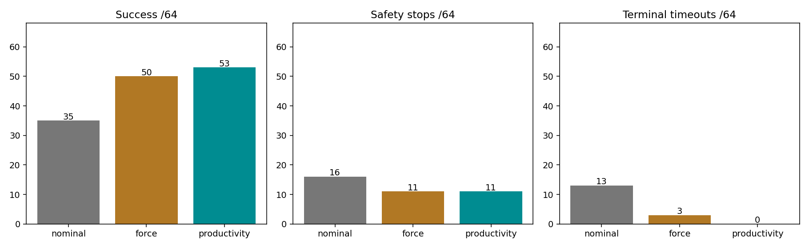
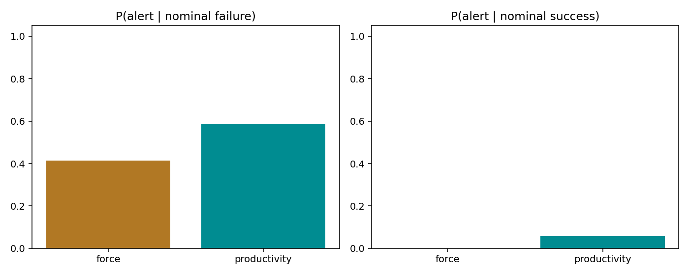
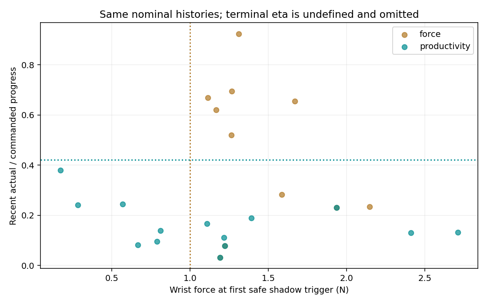

> Audit erratum: the original frozen SciPy reconstruction passed 383/384 episodes and failed one near-identity rotation case. A separately archived postcollection replay using the actual Isaac Lab float32 math passed all 384 with every original assertion and tolerance unchanged. The original failure is retained in `validation/frozen_audit_diagnostic.json`; see [audit erratum](validation/audit_erratum.md). No detector, recovery, budget, physics, outcome, selection rule, metric, or paired-matching criterion changed.

# Force versus Contact Productivity: identical de-wedging recovery

32 new development conditions (192 episodes) selected force **> 1 N for two checks**. A separate frozen set of 64 new conditions compared nominal, force + de-wedging and productivity-v2 + the exact same de-wedging (192 episodes). No held-out outcomes selected any threshold or policy.

| Subset | Policy | Success | Safety stops | Grasp failures | Terminal timeouts | Stalled runs |
|---|---|---:|---:|---:|---:|---:|
| all | nominal | 35/64 | 16 | 16 | 13 | 10 |
| all | force | 50/64 | 11 | 11 | 3 | 3 |
| all | productivity | 53/64 | 11 | 11 | 0 | 6 |
| moderate | nominal | 18/28 | 2 | 2 | 8 | 2 |
| moderate | force | 23/28 | 2 | 2 | 3 | 2 |
| moderate | productivity | 26/28 | 2 | 2 | 0 | 2 |
| severe | nominal | 9/28 | 14 | 14 | 5 | 8 |
| severe | force | 19/28 | 9 | 9 | 0 | 1 |
| severe | productivity | 19/28 | 9 | 9 | 0 | 4 |
| strict_matched | nominal | 17/28 | 7 | 7 | 4 | 1 |
| strict_matched | force | 20/28 | 6 | 6 | 2 | 0 |
| strict_matched | productivity | 24/28 | 4 | 4 | 0 | 0 |

## Paired detector comparison

| Subset | N | Productivity wins | Force wins | Both succeed | Both fail | Difference [95% CI] | Exact paired p |
|---|---:|---:|---:|---:|---:|---|---:|
| all | 64 | 5 | 2 | 48 | 9 | +4.7 pp [-3.1, +12.5] | 0.453125 |
| moderate | 28 | 3 | 0 | 23 | 2 | +10.7 pp [+3.6, +21.4] | 0.25 |
| severe | 28 | 2 | 2 | 17 | 7 | +0.0 pp [-10.7, +10.7] | 1 |
| strict_matched | 28 | 4 | 0 | 20 | 4 | +14.3 pp [+7.1, +21.4] | 0.125 |

Primary inference is the exact two-sided conditional McNemar/binomial test across all 64 paired conditions. The 95% percentile interval uses 10,000 paired condition bootstraps stratified by family (seed 20260919). Secondary moderate/severe and matched analyses are descriptive. Sparse discordances can make bootstrap intervals optimistic; a degenerate interval does not establish equivalence. Conditions are a structured test, not a random population sample.

## Shared-history detector quality

| Subset | Detector | P(alert given failure) | P(alert given success) | Actual interventions on nominal successes | Median safety lead (s) | Median stall lead (s) |
|---|---|---|---|---:|---:|---:|
| all | force | 12/29 (0.414) | 0/35 (0.000) | 0 | 0.187 | 0.100 |
| all | productivity | 17/29 (0.586) | 2/35 (0.057) | 1 | 0.287 | 0.000 |
| moderate | force | 4/10 (0.400) | 0/18 (0.000) | 0 | N/A | -1.317 |
| moderate | productivity | 8/10 (0.800) | 0/18 (0.000) | 0 | N/A | -0.017 |
| severe | force | 8/19 (0.421) | 0/9 (0.000) | 0 | 0.187 | 0.133 |
| severe | productivity | 9/19 (0.474) | 2/9 (0.222) | 1 | 0.287 | 0.042 |
| strict_matched | force | 1/11 (0.091) | 0/17 (0.000) | 0 | N/A | 0.350 |
| strict_matched | productivity | 6/11 (0.545) | 1/17 (0.059) | 0 | 0.208 | 0.050 |

Both shadow detectors see exactly the same nominal history. Only safe alarm samples count. Positive lead means the first safe alarm preceded the first nominal stall/safety stop; negative means it followed the first stall. Medians condition on an alarm and an event; missed cases remain in coverage denominators. An endpoint timeout is not converted into a fictitious early safety warning.

A detector alert on a nominal trajectory that subsequently succeeds is the conservative unnecessary-trigger label. Actual intervention on a paired nominal success is separately reported because resets can differ. Strict nominal-versus-controller match counts are in policy_summary.csv and shadow_detector_analysis.csv. Nominal safety events alerted at least 0.1 s early: force 4/16, productivity 3/16.

## Recovery held identical

| Policy | Intervened runs | Attempts | Verified | Ready | Retry success / retries | Repeated stalls | Mean final depth (mm) | Safety before / during recovery |
|---|---:|---:|---:|---:|---:|---:|---:|---:|
| nominal | 0 | 0 | 0 | 0 | 0/0 | 0 | 19.116 | 16 / 0 |
| force | 15 | 15 | 15 | 15 | 15/15 | 0 | 19.568 | 11 / 0 |
| productivity | 19 | 19 | 19 | 19 | 19/19 | 0 | 19.591 | 11 / 0 |

Force and productivity bind the same execute_dewedge code object. Only Detector, recent_signal, and diagnostic Stream bindings differ. There is no old fixed-command force recovery in this experiment. Both retain identical x/y and roll/pitch relaxation, axial retraction, ≥0.5 mm actual retreat held for 0.25 s, post-verification hold, retry pose, motion/time budgets, gains and hard safety. Verified and ready-to-retry are distinct because the extra frozen hold can still fail. No normal load enters either online detector.

## Discordances and mechanism examples

| Discordant condition | Force outcome | Productivity outcome | Actual first trigger | Same-nominal first trigger | Force at productivity trigger (N) | Eta at force trigger | Strict match |
|---|---|---|---|---|---:|---:|---|
| [ft026_axis_tilt_moderate_v2](conditions/ft026_axis_tilt_moderate_v2.png) | time_budget_exhausted | insertion_success | productivity_only | productivity_only | 0.626 | N/A | True |
| [ft027_axis_tilt_moderate_v3](conditions/ft027_axis_tilt_moderate_v3.png) | time_budget_exhausted | insertion_success | productivity_only | productivity_only | 0.373 | N/A | True |
| [ft030_axis_tilt_severe_v2](conditions/ft030_axis_tilt_severe_v2.png) | grasp_retention_limit | insertion_success | productivity_only | productivity_only | 0.238 | N/A | True |
| [ft034_oblique_tilt_moderate_v2](conditions/ft034_oblique_tilt_moderate_v2.png) | time_budget_exhausted | insertion_success | productivity_only | productivity_only | 0.496 | N/A | False |
| [ft037_oblique_tilt_severe_v1](conditions/ft037_oblique_tilt_severe_v1.png) | insertion_success | grasp_retention_limit | force_only | force_only | N/A | 0.952 | False |
| [ft038_oblique_tilt_severe_v2](conditions/ft038_oblique_tilt_severe_v2.png) | insertion_success | grasp_retention_limit | force_only | force_only | N/A | 0.631 | False |
| [ft055_terminal_band_severe_v3](conditions/ft055_terminal_band_severe_v3.png) | grasp_retention_limit | insertion_success | productivity_only | neither | 1.045 | N/A | True |

discordant_cases.csv records every discordance, both actual and shared-history trigger times, whether only one detector alerts, force/eta and actual/commanded progress rates at each actual trigger, outcomes, privileged diagnostic load and strict match errors. States after the first intervention can diverge; their later trigger times are descriptive, not equivalent-state causal evidence.

A: 16 nominal trajectories had a safe productivity alarm with force ≤ the selected threshold and either meaningful low eta or terminal stagnation. Among these, 7 nominal failures had no safe force alarm anywhere. A force-below-threshold sample alone is not counted as a miss if force alerted earlier. Endpoint eta is undefined (command progress is zero), so terminal cases are labelled separately rather than assigned eta=0.

B: 6 nominal trajectories had a safe force alarm with eta ≥ 0.4212659765112803; 0 of these subsequently succeeded naturally. Here healthy means above the frozen normal productivity-trigger threshold, not a guarantee of safe future progress. Elevated force with healthy current progress on a later-failed trajectory can be useful early warning, not an unnecessary intervention.

On nominal failures, shared-history alert overlap: both 10, force only 2, productivity only 7, neither 10. This measures potential complementarity, not hybrid controller performance. Neither threshold nor hybrid logic was tuned on the held-out data.

Similar timing/decisions: 3 conditions with identical first safe shadow alert times; 43 with neither detector alerting. Same final success status: 57/64.

## Answers to the scientific questions

1. With recovery identical, observed productivity success was 53/64 versus force 50/64, a +4.7 percentage-point difference (exact paired p=0.453125). The strict matched subset contains 28 conditions; its separate paired table is essential. Unmatched outcome differences alone do not establish detector superiority.
2. Force missed all safe alarms on 7 failed nominal trajectories exhibiting low-force low-eta or terminal-stagnation productivity alarms. See the A examples and whether force alerted earlier or later.
3. Force alerted on 0/35 naturally successful nominal trajectories; 0 of those have a recorded high-force/healthy-eta example. Productivity alerted on 2/35 natural successes.
4. Unique failed-case coverage was force 2 versus productivity 7. Complementarity is supported only to that extent; no hybrid intervention outcome was measured.
5. This ablation estimates the effect of changing the detector while holding recovery fixed. Improvements of either active policy over nominal measure that complete detector-plus-recovery system. It cannot separately quantify how much the earlier fixed-retract versus de-wedging action contributed; doing so would require a matched recovery-action ablation. No recovery advantage is attributed to the detector here.

## Remaining failures

| Family | Force failure outcomes | Productivity failure outcomes |
|---|---|---|
| axis_offset | {} | {} |
| axis_tilt | {'time_budget_exhausted': 2, 'grasp_retention_limit': 2} | {'grasp_retention_limit': 1} |
| combined | {'grasp_retention_limit': 3} | {'grasp_retention_limit': 3} |
| easy_controls | {} | {} |
| late_combined | {'grasp_retention_limit': 5} | {'grasp_retention_limit': 5} |
| oblique_offset | {} | {} |
| oblique_tilt | {'time_budget_exhausted': 1} | {'grasp_retention_limit': 2} |
| terminal_band | {'grasp_retention_limit': 1} | {} |

Every safety failure and timeout remains in the primary denominator. Strict matching requires every common-prefix sample through the earlier first intervention or episode end to pass unchanged FORGE pose, joints, velocities, wrench, grasp, finger and contact-state tolerances. Privileged load is used only in this offline matching/diagnostic audit. The matched subset is selective and can be smaller; it never replaces the full-set results. One execution per condition/policy is not a repeatability study.

## Development lock, fairness and provenance

Force threshold was selected solely from 32 new nominal development histories; all five candidates also received 32 closed-loop runs for reporting. False-alert cap met: True. Selection details, all candidates, lead times and closed-loop outcomes are in [force_detector_dev_report.md](force_detector_dev_report.md). Configuration frozen at 2026-09-16T17:50:58.537700+00:00, SHA256 `e6e7f8cc2faa72c0dbba302a80cb7b29fea0a30c822d911592467dcd153654c2`.

Full 0.5 s causal history in one insert or hold phase/segment, above the same contact-onset +0.1 mm gate, finite measured force. No positive-command-progress or success-depth restriction. Geometry/phase are common eligibility metadata, not predictive force features. Current deployable wrist force norm strictly greater than threshold at two consecutive 0.1 s checks. No eta, velocity, normal load, or future information enters the force decision.

Force eligibility uses the same measured contact-onset gate and full causal history convention as productivity. It allows both insertion and endpoint hold, and does not require positive commanded progress or a low depth, so it is not artificially prevented from detecting terminal contact. Pose is common eligibility metadata, not a predictive force feature. Eta logged with force events is diagnostic only. The frozen productivity-v2 normal/urgent/terminal branches and all their eligibility rules are unchanged.

The full development and held-out condition plan and complete collection/analysis sources were frozen before collection. The sets contain 32 and 64 mutually disjoint paths, with zero exact overlap against all earlier FORGE paths, the 80-condition v2 development set and the previous 48- and 64-condition benchmarks. Previous parameter descriptors were used only to exclude duplicates; no old outcome selected a force threshold. Easy controls are fresh nearly aligned paths because exact centered paths already exist.

Native FORGE physics remains 120 Hz. Same assets, contact settings, gains, reset seed, original solver priming, safety/grasp limits, success/stall definitions, 8 s insertion command and trajectory generator. No clearance changes. Policy order and conditions are predeclared; no outcome-driven exclusions, replacements, extra repeats, early stopping or test tuning. Force-rise and hybrid were omitted before collection.

Validation passed: 543727 physics rows, 45120 checks, 46 recovery attempts. Original recovery commands and hard-safety priority were replayed, with independent force/v2 decision reconstruction. 63 source archives verified; 5877 prior files unchanged. validation.json and provenance_audit.json retain the hashes, configuration lock and environment evidence.

Artifacts: summary.csv (192 held-out episodes), development_summary.csv (192 development episodes), policy_summary.csv, detector_comparison.csv, shadow_detector_analysis.csv, paired_comparisons.csv, paired_statistics.csv, discordant_cases.csv, recovery_events.csv, failure_cases.csv, mechanism_examples.csv, force_detector_config.json and its .sha256 file, condition_plan.json, per-run CSV/events/metrics and 64 condition plots.

Command: `./force_productivity_dewedge.sh --headless`. Existing output directories and selected configurations are never overwritten. Offline analysis: `python -m research.force_productivity_report outputs/Force-vs-Productivity-Dewedge-v1`.

