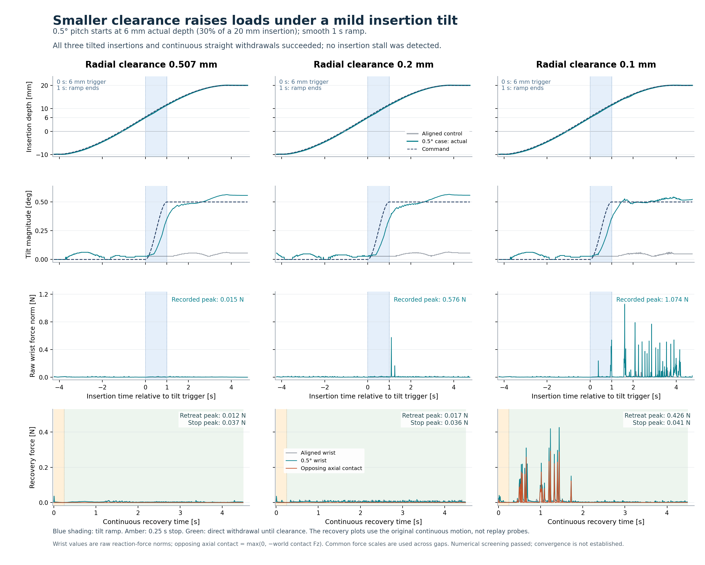
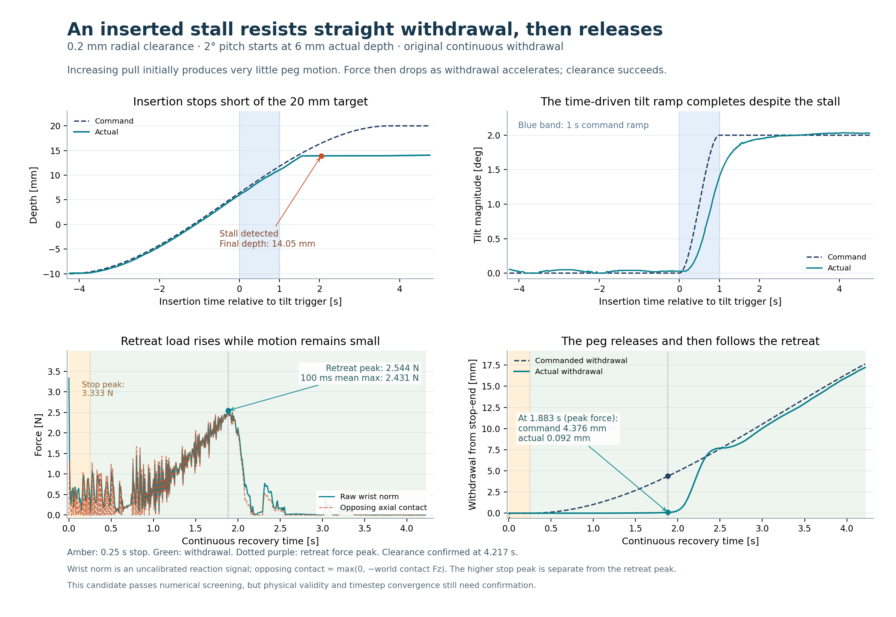
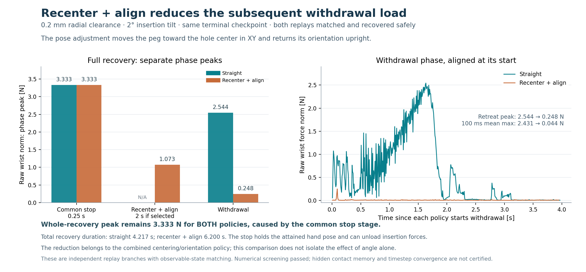
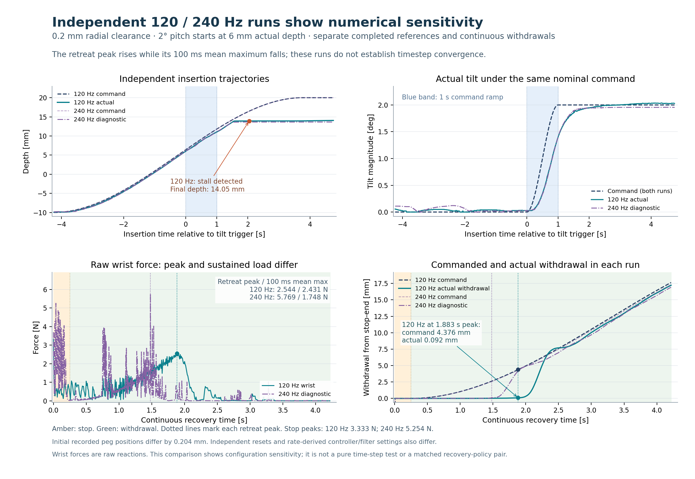

# 间隙与插入倾角实验：120 Hz 主批完整结果

**主批已结束：23 个计划条件均已尝试，共 39 条参考记录；19 个条件通过数值筛查，4 个条件在重试后仍数值无效。** 状态 `target_not_met` 表示没有收齐 23 个数值有效条件，不是仍在采集，也不等于研究假设被否定。

**本轮找到了有价值的候选现象：0.2 mm 间隙、30% 深度触发 +2° 倾角时，插入停在约 14.05 mm；直接退出先建立约 2.54 N 的持续载荷而实际移动很小，随后释放。匹配的终止状态测试中，回中＋姿态对齐将实际退出阶段峰值降至约 0.25 N。** 这支持继续研究卡滞和恢复策略，但尚未证明不可恢复边界、材料损伤机制或数值收敛。

## 1. 实验范围与完成情况

- 固定插销几何尺寸；名义**单边径向间隙**为 0.507、0.4、0.3、0.2、0.1 mm。修改实际孔碰撞网格，并记录真实最小间隙。
- 五档各有一个对齐基线；仅 0.507、0.2、0.1 mm 三档展开倾角实验：实际深度达到 6／10／14 mm，即 30%／50%／70%，再用 1 秒平滑施加 +0.5° 或 +2° pitch，共 18 个扰动条件。
- 深度负责触发，触发后的倾角按时间继续增加。18 个扰动条件的最新记录都触发且完成了**命令**倾角变化；实际倾角独立测量，不能用命令角代替。
- 使用原有刚体 SDF 接触、摩擦和控制参数；没有加入塑料形变、损伤、凸起或人为卡滞力。

| 名义间隙 mm | 计划条件 | 数值有效条件 | 有效插入成功 | 有效插入停滞 | 有效且连续直退成功 |
|---:|---:|---:|---:|---:|---:|
| 0.507 | 7 | 7 | 7 | 0 | 7 |
| 0.400 | 1 | 1 | 1 | 0 | 1 |
| 0.300 | 1 | 1 | 1 | 0 | 1 |
| 0.200 | 7 | 6 | 4 | 2 | 5 |
| 0.100 | 7 | 4 | 4 | 0 | 4 |
| **合计** | **23** | **19** | **17** | **2** | **18** |

其余一个数值有效条件在连续恢复的 **stop 阶段触发夹持保持限制**，没有进入实际退出阶段。4 个数值无效条件不计入物理成功、物理停滞或不可恢复判断。

## 2. 全部 23 个条件

每个条件仅展示最新尝试；全部 39 次尝试仍保留在数据表。实际角度为参考结束时的倾角，深度为最大实际深度。参考腕峰覆盖参考轨迹；“直退峰”只覆盖原参考之后连续执行的 `retreat` 阶段。原始腕部反力模长不是经过标定的纯轴向拔出驱动力。

数值无效条件在本表省略物理数值，原始诊断值仍在 CSV 中；`—` 也可表示实际退出阶段未发生，**不能当作 0 N**。点击条件可打开原始轨迹记录。

### 单边间隙 0.507 mm

| 条件：触发 / 目标角 | 实际角 ° | 最大深度 mm | 参考腕峰 N | 直退阶段腕峰 N | 结果 |
|---|---:|---:|---:|---:|---|
| [对齐基线](../Forge-GapTilt-Pilot-20260915/gap_0507/g0507_aligned_try00/trajectory.json) | 0.056 | 20.11 | 0.014 | 0.012 | 插入成功；直退成功 |
| [30% / +0.5°](../Forge-GapTilt-Pilot-20260915/gap_0507/g0507_d30_pitch_pos05_try00/trajectory.json) | 0.557 | 20.11 | 0.015 | 0.012 | 插入成功；直退成功 |
| [30% / +2°](../Forge-GapTilt-Pilot-20260915/gap_0507/g0507_d30_pitch_pos20_try00/trajectory.json) | 2.009 | 19.99 | 1.789 | 0.309 | 插入成功；直退成功 |
| [50% / +0.5°](../Forge-GapTilt-Pilot-20260915/gap_0507/g0507_d50_pitch_pos05_try00/trajectory.json) | 0.557 | 20.11 | 0.017 | 0.012 | 插入成功；直退成功 |
| [50% / +2°](../Forge-GapTilt-Pilot-20260915/gap_0507/g0507_d50_pitch_pos20_try00/trajectory.json) | 2.018 | 19.98 | 2.182 | 0.509 | 插入成功；直退成功 |
| [70% / +0.5°](../Forge-GapTilt-Pilot-20260915/gap_0507/g0507_d70_pitch_pos05_try00/trajectory.json) | 0.514 | 20.11 | 0.017 | 0.012 | 插入成功；直退成功 |
| [70% / +2°](../Forge-GapTilt-Pilot-20260915/gap_0507/g0507_d70_pitch_pos20_try00/trajectory.json) | 1.996 | 20.01 | 3.414 | 0.438 | 插入成功；直退成功 |

### 单边间隙 0.4 mm

| 条件：触发 / 目标角 | 实际角 ° | 最大深度 mm | 参考腕峰 N | 直退阶段腕峰 N | 结果 |
|---|---:|---:|---:|---:|---|
| [对齐基线](../Forge-GapTilt-Pilot-20260915/gap_0400/g0400_aligned_try00/trajectory.json) | 0.056 | 20.11 | 0.023 | 0.016 | 插入成功；直退成功 |

### 单边间隙 0.3 mm

| 条件：触发 / 目标角 | 实际角 ° | 最大深度 mm | 参考腕峰 N | 直退阶段腕峰 N | 结果 |
|---|---:|---:|---:|---:|---|
| [对齐基线](../Forge-GapTilt-Pilot-20260915/gap_0300/g0300_aligned_try00/trajectory.json) | 0.056 | 20.11 | 0.014 | 0.012 | 插入成功；直退成功 |

### 单边间隙 0.2 mm

| 条件：触发 / 目标角 | 实际角 ° | 最大深度 mm | 参考腕峰 N | 直退阶段腕峰 N | 结果 |
|---|---:|---:|---:|---:|---|
| [对齐基线](../Forge-GapTilt-Pilot-20260915/gap_0200/g0200_aligned_try00/trajectory.json) | 0.056 | 20.11 | 0.023 | 0.016 | 插入成功；直退成功 |
| [30% / +0.5°](../Forge-GapTilt-Pilot-20260915/gap_0200/g0200_d30_pitch_pos05_try00/trajectory.json) | 0.558 | 20.11 | 0.576 | 0.017 | 插入成功；直退成功 |
| [30% / +2°](../Forge-GapTilt-Pilot-20260915/gap_0200/g0200_d30_pitch_pos20_try00/trajectory.json) | 2.028 | 14.05 | 4.193 | 2.544 | **插入停滞；直退成功** |
| [50% / +0.5°](../Forge-GapTilt-Pilot-20260915/gap_0200/g0200_d50_pitch_pos05_try00/trajectory.json) | 0.557 | 20.11 | 0.631 | 0.015 | 插入成功；直退成功 |
| [50% / +2°](../Forge-GapTilt-Pilot-20260915/gap_0200/g0200_d50_pitch_pos20_try00/trajectory.json) | 1.918 | 15.47 | 3.503 | — | **插入停滞；stop 夹持失败** |
| [70% / +0.5°](../Forge-GapTilt-Pilot-20260915/gap_0200/g0200_d70_pitch_pos05_try00/trajectory.json) | 0.523 | 20.09 | 0.745 | 0.131 | 插入成功；直退成功 |
| [70% / +2°](../Forge-GapTilt-Pilot-20260915/gap_0200/g0200_d70_pitch_pos20_try04/trajectory.json) | — | — | — | — | 数值无效（5 次尝试） |

### 单边间隙 0.1 mm

| 条件：触发 / 目标角 | 实际角 ° | 最大深度 mm | 参考腕峰 N | 直退阶段腕峰 N | 结果 |
|---|---:|---:|---:|---:|---|
| [对齐基线](../Forge-GapTilt-Pilot-20260915/gap_0100/g0100_aligned_try00/trajectory.json) | 0.048 | 20.09 | 0.094 | 0.019 | 插入成功；直退成功 |
| [30% / +0.5°](../Forge-GapTilt-Pilot-20260915/gap_0100/g0100_d30_pitch_pos05_try00/trajectory.json) | 0.523 | 20.11 | 1.074 | 0.426 | 插入成功；直退成功 |
| [30% / +2°](../Forge-GapTilt-Pilot-20260915/gap_0100/g0100_d30_pitch_pos20_try04/trajectory.json) | — | — | — | — | 数值无效（5 次尝试） |
| [50% / +0.5°](../Forge-GapTilt-Pilot-20260915/gap_0100/g0100_d50_pitch_pos05_try00/trajectory.json) | 0.508 | 20.12 | 1.292 | 0.353 | 插入成功；直退成功 |
| [50% / +2°](../Forge-GapTilt-Pilot-20260915/gap_0100/g0100_d50_pitch_pos20_try04/trajectory.json) | — | — | — | — | 数值无效（5 次尝试） |
| [70% / +0.5°](../Forge-GapTilt-Pilot-20260915/gap_0100/g0100_d70_pitch_pos05_try00/trajectory.json) | 0.498 | 20.08 | 0.979 | 0.372 | 插入成功；直退成功 |
| [70% / +2°](../Forge-GapTilt-Pilot-20260915/gap_0100/g0100_d70_pitch_pos20_try04/trajectory.json) | — | — | — | — | 数值无效（5 次尝试） |

### 如何阅读这些变化

0.5° 条件在全部触发深度均完成插入。30% 触发时，将间隙从 0.507 缩到 0.2、0.1 mm，参考腕峰依次为 0.015、0.576、1.074 N，实际直退峰为 0.012、0.017、0.426 N。最小间隙的退出载荷明显增加，但仍顺利退出。触发时机对峰值的影响并不整体单调，当前单一条件重复量也不足以建立统计规律。

完整终止状态热图见 [间隙—倾角—触发位置矩阵](gap_terminal_force_matrix.png)。它只展示**终止状态重放后的直接退出**；原参考连续直退另外保存，不会填补重放未知的格子。0.4／0.3 mm 只有基线，没有遗漏倾角实验。

## 3. 关键候选：0.2 mm / 30% / +2°

案例 `g0200_d30_pitch_pos20_try00` 通过当前数值筛查，插入未成功、检测到停滞，最大深度为 **14.0506 mm**，终止实际倾角 **2.028°**。

连续直接退出时：

- 停止阶段先保持实际达到的手部位姿，可能卸掉原插入命令形成的载荷；该阶段峰值为 **3.3329 N**。
- 实际退出阶段腕峰为 **2.5437 N**，100 ms 滑动平均的最大值为 **2.4312 N**，不是单帧尖峰。
- 在恢复时间 **1.8833 s** 的退出峰值处，命令退出 **4.3765 mm**，但相对 stop 结束实际只退出 **0.0925 mm**。
- 同时向下轴向接触阻力为 **2.5493 N**；随后实际位移迅速增加、阻力下降，**4.2167 s** 确认清孔。

这里的证据是“拉力建立但运动很小，随后释放”，并非持续不可退出。孔壁仍是刚体；不能据此推断塑料发生永久变形。

### 匹配终止状态下的两种恢复策略

两种终止状态重放都通过匹配，且都安全完成恢复。`realign` 同时调整 **XY 回中和姿态回正**，因此应称为“回中＋对齐”；不能把减力全部归因于角度单独改变。

| 指标 | 直接退出 | 回中＋对齐后退出 |
|---|---:|---:|
| stop 阶段腕峰 N | 3.3329 | 3.3329 |
| 回中＋对齐阶段腕峰 N | 不执行 | 1.0726 |
| **实际退出阶段腕峰 N** | **2.5437** | **0.2478** |
| 退出 100 ms 平均峰 N | 2.4312 | 0.0443 |
| **完整恢复过程腕峰 N** | **3.3329** | **3.3329** |
| 完整恢复时间 s | 4.2167 | 6.2000 |

**退出阶段减力不等于全程峰值降低。** 如果后续按整个恢复过程设置安全力预算，必须包含共同停止阶段的 3.3329 N，不能把 0.2478 N 当成完整恢复上限。这一例目前是两种策略都成功的成本差异，没有提供“直接退出超预算失败、对齐后在预算内成功”的标签。

两条终止重放前缀各 1321 个样本，与参考前缀在排除累计 `time_s` 后的记录字段完全一致，见 [匹配前缀核查](matched_prefix_audit.json)。这是已记录状态的一致性证据，不等于恢复了未观测的求解器接触记忆。该例首次停滞检查点的 realign 重放仍不匹配；不能把终止状态的可比性外推到全部检查点。

## 4. 数值无效与夹持失败怎样处理

当前筛查要求最大报告重叠不超过**有效径向间隙的 25%**。有效间隙在 0.2 mm 档约为 0.198994 mm，在 0.1 mm 档约为 0.099018 mm。

| 数值无效条件 | 最新尝试最大重叠 mm | 允许重叠 mm | 尝试数 |
|---|---:|---:|---:|
| 0.2 mm / 70% / 2° | 0.05965 | 0.04975 | 5 |
| 0.1 mm / 30% / 2° | 0.06945 | 0.02475 | 5 |
| 0.1 mm / 50% / 2° | 0.09385 | 0.02475 | 5 |
| 0.1 mm / 70% / 2° | 0.07869 | 0.02475 | 5 |

这些轨迹可以定位模型和数值问题，但不能充当真实卡死样本。重复运行相同条件不构成新增独立物理工况：**19 个有效条件各一次，加上 4 个无效条件各五次，共 39 次参考尝试。** 不应把重试数量当作统计样本量。

另一个有效停滞案例是 0.2 mm / 50% / 2°，最大深度 **15.4716 mm**。连续直退在 **stop 阶段**因夹持保持限制终止，尚未真正退出；最大已记录腕力为 **2.1878 N**。它是夹持安全失败，不能当成“大拔出力导致退出失败”。终止状态 straight 重放也因相同原因失败，realign 重放未匹配，联合恢复标签仍未知。

## 5. 恢复标签与未知结果

须区分“单一策略 probe 的结果”和“检查点是否存在安全恢复策略”。以下先按每个计划条件的最新尝试汇总：

| 口径 | 安全／正 | 失败／负 | 未知／空 | 总数 |
|---|---:|---:|---:|---:|
| 检查点 `Y_R_tested` | 18 | **0** | 74 | 92 |
| 单策略恢复 probe | 27 | 2 | 15 | 44 |
| 仅整条参考有效的 probe | 27 | 1 | 14 | 42 |

92 条事件记录中，74 个空标签包括：**10 个对齐基线不适用事件、17 个未发生事件、34 个仅记录而不请求恢复的事件、4 个恢复证据未决事件、9 个无效前缀事件。** 它们不是 74 次恢复失败。

15 个未知 probe 均来自 `replay_mismatch`。两个有效匹配但失败的单策略 probe 都在 stop 阶段触发 `grasp_retention_limit`，没有实际退出阶段。其中一个属于 0.2 mm / 70% / 2° 的早期有效前缀，整条参考后来数值失效。

如果保留全部重试，则有 **156 个事件标签：18 正、0 负、138 空；52 个 probe：27 成功、6 失败、19 未知**。六个失败中，五个是同一数值无效条件的重复早期 probe，不能当作五个独立物理失败。

### 有效前缀与完整参考有效

后续参考失效，不能自动抹去它之前有效且匹配的恢复测试。最新条件中有 **56 个已到达且前缀有效的事件**，其中 **49 个**还满足整条参考有效；双策略都合格的配对有 **9 组**，这九组也都来自整条参考有效条件。

汇总分别保留默认的前缀范围与 `whole_reference_valid_*` 严格子集。数值无效参考的完整插入成功／停滞旗标仅供诊断，物理结果解读使用 `trusted_*` 子计数。

### 连续直退不能被重放未知掩盖

原参考结束后立即执行的连续 straight 恢复存于 `continuation_straight_*`。19 个有效条件中有 **18 个连续直退安全成功**，一个在 stop 阶段夹持失败。这个观察没有经过重新初始化或重放，因此在后续重放不匹配时仍有价值。

它**不会替代缺失的匹配策略分支，也不会修改检查点标签**。例如 0.1 mm / 50% / 0.5° 的连续直退成功，但终止状态重放证据仍未知。当前没有 `Y_R_tested = 0` 的检查点，因此还没有验证“两种既定策略均无法安全恢复”的边界。**已有有效插入失败和持续拔出成本上升样本，但不能说“20 N 内恢复不可行”的分类数据已经具备。**

本轮保留的 **20 N 是实验操作预算，不是机械臂硬件能力上限**，恢复 probe 中也没有因力预算超限而失败的记录。当前平移刚度为 565 N/m，通常约 30 mm 的有限退出行程对应轴向比例控制项约 17 N 的量级；这只是准静态位置误差项的量级估计，不能当作腕部合力上限。

## 6. 数据入口与关键字段

| 文件 | 粒度与用途 |
|---|---|
| [case_summary.csv](case_summary.csv) | 23 个计划条件，每个条件的最新尝试；实验因素、实际角度、可信插入结果与连续直退 |
| [attempt_summary.csv](attempt_summary.csv) | 全部 39 次尝试；保留重试和数值无效记录 |
| [checkpoint_summary.csv](checkpoint_summary.csv) | 事件状态、前缀／整条参考有效性、命令／实际角度、两策略峰值和终止原因 |
| [comparison.csv](comparison.csv) | 同一检查点的两种重放策略横向比较，包括失败和未知 |
| [recovery_probes.csv](recovery_probes.csv) | 每个已请求的策略测试，包括匹配误差与分阶段结果 |
| [summary.json](summary.json) | 机器可读统计及各统计口径定义 |
| [aggregate_study.json](aggregate_study.json) | 主批全部子运行合并后的完整轨迹和检查点记录 |
| [report.md](report.md) | 完整英文表格与图 |

- 因素：`radial_clearance_mm` 是名义单边间隙，`effective_radial_clearance_mm` 是几何测量值；`tilt_onset_fraction`、`tilt_amplitude_deg` 分别表示触发深度比例和目标角度。
- 实际执行：`tilt_triggered`、`tilt_ramp_completed`、`terminal_actual_tilt_deg`、`max_depth`、`stalled`。
- 力的范围：`max_wrist_force_n` 包含相应完整过程；`retreat_peak_wrist_force_n` 只看实际退出；`retreat_peak_wrist_force_mean100ms_n` 只使用相内完整 100 ms 窗口。
- 轴向接触阻力：`retreat_peak_contact_downward_resistance_n = max(0, -world contact Fz)`。它与腕部原始反力分开，不能互相替代。
- 证据质量：`prefix_numerically_valid`、`parent_numerically_valid`、`replay_matched`、`label_eligible`、`event_status`。
- 截断：`recovery_censored` 与 `termination_phase` 表明是否提前停止以及发生在哪一阶段；失败记录中的峰值只是停止前观测值。

原始 CSV 和各条件的 `trajectory.json` 位于 [120 Hz 主批目录](../Forge-GapTilt-Pilot-20260915/)。本目录是离线复核输出，不改写原始主批。

## 7. 检查、运行时间与可复现性

- 本轮代码相关 **104 项测试通过**，见[完整测试记录](unit_tests.txt)。这些检查覆盖计划、几何、触发、标签、统计和输出等软件行为，不能代替物理验证。
- 主批仿真子进程累计 **4155.95 秒，约 69.3 分钟**；主批实际采集墙钟约 **70 分钟**，不包含此前代码实现时间。
- [冻结源码核查](source_audit.json)确认各子运行记录的实验源码未变化。
- 执行环境为 Isaac Sim 5.1.0.0、Isaac Lab 0.47.2、RTX 5060 Laptop GPU；版本、提交和依赖见 [运行环境归档](runtime_environment.json)。
- 候选退出峰的独立网格核查确认运行孔网格哈希一致。该峰值帧报告重叠约 **17.844 μm**，独立直孔壁平面越界约 **16.277 μm**；这不是塑料形变估计，也不是完整网格穿透深度。见 [几何核查方法与局限](geometry_audit/README.md)。
- 已通过的 25% 间隙重叠筛查只是实验规则，并非已确认的精度门槛。更小间隙／大倾角的数值无效结果，进一步说明需要时间步、接触分辨率与后续实物复核。
- 关键图的复现脚本和输入 SHA-256 均保存在本目录：[温和倾角图](plot_mild_tilt_profiles.py)、[候选力—位移图](plot_candidate_withdrawal.py)、[匹配策略图](plot_terminal_policy_comparison.py)。

## 8. 独立 240 Hz 复核：现象仍在，力值尚未稳定

**复核已完成，耗时 389.46 秒，约 6.5 分钟。** 同一名义条件（0.2 mm / 30% / 2°）在 240 Hz 下仍出现孔内插入停滞，连续直接退出成功；终止状态的 straight 和 realign 重放也都匹配、数值有效且恢复成功。诊断保存在[独立目录](../Forge-GapTilt-Diagnostic-240Hz-20260915/)，不并入主批的 23 个条件或 39 次尝试。

### 插入与连续直接退出

| 指标 | 120 Hz 主批候选 | 240 Hz 独立诊断 |
|---|---:|---:|
| 最大插入深度 mm | 14.0506 | 13.6508 |
| 终止实际倾角 ° | 2.0280 | 1.9557 |
| 插入腕峰 N | 4.1933 | 5.0048 |
| 插入最大报告重叠 μm | 32.158 | 11.574 |
| **实际退出单帧腕峰 N** | **2.5437** | **5.7692** |
| **退出 100 ms 平均峰 N** | **2.4312** | **1.7479** |
| 退出接触阻力功 J | 0.01944 | 0.00726 |
| 退出最大深度跟踪误差 mm | 4.620 | 2.729 |
| 退出腕力连续超过 2 N 的最长时间 ms | 241.7 | 8.3 |
| 连续直接退出是否成功 | 是 | 是 |

240 Hz 的负载更呈脉冲状：单帧峰更高，持续平均负载和阻力功却更低。因此不能用单帧最大值判断“更难拔出”，也不能声称 120 Hz 的持续 2 N 拉力已经定量复现。两组曲线支持“插入受阻、退出存在负载和运动滞后”的定性现象，**尚未给出稳定的物理拔出力数值**。

### 240 Hz 内部的匹配策略比较

| 腕力指标 N | 直接退出 | 回中＋对齐后退出 |
|---|---:|---:|
| stop 阶段峰值 | 5.2545 | 5.2545 |
| 回中＋对齐阶段峰值 | 不执行 | 3.9225 |
| **实际退出峰值** | **5.7692** | **0.8422** |
| 退出 100 ms 平均峰值 | 1.7479 | 0.0696 |
| **完整恢复峰值** | **5.7692** | **5.2545** |

回中＋对齐仍明显降低随后退出阶段的力，但完整过程的峰值改善小得多，且多用了约 2 秒。两种策略都在原预算下成功，依旧没有产生因 20 N 超限而恢复失败的负标签。

### 复核边界与停滞事件分类

- 孔网格和有效间隙相同，摩擦与控制增益不变。物理步长由 1/120 秒改为 1/240 秒，同时加密该实现中的控制更新；动作间隔、渲染间隔和滤波系数按物理时间调整，见[完整配置差异](diagnostic_setup_comparison.json)。
- 两次复位后的首个记录位置已相差约 **0.204 mm**。这不是从完全相同状态开始、只改变积分步长的严格收敛试验；结果包含复位平衡和控制更新频率的影响，也没有验证 SDF 空间分辨率收敛。
- 240 Hz 原始 `first_stall` 在 **2.6292 秒、深度 −9.7443 mm** 触发，当时接触力为零、倾角命令为零，属于进孔前跟踪迟滞。该处两次成功恢复不能用作孔内卡滞恢复样本。
- 真正的孔内停滞随后出现在 **8.2417 秒、深度 13.6495 mm**。原实现只为首次检测事件设置检查点，故没有测试这一后续事件的恢复；终止状态的合格策略比较仍成立。
- 120 Hz 全部 39 条参考记录中，已检测到的首停滞均在孔内，未发现上述孔外事件。原始检测事件和标签保持不变，离线审计另行分类，见[停滞位置核查](stall_location_audit.md)。

机器可读数值与源码核查见 [diagnostic_comparison.json](diagnostic_comparison.json)，力、位移、初态和几何明细见 [diagnostic_physics_audit.json](diagnostic_physics_audit.json)。两种频率的实验源文件哈希均与冻结记录一致。

## 结论

这轮修改已经产生了“插入停滞、退出需先建立明显载荷、回中＋对齐可降低随后退出代价”的候选证据。当前最清楚的案例来自 **0.2 mm / 30% / 2°**，而不是继续缩到最小间隙后出现的数值无效轨迹。

独立 240 Hz 复核保留了插入停滞和对齐后退出减力的现象，但暴露出明显的力曲线敏感性。接下来应先提高数值稳定性并控制复位状态，再确定任务安全预算、开展金属销／塑料孔实物标定和研究避免进入高退出代价状态的方法。当前结果支持这一研究方向，但尚不足以宣称真实材料卡死、永久不可恢复或已建立可靠的 sim-to-real 规律。
