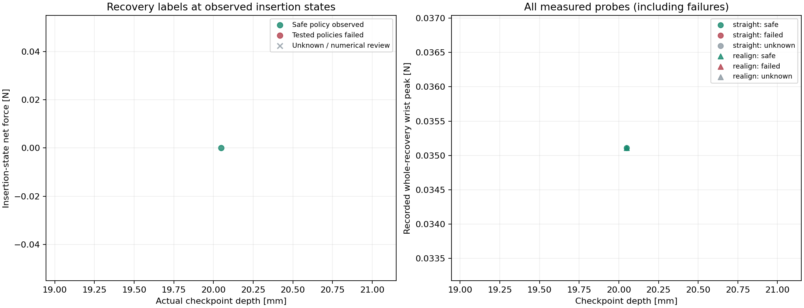
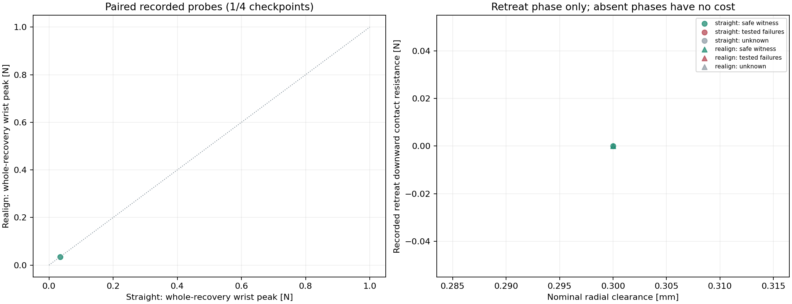
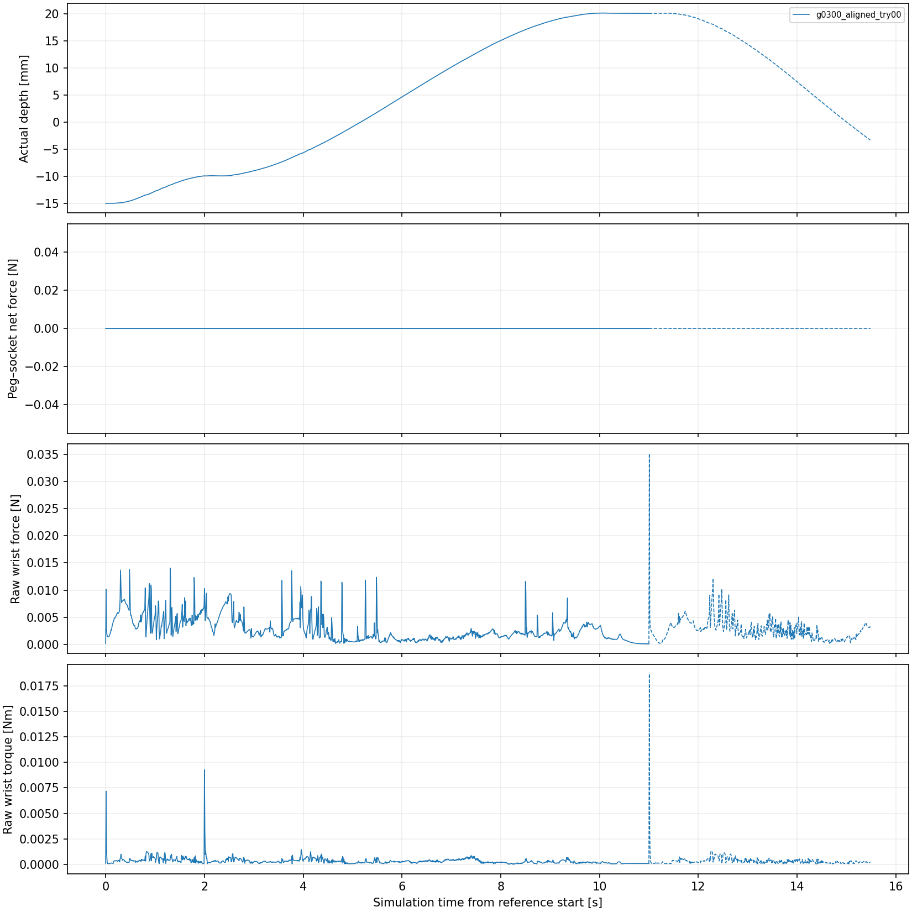
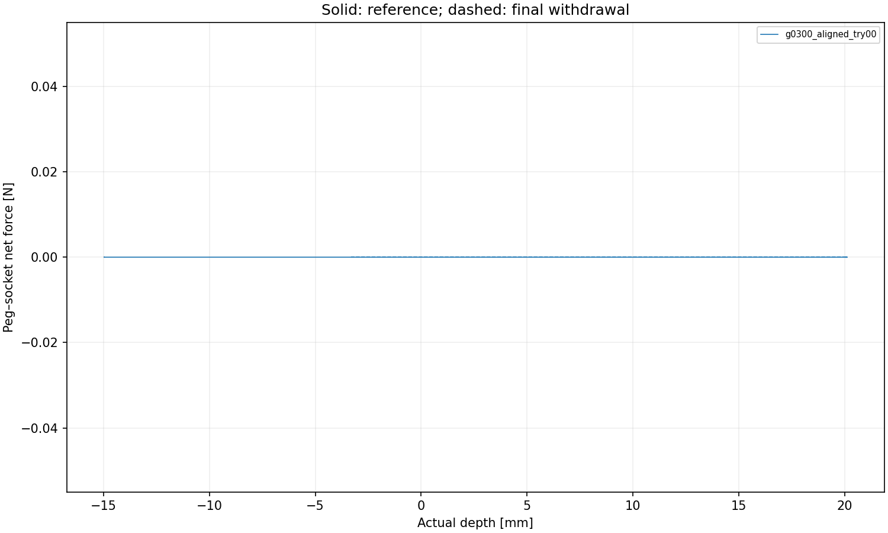

# FORGE clearance and insertion-triggered tilt study

Status: **complete**. 1 / 1 numerically valid trajectory slots filled.

A valid trajectory need not insert successfully or remain within force budgets. Numerical rejects stay in the dataset; retries keep their family and direction.

| Family | Completed attempts | Numerically valid slots |
| --- | ---: | ---: |
| centered | 1 | 1 |
| x_offset | 0 | 0 |
| y_offset | 0 | 0 |
| diagonal_offset | 0 | 0 |
| tilt_only | 0 | 0 |
| offset_tilt | 0 | 0 |

Only hole geometry and tilt timing/amplitude vary. Tilt starts after an actual-depth crossing, then ramps with elapsed time; a stall does not freeze the command ramp. All force costs are recorded-motion costs, including failed probes.

Eligible-parent checkpoint labels: 1 safe witnesses, 0 tested-policy failures, 3 unknown. 0 checkpoint records belong to invalid or incomplete parents.

## Labels and numerical limits

`Y_R_tested = 1` is a safe-policy witness. Zero means both tested policies failed valid matched-state tests, not that all recovery motions are impossible. Null means unknown. Labels are recorded only at the tested checkpoints; no continuous recoverability boundary is inferred.

Branches replay the insertion prefix and compare observable state, velocity and wrench against the original checkpoint. Hidden contact/solver memory is not restored or certified equivalent. Unmatched probes cannot provide labels.

The central plot shows invalid-parent or unfinished-parent points as unknown. A passed overlap screen is a first numerical acceptance criterion, not proof of convergence.

[Trajectory labels](trajectories.csv) · [Checkpoint features and labels](checkpoints.csv) · [Policy tests](recovery_probes.csv) · [Protocol and ledger](study.json)

## Clearance × tilt experiment

[Planned cases](cases.csv) · [Paired checkpoint comparison](comparison.csv)

| Nominal radial clearance [mm] | Measured references | Numerically valid | Insertion success | Triggered / applicable | Ramp completed |
| ---: | ---: | ---: | ---: | ---: | ---: |
| 0.3 | 1 | 1 | 1 | 0 / 0 | 0 |

The comparison table contains every checkpoint, including unreached, unmatched, failed, invalid and incomplete records. A missing cost is not zero force. A failed/censored probe reports only the observed part of motion, not the force required to complete withdrawal.

Force definitions: operational safety uses whole-recovery raw wrist force/torque norms. `wrist_world_z_abs` is the absolute world-Z component of the raw wrist reaction; it is not gravity-compensated or calibrated as external extraction force. World +Z is the fixed-hole withdrawal axis in this setup. `contact_downward_resistance` is max(0, −contact Fz), the peg/socket force opposing upward withdrawal. These signals must not be substituted for one another.

The 100 ms moving means use complete windows within each phase, never stop-to-retreat mixtures. Short phases have no full-window value. Retreat displacement is signed progress from the state immediately before retreat; force without progress remains visible. Root-level recovery labels retain full-process budget, grasp, clearance and numerical checks.

3 checkpoints lack two measured whole-recovery costs and are absent from the paired scatter; all remain in `comparison.csv`. Green: safe witness; red: both tested policies fail; grey: unknown/ineligible pair. No safe-only filter is applied.

## Controlled FORGE interpretation

Panda and stock SDF assets/contact settings; fixed nuisance parameters, zero dead zone, and full pose targets at the physics rate using the upstream torque law. Operational budgets apply to raw wrist force/torque norms. Contact torque is about the peg base. Wrist and contact signals are saved separately.

**Labels are provisional:** the overlap screen and replay check do not establish timestep convergence. Valid-reference counts do not guarantee known recovery labels at every checkpoint.

