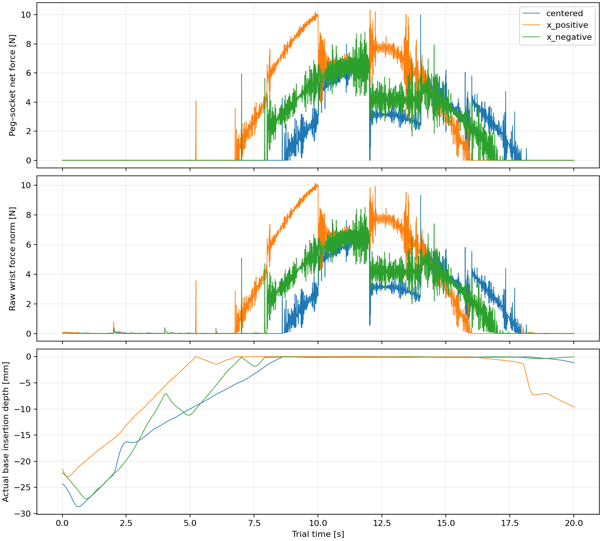
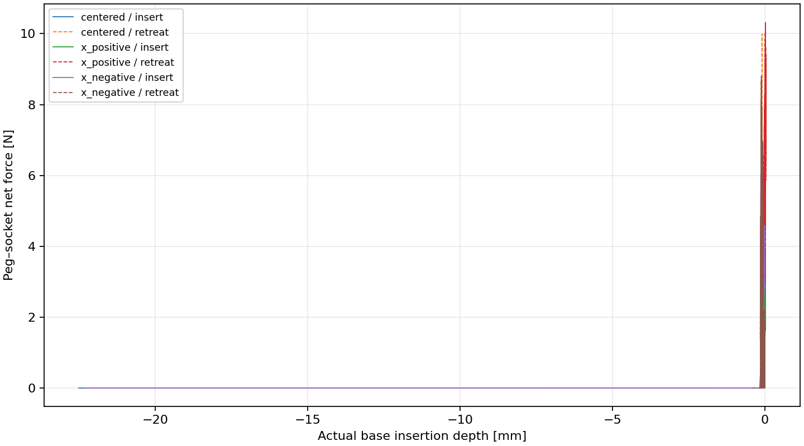

# Native FORGE pilot

Panda; native 120 Hz physics / 15 Hz actions; full-rate logging.

Scripted position targets use measured initial grasp geometry. Native controller, contact settings, pose noise and dynamics randomization remain enabled. No trained FORGE policy is used.

| Trial | Max depth (mm) | Contact peak (N) | Wrist peak (N) | Max overlap (mm) | Exit |
|---|---:|---:|---:|---:|---|
| centered | -0.014 | 9.992 | 9.327 | 0.01074 | complete |
| x_positive | 0.031 | 10.330 | 10.129 | 0.01931 | complete |
| x_negative | -0.003 | 8.835 | 8.510 | 0.01440 | complete |

The stock success flag uses Factory's geometric reward criterion. These are diagnostics, not accepted Phase 2 trajectories. Numerical validity and Y_R are deliberately unknown until the geometry, timestep dependence, grasp retention and matched recovery branching are validated.

Contact wrench includes normal and friction forces from socket onto peg, in world axes; moment is about the peg base. Raw wrist wrench is the PhysX incoming joint reaction in the child joint frame, including hand/grasp dynamics. FORGE's processed observation is stored verbatim; its frame naming must not be used to interpret it as a calibrated world-frame torque.

**Geometry audit correction:** the actual USD bore is 9.0 mm, with approximately 0.507 mm radial clearance (0.5059 mm conservatively). The previous 8.1 mm / 0.057 mm figures came from stale upstream config metadata. Raw traces are unchanged; see [correction details](geometry_correction.md).
