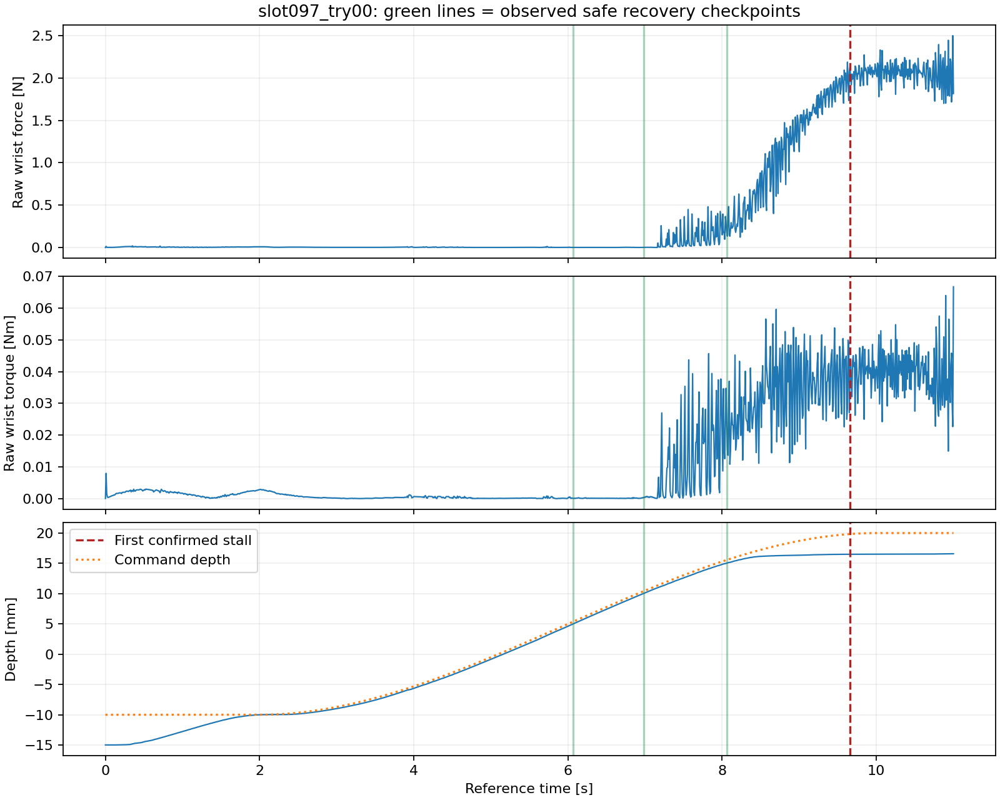

# Future-stall labels

100 reference records; 3 numerically valid stalled trajectories.

History: 0.5 s; stride: 0.1 s; horizons: [1.0, 2.0] s.

Y_stall is an observed binary event target, not an estimated probability. The event time is the first confirmation of the existing trailing-window stall predicate; it is not backdated by the confirmation window.

Only insertion time is at risk. Already-stalled states are excluded from first-event prediction. A negative requires the entire future horizon to be observed during insertion. End-of-insertion windows without a witnessed event are right-censored. Invalid/incomplete references have unknown targets.

Features use only [t-history,t]; future labels are separate columns. Row indices point into the unchanged insertion.csv. Do not use event times, outcome fields, or future targets as model inputs. These observational trajectories support prediction under the recorded continuation, not arbitrary action-conditioned safety guarantees.

Split all windows, checkpoints and branches using split_group_id. Centered controls share one group. Overlapping windows do not increase the number of independent stalled trajectories; only three positives would be insufficient to claim validated predictive performance. When pooling Phase 2B paths, audit identical pre-ramp histories across groups and exclude shared prefixes from independent evaluation.

| Horizon [s] | Positive | Negative | Unknown |
| --- | ---: | ---: | ---: |
| 1.0 | 30 | 6992 | 978 |
| 2.0 | 60 | 5992 | 1948 |

## Slot 097

| Depth [mm] | Horizon [s] | Y_R | Y_stall | Time to confirmation [s] |
| --- | --- | --- | --- | --- |
| 5 | 1 | 1 | 0 | 3.591666666614401 |
| 5 | 2 | 1 | 0 | 3.591666666614401 |
| 10 | 1 | 1 | 0 | 2.6749999999610736 |
| 10 | 2 | 1 | 0 | 2.6749999999610736 |
| 15 | 1 | 1 | 0 | 1.599999999976717 |
| 15 | 2 | 1 | 1 | 1.599999999976717 |

