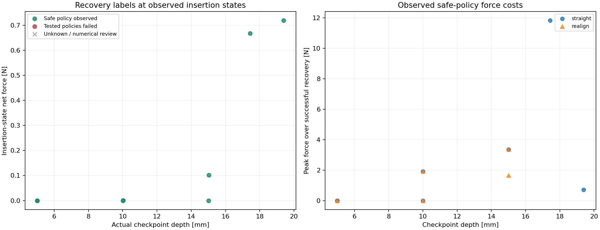
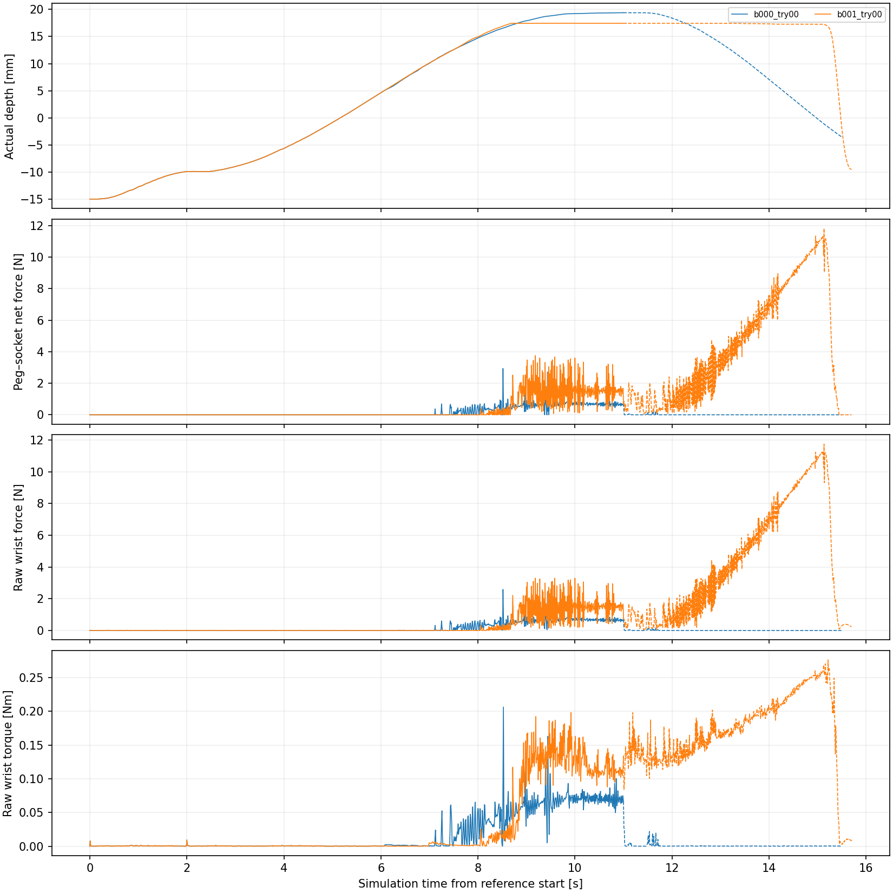
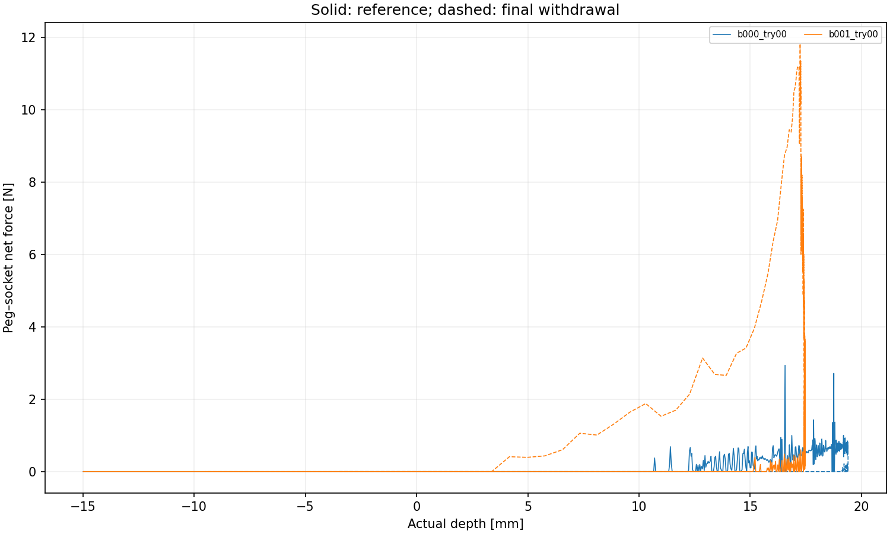
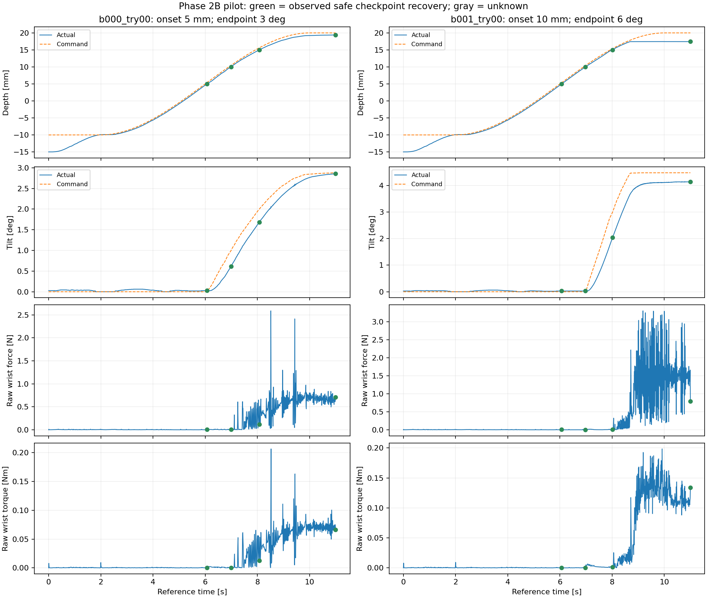

# FORGE Phase 2B depth-dependent boundary search

Status: **complete**. 2 / 2 numerically valid trajectory slots filled.

A valid trajectory need not insert successfully or remain within force budgets. Numerical rejects stay in the dataset; retries keep their family and direction.

| Family | Completed attempts | Numerically valid slots |
| --- | ---: | ---: |
| centered | 0 | 0 |
| x_offset | 0 | 0 |
| y_offset | 0 | 0 |
| diagonal_offset | 0 | 0 |
| tilt_only | 0 | 0 |
| offset_tilt | 2 | 2 |

Misalignment ramps with the maximum actual depth reached on the previous physics step, starting at 5 or 10 mm. Terminal probes test the final insertion/hold state as well as fixed-depth checkpoints. A terminal safe recovery after a stall does not establish safe further insertion progress.

Group paired amplitudes and all branches by `split_group_id`. Shared aligned prefixes across paths also need duplicate-history handling before ML evaluation. Unreached checkpoints are unknown; zero requires valid failures of both tested recovery policies.

Eligible-parent checkpoint labels: 8 safe witnesses, 0 tested-policy failures, 2 unknown. 0 checkpoint records belong to invalid or incomplete parents.

## Labels and numerical limits

`Y_R_tested = 1` is a safe-policy witness. Zero means both tested policies failed valid matched-state tests, not that all recovery motions are impossible. Null means unknown. Labels are recorded only at the tested checkpoints; no continuous recoverability boundary is inferred.

Branches replay the insertion prefix and compare observable state, velocity and wrench against the original checkpoint. Hidden contact/solver memory is not restored or certified equivalent. Unmatched probes cannot provide labels.

The central plot shows invalid-parent or unfinished-parent points as unknown. A passed overlap screen is a first numerical acceptance criterion, not proof of convergence.

[Trajectory labels](trajectories.csv) · [Checkpoint features and labels](checkpoints.csv) · [Policy tests](recovery_probes.csv) · [Protocol and ledger](study.json)

## Controlled FORGE interpretation

Panda and stock SDF assets/contact settings; fixed nuisance parameters, zero dead zone, and full pose targets at the physics rate using the upstream torque law. Operational budgets apply to raw wrist force/torque norms. Contact torque is about the peg base. Wrist and contact signals are saved separately.

**Labels are provisional:** the overlap screen and replay check do not establish timestep convergence. Valid-reference counts do not guarantee known recovery labels at every checkpoint.

## Phase 2B pilot verification

Both references passed the configured numerical and grasp screens. Eight reached checkpoint/terminal states had safe recovery witnesses; the two 20 mm checkpoints were unreached. Thirteen of sixteen policy replays matched; three remain unknown. No tested-recoverability failure was observed.

The stronger path stalled at 17.4555 mm with about 4.14 degrees maximum actual tilt (6 degrees was the nominal endpoint at 20 mm). Its terminal straight recovery cleared.

Command reconstruction, prefix clocks, checkpoint timing, label consistency, archived source hashes and 54 unit tests passed. This is not a timestep-convergence certificate.

[Audit](validation.json) · [Next search recommendation](analysis/boundary/report.md)

