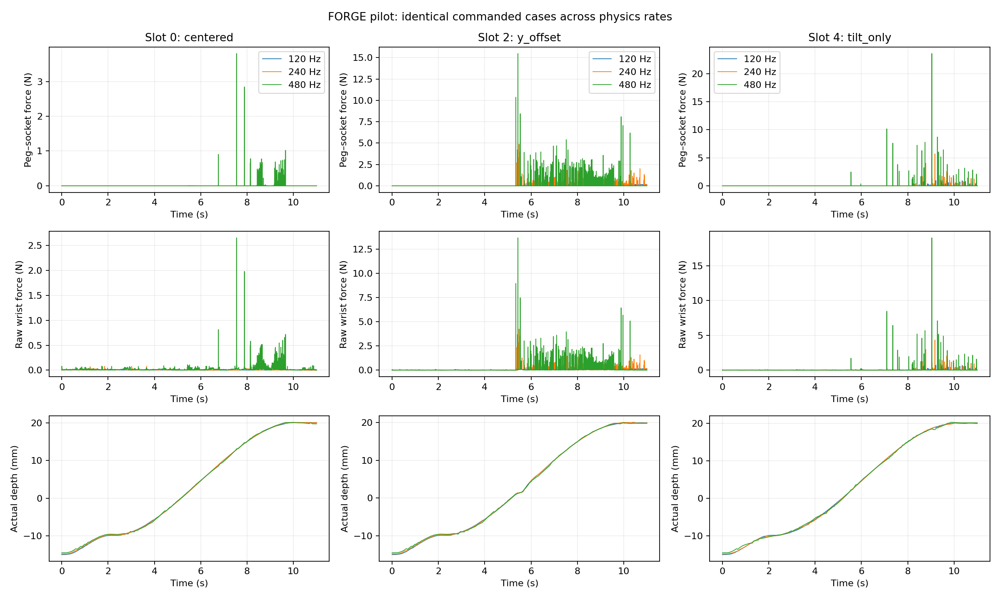

# FORGE validation assessment

Full collection ready under the pilot gates: **False**.

| Check | Passed |
|---|---|
| centered_checkpoint_baseline | True |
| wrist_calibration | True |
| reference_and_final_retreat_csv_integrity | True |
| six_families_piloted | True |
| screened_contact_cases_present | True |
| finest_pair_converges_on_sampled_cases | False |

| Rate pair | Slot | Family | Passed | Failed checks |
|---|---:|---|---|---|
| 120 → 240 Hz | 0 | centered | False | same_stalled, retreat_max_wrist_torque_nm |
| 120 → 240 Hz | 2 | y_offset | False | max_depth, retreat_max_wrist_force_n, retreat_max_wrist_torque_nm |
| 120 → 240 Hz | 4 | tilt_only | False | max_force, max_normal_load, max_torque, max_wrist_force_n, max_wrist_torque_nm, retreat_max_wrist_force_n, retreat_max_wrist_torque_nm |
| 240 → 480 Hz | 0 | centered | False | max_force, max_normal_load, max_wrist_force_n, max_wrist_torque_nm, retreat_max_wrist_force_n, retreat_max_wrist_torque_nm, recovery_work |
| 240 → 480 Hz | 2 | y_offset | False | max_force, max_normal_load, max_torque, max_wrist_force_n, max_wrist_torque_nm, max_depth, same_stalled, retreat_max_wrist_force_n, retreat_max_wrist_torque_nm, recovery_work |
| 240 → 480 Hz | 4 | tilt_only | False | max_force, max_normal_load, max_torque, max_wrist_force_n, max_wrist_torque_nm, max_depth, max_penetration, same_torque_budget_exceeded, retreat_max_wrist_force_n, retreat_max_wrist_torque_nm, recovery_work |

Thresholds and individual differences are recorded in [validation.json](validation.json). The finest available pair controls the convergence gate; the native-rate comparison remains visible. A failed gate is not hidden by collecting more easy trajectories.

[Per-rate metrics](rate_metrics.csv)

Pilot evidence for this synthetic model and tested policies; not real-world material validation or a global recoverability certificate. Rate comparisons include integration, per-step controller sampling and seeded preparation; they do not isolate the contact solver alone.

[Detailed pilot findings, stress case and viewer instructions](pilot_notes.md)
