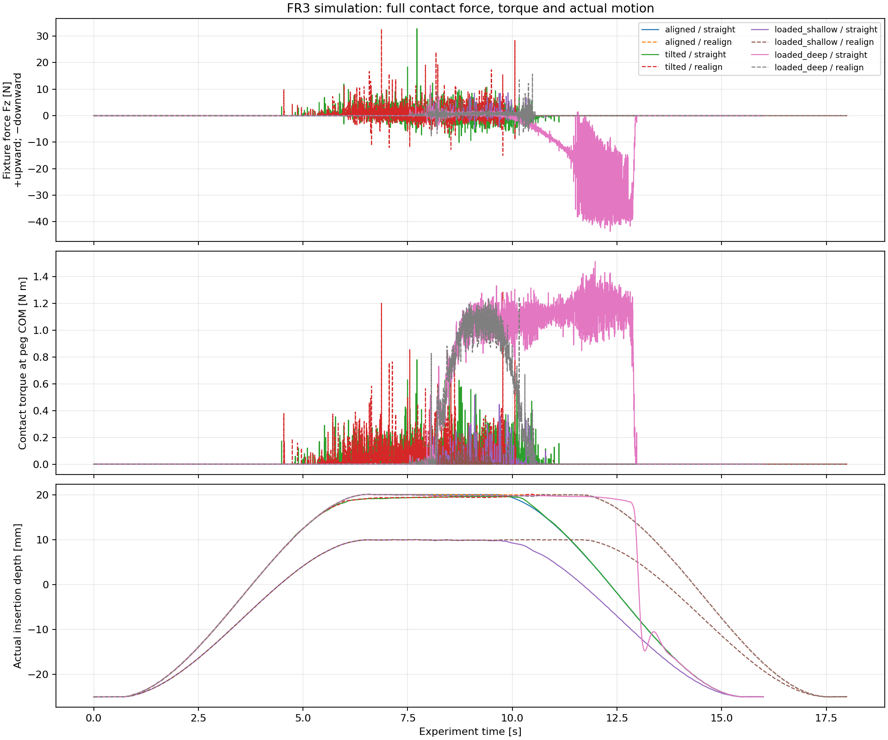
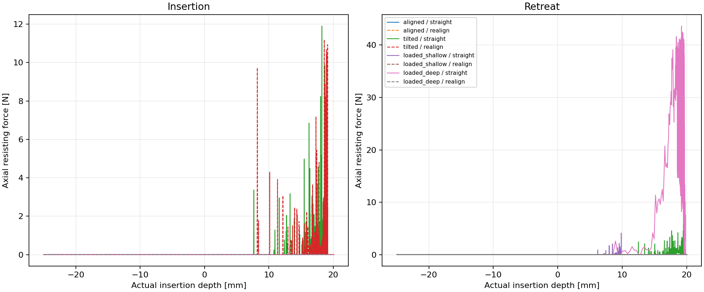

# FR3 recovery study

Synthetic compliant-contact study. Rankings apply to these parameters and recovery policies.

8 completed trials; 2 numerically invalid trials excluded from recovery costs and plots.

Positive Fz is upward fixture-on-peg force. Insertion resistance is max(Fz, 0); retreat resistance is max(-Fz, 0). All raw samples include normal and friction forces.

| Scenario | Recovery | Depth before recovery (mm) | Peak retreat (N) | 50 ms peak (N) | Recovery work proxy (J) | Time to clear (s) | Max overlap (mm) | Contact screen | Outcome |
| --- | --- | ---: | ---: | ---: | ---: | ---: | ---: | --- | --- |
| aligned | straight | 20.06 | 0.000 | 0.000 | 0.000000 | 3.215 | 0.0000 | passed | cleared_within_budget |
| aligned | realign | 20.04 | 0.000 | 0.000 | 0.000000 | 5.212 | 0.0000 | passed | cleared_within_budget |
| tilted | straight | 19.60 | 7.528 | 1.769 | 0.001161 | 3.231 | 0.4575 | review required | cleared_within_budget |
| tilted | realign | 19.46 | 0.000 | 0.000 | 0.000185 | 5.210 | 0.8135 | review required | cleared_over_budget |
| loaded_shallow | straight | 9.79 | 4.111 | 0.287 | 0.000740 | 2.662 | 0.2768 | review required | cleared_over_budget |
| loaded_shallow | realign | 9.90 | 0.000 | 0.000 | 0.000067 | 4.619 | 0.3046 | review required | cleared_within_budget |
| loaded_deep | straight | 19.82 | 43.633 | 35.597 | 0.060649 | 3.727 | 0.3860 | review required | cleared_over_budget |
| loaded_deep | realign | 19.81 | 0.000 | 0.000 | 0.000042 | 5.210 | 0.3731 | review required | cleared_over_budget |

The work proxy integrates max(0, −(F·v + τ·ω)) over the full recovery, using contact wrench and peg COM velocity in the same world frame. It is not motor energy; a static jam can have zero work while requiring high force. Time and force limits must be considered separately. Failure to clear means this tested policy failed within its duration, not that all recovery motions are impossible.

Force and torque budgets classify outcomes after execution; the controller does not enforce those budgets. Different achieved depths are reported and must not be treated as matched-depth comparisons. See study.json for all run parameters.

Contact screen: overlaps above 25% of radial clearance require review. A passed screen does not establish timestep convergence; compare refinements before trusting a cost ranking.

## Numerically invalid trials

These trials stopped at the numerical guard. Their partial CSVs include the offending sample. They are excluded from the plots and recovery-cost comparison; missing costs are not zero. An invalid trial is not evidence of physical jamming or irrecoverability.

| Scenario | Recovery | Time (s) | Phase | Force (N) | Separation (mm) | Partial samples |
| --- | --- | ---: | --- | ---: | ---: | --- |
| offset | straight | 3.8750 | insert | 188.103 | -1.3121 | [CSV](offset__straight.csv) |
| offset | realign | 3.8729 | insert | 159.241 | -1.1363 | [CSV](offset__realign.csv) |
