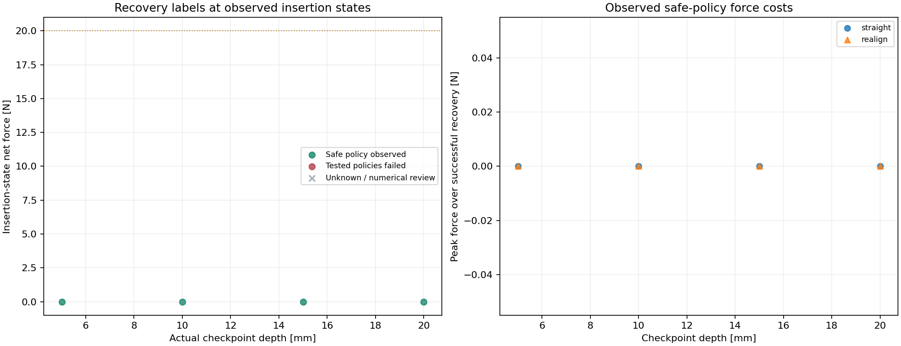

# Phase 2 randomized insertion characterization

Status: **complete**. 1 / 1 numerically valid trajectory slots filled.

A valid trajectory need not insert successfully or remain within force budgets. Numerical rejects stay in the dataset; retries keep their family and direction.

| Family | Completed attempts | Numerically valid slots |
| --- | ---: | ---: |
| centered | 1 | 1 |
| x_offset | 0 | 0 |
| y_offset | 0 | 0 |
| diagonal_offset | 0 | 0 |
| tilt_only | 0 | 0 |
| offset_tilt | 0 | 0 |

Eligible-parent checkpoint labels: 4 safe witnesses, 0 tested-policy failures, 0 unknown. 0 checkpoint records belong to invalid or incomplete parents.

## Labels and numerical limits

`Y_R_tested = 1` is a safe-policy witness. Zero means both tested policies failed valid matched-state tests, not that all recovery motions are impossible. Null means unknown. Labels are recorded only at the tested checkpoints; no continuous recoverability boundary is inferred.

Branches replay the insertion prefix and compare observable state, velocity and wrench against the original checkpoint. Hidden contact/solver memory is not restored or certified equivalent. Unmatched probes cannot provide labels.

The central plot shows invalid-parent or unfinished-parent points as unknown. A passed overlap screen is a first numerical acceptance criterion, not proof of convergence.

[Trajectory labels](trajectories.csv) · [Checkpoint features and labels](checkpoints.csv) · [Policy tests](recovery_probes.csv) · [Protocol and ledger](study.json)

